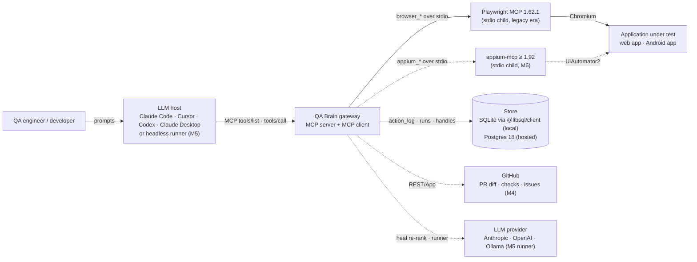
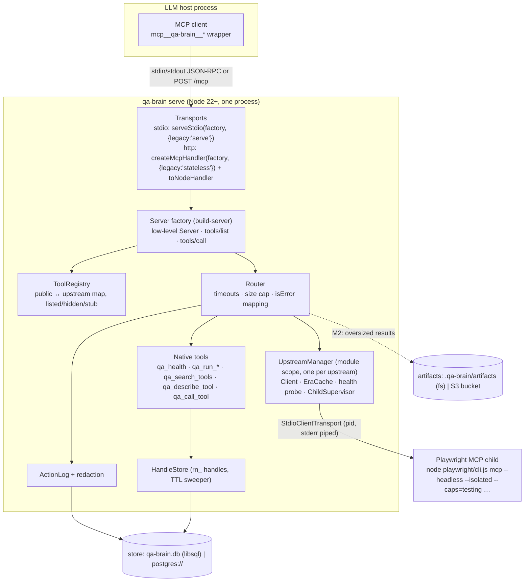
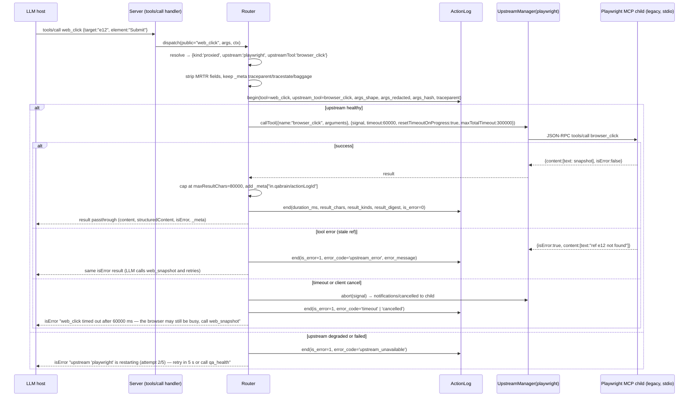

# QA Brain Architecture

QA Brain is an MCP gateway that sits between an LLM host (Claude Code, Cursor, Codex, Claude Desktop, or a headless CI runner) and the automation MCP servers that actually drive a browser or a device (Playwright MCP today, [appium-mcp](https://github.com/appium/appium-mcp) designed-in). It is simultaneously an MCP *server* to the host and an MCP *client* to its upstreams. The gateway curates a 22-tool surface, persists every proxied call to an `action_log`, mints handles for cross-call state, and provides the extension points (`UpstreamAdapter`, `StoreAdapter`, `ArtifactStore`, `LlmDriver`, `HealStrategy`, `ImpactAnalyzer`) through which the later milestones add a persistent test store, self-healing locators, diff-aware test selection, web/mobile parity, and reporting. This document describes the system as it exists in M0 (September 2026) and the seams that the roadmap in [docs/roadmap.md](./docs/roadmap.md) builds on. Where it names numbers, they come from the verified facts sheet behind this PR or are marked as design decisions.

## 1. Problem and positioning

"LLM + Playwright MCP" already works for plain-English authoring of 8 to 15 step flows, and field data shows where it breaks: context loss past 15 to 20 steps, hard-coded dynamic data, no memory between sessions, and roughly 114k tokens per MCP-driven test versus 27k through a CLI workflow ([QAby](https://qaby.ai/blog/claude-code-playwright-tests-guide), [TestQuality](https://testquality.com/playwright-test-agents-mcp-architecture-2026/)). What the model lacks is not a browser but a *brain*: durable test definitions, run history, locator memory, and a policy layer that says which tools may be called, which tests matter for this diff, and when a failure is a regression rather than a stale selector.

| System | What it is | What QA Brain takes from it | Where QA Brain differs |
|---|---|---|---|
| [Momentic](https://momentic.ai/docs/reliability/auto-maintenance.md) | Closed-source incumbent: YAML tests, step cache, 4-layer heal ladder, `--ai-select` TIA, two MCP servers (web, mobile) | Test file shape (`act:`/`assert:` steps, modules), cached multi-signal locators, L1-L4 escalation, `selectedTests` + `fallbackToRunAll` | Open source (Apache-2.0), one gateway for web and mobile, the store runs locally on SQLite or hosted on Postgres |
| [Playwright Test Agents](https://playwright.dev/docs/test-agents) | Planner/Generator/Healer agent definitions backed by a hidden `playwright-test` MCP (`test_run`, `planner_*`, `generator_*`) | Tool-surface shape for planning/generation; `--caps=testing` verify tools; Healer's "reviewable patch" stance | No run history, no cross-platform story, no tool policy; QA Brain wraps Playwright MCP instead of replacing it |
| [Octomind](https://stackpick.net/tools/octomind/) (discontinued May 2026) | AI-authored tests executed as plain Playwright | The lesson: "AI writes tests, Playwright runs them" alone did not find market validation; the durable value is the maintenance, triage, and history layer | QA Brain's core is exactly that layer; test generation is a client concern |
| [Stagehand](https://www.browserbase.com/blog/stagehand-caching) | Browser-automation primitives with conservative selector caching | Cache key over instruction + variable *keys* (never values); region fingerprint validation; "a wrong cached click is worse than a slow click"; `cacheStatus: HIT\|MISS` | Stagehand is a library inside an agent; QA Brain is a protocol-level gateway any host can attach to |

The defensible gap is the combination nobody ships as one open-source artifact: an MCP gateway that the LLM attaches to once, with web and mobile parity from one intent-level test, diff-aware selection, and a persistent history that runs on a laptop over stdio or as a team service over Streamable HTTP.

## 2. System context (C4 level 1)



Solid edges exist in M0; dotted edges are designed-in and arrive at the milestone shown.

## 3. Containers and process topology (C4 level 2)

One gateway process hosts everything in local mode. Upstream MCP servers are long-lived child processes (one per `mcpServers` entry, never one per request), because Playwright MCP holds browser state and a process-per-call model would lose it and leak Chromium trees ([punkpeye/mcp-proxy](https://github.com/punkpeye/mcp-proxy) multiplexing model; zombie-child history in [python-sdk #850](https://github.com/modelcontextprotocol/python-sdk/pull/850)).



The per-request server instance is stateless; `UpstreamManager`, `ToolRegistry`, `ActionLog`, and `HandleStore` live in module scope and are shared by every instance the transport factory creates. That is what makes the HTTP mode horizontally scalable under the session-less 2026-07-28 transport ([Streamable HTTP](https://modelcontextprotocol.io/specification/2026-07-28/basic/transports/streamable-http)).

## 4. Request lifecycle of a proxied call

The LLM calls `web_click`; the gateway forwards it as `browser_click` to the Playwright child. Every branch ends in `ActionLog.end()` and every failure returns as an `isError` result with a recovery hint, never as a JSON-RPC `-32603` (see [docs/tool-catalog.md](./docs/tool-catalog.md) for the error contract).



Redaction runs in `begin()` before anything is persisted or logged to stderr: key patterns (`/pass(word)?|secret|token|api[-_]?key|authorization|cookie|session/i`), value patterns (JWT, `ghp_`, `github_pat_`, `Bearer …`), and every value the config loader expanded from `${VAR}`. Result bodies are never stored in `action_log`; only `result_chars`, `result_kinds` (for example `text,image`) and a sha256 `result_digest` are ([docs/data-model.md](./docs/data-model.md)).

## 5. Module map of `packages/gateway`

| Path | Responsibility | Key facts |
|---|---|---|
| `src/config/{load,expand-env,defaults}.ts` | Read `qa-brain.config.json\|yaml`, expand `${VAR}` and `${VAR:-default}`, validate against the zod schema in `@qa-brain/core`, resolve relative paths against the config file | Unset variable without default is a validation error; expanded values join the redaction set; `block` wins over `allow`; empty `allow` means nothing is exposed |
| `src/upstream/upstream-manager.ts` | One instance per `mcpServers.<id>`; owns a `Client` from `@modelcontextprotocol/client` with `versionNegotiation: {mode:'auto'}`; exposes `callTool`, `listTools`, `state` | Created once per process, shared by all server instances |
| `src/upstream/child-supervisor.ts` | Spawn via `StdioClientTransport({command, args, env, cwd, stderr:'pipe'})`; pipe stderr to pino at `debug` (redacted); shutdown close-stdin → 2 s → `SIGTERM` → 3 s → `SIGKILL`; Windows `taskkill /PID <pid> /T /F`; idempotent `closeAll()` on `exit`/`SIGINT`/`SIGTERM` | `transport.pid` is available in SDK v2 (verified); Playwright 1.62.1 exits cleanly on `client.close()` on Windows |
| `src/upstream/era-cache.ts` | Persist `{kind:'modern', discover} \| {kind:'legacy'}` per upstream in `.qa-brain/era-cache.json`, keyed by sha256 of command, args, sorted env keys, adapter version; passed as `prior` to `client.connect` | Evicted on `EraNegotiationFailed` ([SDK gateway guide](https://ts.sdk.modelcontextprotocol.io/v2/advanced/gateway.html)) |
| `src/upstream/health.ts` | Probe every 60 s with a 5 s timeout; 3 consecutive failures → `degraded` → restart with exponential backoff 1 s → 30 s, 5 attempts → `failed` | Modern upstreams are probed with `server/discover`, legacy ones with `ping()` |
| `src/registry/tool-registry.ts` | Build the public table at startup from every upstream's `listTools()` plus native definitions; public name = `prefix + name.replace(strip, '')`; validate `^[a-zA-Z0-9_-]{1,64}$` and ≤ 40 chars; collision → startup error | `tools/list` is sorted by name with `ttlMs: 300000`, `cacheScope: 'public'`; names are never removed at runtime (stale-history rule, [discussion #2036](https://github.com/modelcontextprotocol/modelcontextprotocol/discussions/2036)) |
| `src/router/router.ts` | The single `tools/call` path for both eras: resolve, strip MRTR fields, log, dispatch native or proxied, pass through `content`/`structuredContent`/`isError`/`_meta`, cap size, map failures to `isError` | `timeout: server.callTimeoutMs` (60000), `resetTimeoutOnProgress: true`, `maxTotalTimeout: 5 × callTimeoutMs` |
| `src/log/action-log.ts`, `src/log/logger.ts` | `begin()`/`end()` around every call; pino 10 JSON logger bound to stderr in stdio mode | Columns listed in §4; `argsMode` `shape` \| `redacted` \| `none` |
| `src/handles/handle-store.ts` | Mint, resolve (with owner check), sweep handles in table `handle` | M0 mints only `rn_<uuidv7>` run handles with 24 h TTL; sweeper every 5 min |
| `src/server/build-server.ts` | Factory returning a low-level `Server` from `@modelcontextprotocol/server` with `setRequestHandler('tools/list')` and `setRequestHandler('tools/call')` installed and `cacheHints` set | The low-level server is the documented path for proxies and dynamic registries ([SDK docs](https://ts.sdk.modelcontextprotocol.io/v2/advanced/low-level-server.html)) |
| `src/server/define-native-tool.ts`, `src/server/native/{qa_health,qa_run,qa_discovery,qa_stubs}.ts` | Declare native tools with zod 4 input/output schemas; JSON Schema for `tools/list` is produced with `z.toJSONSchema`; stubs return `isError` "not implemented in M0" | All native schemas set `additionalProperties: false` with explicit `required` |
| `src/transports/stdio.ts`, `http.ts`, `auth.ts`, `health-endpoints.ts` | `serveStdio(factory, {legacy:'serve'})` with `console.log` rebound to stderr; `createMcpHandler(factory, {legacy:'stateless'})` composed with `toNodeHandler`, `localhostHostValidation()`/`originValidation()`, `requireBearerAuth` against `QA_BRAIN_TOKEN` (constant-time), `GET /healthz`, `GET /readyz` | Binds `127.0.0.1:8787` by default; `--allow-unauthenticated` only on loopback |
| `src/otel.ts` | Hand-rolled spans following the [OTel GenAI MCP conventions](https://github.com/open-telemetry/semantic-conventions-genai/blob/main/docs/gen-ai/mcp.md); `QA_BRAIN_OTEL_EXPORTER=none` default | Inbound `_meta.traceparent` is propagated to every upstream call |
| `src/index.ts` | `createGateway(config, deps) → { buildServer, start, close }` | Used by the CLI and by the smoke test through `InMemoryTransport.createLinkedPair()` |

The CLI in `apps/qa-brain` (commander 15) exposes `qa-brain serve --transport stdio|http [--config] [--port] [--host] [--allow-unauthenticated] [--log-level] [--dry-run]`, `qa-brain doctor`, and `qa-brain tools list [--all] [--json]`.

## 6. Two rules that shape everything

### 6.1 The dual-era rule: never pin a protocol era

The 2026-07-28 revision removed the `initialize` handshake and protocol sessions, made `server/discover` mandatory, and moved version and capabilities into per-request `_meta` ([changelog](https://modelcontextprotocol.io/specification/2026-07-28/changelog), [versioning](https://modelcontextprotocol.io/specification/2026-07-28/basic/versioning)). The upstreams QA Brain depends on have not followed yet: Playwright MCP 1.62.1 negotiates `2025-11-25` (verified, serverInfo `{name:"Playwright", version:"1.62.1"}`, connect ≈ 700 ms), and appium-mcp is on the v1 SDK line. The gateway therefore speaks both eras on both sides:

- **Downstream (server side).** `serveStdio(factory, {legacy:'serve'})` and `createMcpHandler(factory, {legacy:'stateless'})` install the modern handlers per connection or request and still accept legacy clients ([legacy clients](https://ts.sdk.modelcontextprotocol.io/v2/serving/legacy-clients.html)). A plain `server.connect(InMemoryTransport)` serves the legacy handshake, which is what unit tests exercise.
- **Upstream (client side).** `new Client(info, {versionNegotiation: {mode:'auto'}})` with a `prior` hint from the `EraCache`; the negotiated era is recorded per call in `action_log.protocol_era`.
- **One Router for both.** MRTR fields (`inputResponses`, `requestState`) are stripped before forwarding; `_meta` is reduced to the W3C trace keys plus the SDK's protocol keys.

The rule is recorded in [ADR-0003](./docs/adr/0003-mcp-2026-07-28-dual-era.md) and tested with a fake upstream served in both eras.

### 6.2 The handles-not-sessions rule

Because `Mcp-Session-Id` is gone and `tools/list` MUST NOT vary per connection ([tools](https://modelcontextprotocol.io/specification/2026-07-28/server/tools)), any state that must survive across calls is a server-minted handle passed back as an ordinary argument. Handles are `<kind>_<uuidv7>` (`rn_0198…` for runs; `bh_`, `dh_`, `sn_` reserved for browser, device, and snapshot; `lock` is the fifth kind), stored in table `handle` with owner, TTL, and state, and verified against the calling principal on every use. In M0 only `qa_run_start` mints a handle. Per-run browser isolation (one Playwright child per `bh_` handle, pooled) is an M4+ feature; in M0 one child per process means one shared browser context, which is adequate for a single developer over stdio and is the reason the HTTP mode stays behind a bearer token ([ADR-0005](./docs/adr/0005-handles-not-sessions.md)).

## 7. Local and hosted modes

| Concern | Local (M0) | Hosted (M5) |
|---|---|---|
| Transport | stdio, `serveStdio` | Streamable HTTP `POST /mcp`, `createMcpHandler` + `toNodeHandler` behind Caddy |
| Store | SQLite file `./.qa-brain/qa-brain.db` via `@libsql/client` 0.17.4 and `drizzle-orm/libsql`; auto-migrate at startup | Postgres 18 via `pg` 8.23.0; `qa-brain db migrate` one-shot service |
| Artifacts | `artifacts.driver: 'fs'`, `./.qa-brain/artifacts` | `'s3'` against SeaweedFS (`weed server -s3`) or real S3, presigned GET |
| Queue | none (inline execution) | [pg-boss 12](https://github.com/timgit/pg-boss) on the same Postgres; `worker` service |
| Upstreams | child processes spawned by the gateway | `playwright-mcp` sidecar container (own image from `mcr.microsoft.com/playwright:v1.62.1-noble`, `pwuser`, seccomp) reached over HTTP with `PLAYWRIGHT_MCP_PING_TIMEOUT_MS=60000`; appium-mcp as a worker child |
| Egress | none | Smokescreen proxy on an `internal: true` network, `--proxy-server http://egress:4750` |
| Auth | none on stdio (credentials from the environment, as the spec recommends) | bearer API keys (argon2id hashes in `api_key`), OAuth 2.1 resource server in M7 |
| Observability | pino JSON on stderr, OTel off | otel-collector → Jaeger (dev) or Tempo + Grafana (prod) |
| Principal in `action_log` | `local` | bearer subject |

The same image serves both: `qa-brain serve --transport stdio` inside `docker run -i` for a laptop, `--transport http` for the compose stack in [docs/deployment.md](./docs/deployment.md).

## 8. Monorepo map

| Path | One line |
|---|---|
| `packages/core` (`@qa-brain/core`) | Zero-runtime-dep contracts: zod config schema, tool-name rules (`TOOL_NAME_REGEX`, 40-char cap), redaction, handle minting, the interfaces in §9 |
| `packages/store` (`@qa-brain/store`) | Drizzle 0.45.2 schemas for all 17 tables in SQLite and Postgres dialects, adapters, migrations, dialect-conformance test |
| `packages/adapter-playwright` | `UpstreamAdapter` for Playwright MCP: resolves `node <playwright>/cli.js mcp …` via `require.resolve('playwright/package.json')`, allow/block/hidden table, flag validation for `doctor`; depends on `playwright` 1.62.1 |
| `packages/gateway` (`@qa-brain/gateway`) | The runtime described in §5 |
| `packages/test-format` | zod schema for `fileType: qabrain/test/v1`, canonicalizer, `cache_key` (M0 nice-to-have; see [docs/test-format.md](./docs/test-format.md)) |
| `packages/healing` | Pure functions `score()`, T0 chain, `classify()`, pHash stub (M0 nice-to-have; [docs/self-healing.md](./docs/self-healing.md)) |
| `apps/qa-brain` (`qa-brain`) | commander CLI: `serve`, `doctor`, `tools list`; the smoke e2e test in `test/smoke.e2e.test.ts` |
| `examples/static-site` | Three static pages served by `serve.ts` on an ephemeral port for the smoke test |
| `examples/mcp-configs` | `.mcp.json` (Claude Code), `cursor.mcp.json`, `codex.config.toml` ([docs/client-setup.md](./docs/client-setup.md)) |
| `deploy/` | `docker-compose.{yml,dev.yml,prod.yml}`, `qa-brain.yaml`, `otel/collector.yaml`, `egress/acl.yaml`, `Caddyfile` |
| `docker/` | `qa-brain.Dockerfile`, `browser.Dockerfile`, `egress/Dockerfile`, `seccomp_profile.json` |
| `docs/`, `docs/adr/` | This design set and ADRs 0001 to 0015 |
| `research/bench` | Benchmark harness design for the thesis track ([docs/research-track.md](./docs/research-track.md)) |

Toolchain: Node ≥ 22.12, pnpm 10.34.5, TypeScript 5.9.3 (ESM, `module: NodeNext`), tsup 8.5.1, vitest 4.1.11 (projects `unit` and `e2e`), Biome 2.5.9, changesets 3.0.1, `@modelcontextprotocol/{server,client,core,node}` 2.0.0, zod 4.4.3 ([ADR-0002](./docs/adr/0002-typescript-monorepo.md)).

## 9. Interfaces later milestones plug into

These live in `packages/core/src/interfaces.ts` so that the gateway never imports a concrete store, adapter, or LLM SDK.

```ts
export interface UpstreamAdapter {
  readonly id: string;                         // 'playwright' | 'appium' | 'generic'
  readonly platform: 'web' | 'mobile';
  readonly snapshotKind: 'aria-ref' | 'synthesized';   // mobile builds [ref=mN] from page-source XML
  resolveLaunch(cfg: UpstreamConfig): { command: string; args: string[]; env: Record<string, string> };
  validateFlags?(helpText: string, args: string[]): string[];       // doctor: unknown flags
  toolTable(): Record<string, { allow: boolean; hidden?: boolean; description?: string }>;
  mapArgs?(publicName: string, args: unknown): unknown;              // e.g. ref=mN → elementUUID
  mapResult?(publicName: string, result: CallToolResult): CallToolResult;
}

export interface StoreAdapter {
  readonly driver: 'sqlite' | 'pg';
  migrate(): Promise<void>;
  ping(): Promise<boolean>;
  actionLog: { insert(row: ActionLogRow): Promise<void>; query(q: ActionLogQuery): Promise<ActionLogRow[]> };
  runs: { create(r: NewRun): Promise<Run>; finish(id: string, patch: RunPatch): Promise<Run>; get(id: string): Promise<Run | null> };
  handles: {
    mint(kind: HandleKind, owner: string, ttlMs: number, state?: unknown): Promise<string>;
    resolve(handle: string, owner: string): Promise<HandleRecord | null>;
    sweep(): Promise<number>;
  };
  tests?: TestRepository;                  // M1
  healProposals?: HealProposalRepository;  // M3
  close(): Promise<void>;
}

export interface ArtifactStore {
  put(input: { runId?: string; kind: 'screenshot' | 'snapshot' | 'trace' | 'result' | 'video';
               contentType: string; body: Uint8Array | ReadableStream }): Promise<ArtifactRef>; // {id, sha256, bytes}
  get(id: string): Promise<{ contentType: string; body: ReadableStream } | null>;
  url(id: string, ttlMs?: number): Promise<string | null>;   // presigned (s3) or file:// (fs)
  delete(id: string): Promise<void>;
}

export interface LlmDriver {                 // 'anthropic' (default, claude-opus-5) | 'openai' | 'ollama'
  readonly provider: string;
  readonly model: string;
  runAgentLoop(input: { systemPrompt: string; task: string; tools: McpToolDef[];
                        callTool: (name: string, args: unknown) => Promise<CallToolResult>;
                        maxTurns: number; maxTokens?: number; signal?: AbortSignal }): Promise<AgentRunResult>;
  complete(input: { prompt: string; schema?: JsonSchema; effort?: 'low' | 'medium' | 'high' }): Promise<unknown>;
  estimateCost(usage: TokenUsage): number;
}

export interface HealStrategy {
  readonly tier: 'T0' | 'T1' | 'T2' | 'T3';
  propose(input: { fingerprint: ElementFingerprint; snapshot: string; candidates?: Candidate[];
                   limits: { maxCandidates: number } }): Promise<HealProposal[]>;   // scored, never auto-applied
  verify(p: HealProposal, probe: { find(target: string): Promise<number> }): Promise<boolean>; // exactly one match
}

export interface ImpactAnalyzer {
  readonly layer: 'static-imports' | 'dynamic-coverage' | 'route-map' | 'network' | 'smoke-set';
  select(input: { diff: GitDiff; tests: TestRef[]; trackedFilesGlobs: string[] }):
    Promise<{ selected: TestRef[]; fallbackToRunAll: boolean; reasons: string[] }>;
}
```

Milestone ownership: `UpstreamAdapter` gets its second implementation in M6 (appium-mcp, [ADR-0015](./docs/adr/0015-mobile-appium-mcp.md)); `StoreAdapter` gains `tests` in M1 and `healProposals` in M3 ([ADR-0006](./docs/adr/0006-store-sqlite-and-postgres.md)); `ArtifactStore` goes from `fs` to `s3` in M5 ([ADR-0008](./docs/adr/0008-artifacts-s3-compatible.md)); `LlmDriver` arrives with the runner in M5 on the official `@anthropic-ai/sdk` and the `openai` SDK ([ADR-0014](./docs/adr/0014-provider-agnostic-llm-runner.md)); `HealStrategy` T0/T1 in M3 and T2/T3 in M6 ([ADR-0009](./docs/adr/0009-self-healing-tiered-proposals.md)); `ImpactAnalyzer` layers in M4 ([ADR-0010](./docs/adr/0010-test-impact-analysis-layered-union.md)).

## 10. Security posture in one paragraph

Tools are default-deny: an upstream exposes nothing until its adapter's `toolTable()` or the config's `tools.allow` names it, and `browser_run_code_unsafe` and `browser_evaluate` are blocked because Playwright's own config calls them "RCE-equivalent" and states that its guardrails are "convenience, not boundaries" ([config.d.ts](https://raw.githubusercontent.com/microsoft/playwright/main/packages/playwright-core/src/tools/mcp/config.d.ts)). Inbound bearer tokens are never forwarded upstream. Arguments are logged by shape or redacted, never raw. HTTP binds loopback and requires a bearer token unless explicitly told otherwise, following the [Docker MCP Gateway v0.43.1](https://github.com/docker/mcp-gateway/releases/tag/v0.43.1) hardening list. The full T1 to T15 table is in [docs/security-threat-model.md](./docs/security-threat-model.md) and [ADR-0011](./docs/adr/0011-security-posture.md).

## 11. What is NOT in M0

M0 is a blueprint plus a scaffold whose smoke test proves one path end to end: Claude Code (or the vitest `e2e` project) → `qa-brain serve --transport stdio` → `web_navigate`/`web_snapshot`/`web_click` against `examples/static-site` → rows in `action_log` → child process tree dead on close. Explicitly deferred, each with an owning milestone in [docs/roadmap.md](./docs/roadmap.md):

- **Test store tools** (`qa_test_save`, `qa_test_get`, `qa_test_list`) and deterministic replay: M1 and M2. The stubs exist and return `isError` "not implemented in M0".
- **Self-healing** (`qa_heal_locator`, proposals, approval): M3 (T0/T1), M6 (T2/T3). Only pure scoring functions may land in M0.
- **Test impact analysis** (`qa_impact_select`) and GitHub App (PR diff, check runs, issues): M4.
- **Hosted mode wiring**: the HTTP transport handler is implemented and unit-tested, but Postgres, pg-boss, SeaweedFS, Smokescreen, OTel exporters, and API keys are compose files and schema only until M5.
- **LLM runner** and `LlmDriver` implementations: M5. In M0 the LLM is whatever host attaches over MCP.
- **Mobile** (`mobile_*`, appium-mcp adapter, synthesized `ref=mN`, parity report): M6; iOS stays documentation-only and macOS-bound.
- **Artifacts**: the size cap truncates with a marker but stores nothing; `ArtifactStore` gets a real `fs` implementation in M2.
- **Per-run browser isolation** (`bh_` handles, child pool): M4+. M0 runs one Playwright child per gateway process.
- **Reports, visual regression, issue filing, Tasks extension** (`qa_report_generate`, `qa_visual_compare`, `qa_issue_file`, `qa_run_suite`): M2 onward.
- **`--watch` config reload, per-principal `tools/list` filtering (`cacheScope: 'private'`), OAuth 2.1, rate limiting**: M5 to M7.

Related reading: [docs/tool-catalog.md](./docs/tool-catalog.md), [docs/data-model.md](./docs/data-model.md), [docs/observability.md](./docs/observability.md), [docs/ci-cd.md](./docs/ci-cd.md), [ADR-0001](./docs/adr/0001-gateway-on-ts-sdk-v2-low-level-server.md) (why a gateway on the low-level server), [ADR-0004](./docs/adr/0004-tool-namespacing-and-curated-surface.md) (naming and the 22-tool surface).
