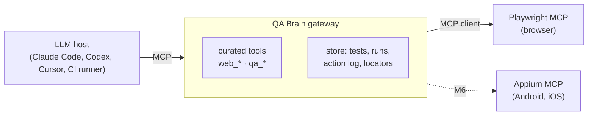

# QA Brain

**An MCP gateway that turns an LLM agent into a persistent, self-healing, change-aware test engineer for web and mobile apps.**

QA Brain sits between an LLM host (Claude Code, Codex, Cursor, Claude Desktop, or a headless CI runner) and the
browser/device automation MCP servers ([Playwright MCP](https://playwright.dev/docs/getting-started-mcp),
[Appium MCP](https://github.com/appium/appium-mcp)). The model attaches to **one** server — QA Brain — which
exposes a small curated tool surface, proxies the rest, and adds what the raw automation servers lack:

- a **persistent test store and run history** — tests are intent-level YAML in your repo, resolved locators are cached;
- **self-healing locators** with an approval workflow, never a silent edit;
- **diff-aware test selection** so a pull request runs only the tests it can affect;
- **web ↔ mobile parity** from one test definition;
- **flakiness detection and quarantine**, reporting, and GitHub integration.



## Status

**M0 — blueprint and scaffold.** The gateway runs: it spawns the pinned Playwright MCP, exposes 22 curated
tools, proxies calls with full audit logging, and is covered by a smoke test that drives a real Chromium.
Everything else in the list above is designed in detail (ADRs, schemas, algorithms) and scheduled — see the
[roadmap](./docs/roadmap.md) (M0 September 2026 → M9 June 2027).

| Working today | Designed, not yet built |
| --- | --- |
| stdio + Streamable HTTP transports, dual-era (2026-07-28 with legacy fallback) | test store tools, healing, impact analysis, reporting (stubs return `not_implemented`) |
| curated tool registry, prefixing, collision detection, hidden/blocked classes | mobile adapter and web ↔ mobile parity (M6) |
| upstream supervision: health probes, backoff restarts, Windows-safe process-tree kill | hosted mode wiring: Postgres, pg-boss, S3 artifacts, OAuth (M5) |
| action log with secret redaction and W3C trace propagation | headless LLM runner and the reusable GitHub Action (M5–M7) |

## Quickstart

Requires **Node ≥ 22.12** and **pnpm 10** (`corepack enable`).

```bash
pnpm install
pnpm build
pnpm exec playwright install chromium   # one Chromium revision, pinned to playwright 1.62.1
pnpm doctor                             # checks Node, config, store, Playwright, browser, credentials
```

Run the acceptance test — it serves a local example site and drives a real browser through the gateway:

```bash
pnpm test    # unit tests
pnpm smoke   # end-to-end: navigate, snapshot, click, verify, audit log, clean shutdown
```

Attach it to Claude Code (project scope):

```bash
claude mcp add --transport stdio --scope project qa-brain \
  -- node ./apps/qa-brain/dist/cli.js serve --transport stdio
```

Then ask the model to `qa_run_start`, `web_navigate` to your app, `web_snapshot`, and act on the `[ref=eN]`
targets it sees. Configuration snippets for Codex, Cursor and Claude Desktop are in
[client setup](./docs/client-setup.md). With no config file present the gateway uses built-in defaults (one
Playwright upstream, SQLite under `QA_BRAIN_HOME`); copy
[`qa-brain.config.example.json`](./qa-brain.config.example.json) to `qa-brain.config.json` to change them.
Hosted-mode compose files live in [`deploy/`](./deploy/) — see [deployment](./docs/deployment.md).

## Command line

```
qa-brain serve --transport stdio|http [--config <path>] [--port] [--host] [--dry-run]
qa-brain doctor                 # environment diagnostics, non-zero exit on any failure
qa-brain tools list [--all]     # exactly what the model will see, and what is hidden or blocked
```

## Documentation

| | |
| --- | --- |
| [ARCHITECTURE.md](./ARCHITECTURE.md) | system design, request lifecycle, module map |
| [docs/adr/](./docs/adr/) | 15 architecture decision records — start at [ADR-0001](./docs/adr/0001-gateway-on-mcp-sdk-v2-low-level-server.md) |
| [tool catalog](./docs/tool-catalog.md) | every tool, its schema, and why it is listed, hidden or blocked |
| [data model](./docs/data-model.md) · [test format](./docs/test-format.md) | the 17-table store; the `qabrain/test/v1` YAML spec |
| [self-healing](./docs/self-healing.md) · [impact analysis](./docs/impact-analysis.md) · [flaky and quarantine](./docs/flaky-and-quarantine.md) | the algorithms, with thresholds and citations |
| [deployment](./docs/deployment.md) · [security](./docs/security-threat-model.md) · [observability](./docs/observability.md) · [CI/CD](./docs/ci-cd.md) | running it for real |
| [roadmap](./docs/roadmap.md) · [research track](./docs/research-track.md) · [sources](./docs/research-sources.md) | milestones, benchmark design, bibliography |

## Security

The gateway is the enforcement point, not the automation servers: Playwright documents its own origin and
file guardrails as "convenience, not a security boundary". QA Brain blocks the RCE-equivalent tools
(`browser_run_code_unsafe`, `browser_evaluate`) by default, never forwards a client's bearer token upstream,
and redacts secrets before anything reaches the action log or stderr. See the
[threat model](./docs/security-threat-model.md) and [SECURITY.md](./SECURITY.md).

## Contributing

See [CONTRIBUTING.md](./CONTRIBUTING.md). Licensed under [Apache-2.0](./LICENSE).
