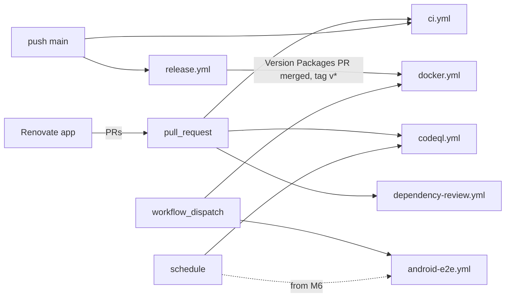

# CI/CD

QA Brain ships six GitHub Actions workflows plus a Renovate policy in the M0 pull request. `ci.yml` is the merge gate: Biome lint, `tsc` typecheck, vitest unit tests on Ubuntu and Windows, and an end-to-end smoke test that spawns the real Playwright MCP child (`playwright@1.62.1`) through the gateway on both operating systems. `docker.yml` builds signed multi-arch images to GHCR, `release.yml` versions the workspace with changesets (npm publishing stays disabled until the `qa-brain` package name is claimed), `android-e2e.yml` reserves the KVM-accelerated emulator lane for the mobile milestone, and `codeql.yml` / `dependency-review.yml` / `renovate.json` enforce the supply-chain rules from the [threat model](./security-threat-model.md). This document describes every job, the secrets and token permissions each one needs, the branch-protection rules that make the checks binding, how to reproduce the checks locally, and the design of the reusable `qa-brain/run-action` that later milestones expose to downstream repositories. All workflows live under `.github/workflows/`; the roadmap context is in [roadmap](./roadmap.md) and the tooling rationale in [ADR-0002](./adr/0002-typescript-monorepo-pnpm-node22-esm.md).

## 1. Workflow map



| Workflow | Trigger | Jobs | Runner(s) | Token permissions | Secrets |
|---|---|---|---|---|---|
| `ci.yml` | `push` (main), `pull_request` | `lint-typecheck`, `unit`, `smoke`, `docker-build` | ubuntu-latest, windows-latest | `contents: read` | none |
| `docker.yml` | `push` tags `v*`, `workflow_dispatch` | `build-push` | ubuntu-latest | `contents: read`, `packages: write`, `id-token: write` | none (`GITHUB_TOKEN` logs in to GHCR) |
| `release.yml` | `push` (main) | `release` | ubuntu-latest | `contents: write`, `pull-requests: write`, `id-token: write` | `NPM_TOKEN` (unused until publishing is enabled), `RELEASE_TOKEN` (for tag-triggered builds, see section 4) |
| `android-e2e.yml` | `workflow_dispatch`; `schedule: '0 3 * * 1'` from M6 | `android` | ubuntu-latest (KVM) | `contents: read` | none in M0 |
| `codeql.yml` | `pull_request`, `push` (main), `schedule: '0 6 * * 1'` | `analyze` | ubuntu-latest | `security-events: write`, `actions: read`, `contents: read` | none |
| `dependency-review.yml` | `pull_request` | `review` | ubuntu-latest | `contents: read`, `pull-requests: write` | none |

Every workflow declares a top-level `permissions:` block and every `uses:` is pinned to a commit SHA with a version comment; Renovate's `helpers:pinGitHubActionDigests` preset keeps those digests current. Concurrency is `ci-${{ github.ref }}` with `cancel-in-progress: true`, so a force-push to a PR branch cancels the superseded run.

## 2. `ci.yml`: the merge gate

```yaml
name: ci
on:
  push: { branches: [main] }
  pull_request:
concurrency:
  group: ci-${{ github.ref }}
  cancel-in-progress: true
permissions:
  contents: read
jobs:
  lint-typecheck:
    runs-on: ubuntu-latest
    steps:
      - uses: actions/checkout@v4
      - uses: pnpm/action-setup@v4            # reads "packageManager": "pnpm@10.34.5"
      - uses: actions/setup-node@v4
        with: { node-version-file: .nvmrc, cache: pnpm }
      - run: pnpm install --frozen-lockfile
      - run: pnpm lint                          # biome ci .
      - run: pnpm typecheck                     # tsc -b tsconfig.json
      - run: pnpm audit --prod --audit-level high
  unit:
    needs: lint-typecheck
    strategy:
      fail-fast: false
      matrix: { os: [ubuntu-latest, windows-latest] }
    runs-on: ${{ matrix.os }}
    steps:
      # checkout, pnpm/action-setup, setup-node, install: same four steps as lint-typecheck
      - run: pnpm build
      - run: pnpm test                          # vitest run --project unit
  smoke:
    needs: lint-typecheck
    strategy:
      fail-fast: false
      matrix: { os: [ubuntu-latest, windows-latest] }
    runs-on: ${{ matrix.os }}
    env: { QA_BRAIN_E2E: "1" }
    steps:
      # checkout, pnpm/action-setup, setup-node, install: same four steps as lint-typecheck
      - id: pw
        shell: bash
        run: echo "version=$(node -p "require('playwright/package.json').version")" >> "$GITHUB_OUTPUT"
      - uses: actions/cache@v4
        with:
          path: |
            ~/.cache/ms-playwright
            ~/AppData/Local/ms-playwright
          key: ms-playwright-${{ runner.os }}-${{ steps.pw.outputs.version }}
      - run: pnpm exec playwright install --with-deps chromium
      - run: pnpm build
      - run: pnpm smoke                         # vitest run --project e2e
      - if: failure()
        uses: actions/upload-artifact@v4
        with:
          name: smoke-${{ matrix.os }}
          path: |
            .qa-brain/pw-out
            test-results
  docker-build:
    if: github.event_name == 'pull_request'
    needs: lint-typecheck
    runs-on: ubuntu-latest
    steps:
      - uses: actions/checkout@v4
      - uses: docker/setup-buildx-action@v3
      - uses: docker/build-push-action@v6
        with: { file: docker/qa-brain.Dockerfile, push: false, cache-from: type=gha, cache-to: "type=gha,mode=max" }
      - uses: docker/build-push-action@v6
        with: { file: docker/browser.Dockerfile, push: false, cache-from: type=gha, cache-to: "type=gha,mode=max" }
```

Design notes:

- **Why both OSes for unit and smoke.** The gateway spawns and reaps a stdio child (`node <playwright>/cli.js mcp ...`), and process-tree cleanup differs on Windows (`taskkill /PID /T /F`) from POSIX (`SIGTERM` then `SIGKILL`). The smoke test's last assertion is that the child PID is dead after `client.close()`, which is exactly the kind of check that passes on Linux and regresses silently on Windows. The Windows leg is also what keeps the `@libsql/client` choice honest ([ADR-0006](./adr/0006-store-sqlite-local-postgres-hosted-drizzle.md)): `better-sqlite3` has no prebuilt binary for Node 24 on Windows.
- **Browser cache.** `playwright install --with-deps chromium` downloads one Chromium revision into `~/.cache/ms-playwright` (Linux) or `%LOCALAPPDATA%\ms-playwright` (Windows); the cache key includes the resolved `playwright` version, so a Renovate bump invalidates it. `--with-deps` installs OS packages on Ubuntu and the Visual C++ redistributable on Windows, so the same command is used on both legs. Only Chromium is installed; Firefox and WebKit are outside the M0 surface.
- **What `pnpm smoke` asserts** (full list in [ARCHITECTURE.md](../ARCHITECTURE.md)): `tools/list` returns the 22 default tools sorted by name with `ttlMs` = 300000 and `cacheScope: 'public'`; `web_run_code_unsafe` and `web_evaluate` are absent; `web_navigate` to `examples/static-site` returns "QA Brain Example"; `web_snapshot` contains `[ref=`; `web_click` on Submit yields "Submitted"; the SQLite `action_log` table has rows with `args_shape` and `args_redacted` populated; and the child process tree is gone after close.
- **`pnpm audit --prod --audit-level high`** is blocking: a high-severity advisory in a production dependency fails the job. False positives are handled by a Renovate PR or, as a last resort, a `pnpm.auditConfig.ignoreCves` entry in the root `package.json` with a linked issue.
- **`docker-build` runs on PRs only.** It proves both Dockerfiles (`docker/qa-brain.Dockerfile`, and `docker/browser.Dockerfile` FROM `mcr.microsoft.com/playwright:v1.62.1-noble`) still build; pushing is the job of `docker.yml`. Build layers are cached in the GitHub Actions cache backend (`type=gha`).

## 3. `docker.yml`: signed multi-arch images

Triggered by a `v*` tag or manually. The job logs in to GHCR with the workflow's own `GITHUB_TOKEN` (`packages: write`), sets up QEMU and Buildx, derives tags with `docker/metadata-action@v5` (`type=semver,pattern={{version}}`, `type=semver,pattern={{major}}.{{minor}}`, `type=sha`), and runs `docker/build-push-action@v6` with `platforms: linux/amd64,linux/arm64`, `provenance: true` and `sbom: true`, which attaches a SLSA provenance attestation and an SPDX SBOM to the image index. `sigstore/cosign-installer@v3` then signs keylessly, `cosign sign --yes ghcr.io/chinmaydhokey/qa-brain@${{ steps.build.outputs.digest }}`, using the job's OIDC identity (`id-token: write`), so there is no signing key to store. Both images are handled: `ghcr.io/chinmaydhokey/qa-brain` (gateway, HTTP mode) and `ghcr.io/chinmaydhokey/qa-brain-browser` (Playwright MCP sidecar; see [deployment](./deployment.md)). A final step writes the digests to `$GITHUB_STEP_SUMMARY`; `deploy/docker-compose.prod.yml` pins images by digest rather than tag, and consumers verify with `cosign verify --certificate-identity-regexp 'https://github.com/chinmaydhokey/MCP_server/.github/workflows/docker.yml@.*' --certificate-oidc-issuer https://token.actions.githubusercontent.com`.

## 4. `release.yml`: changesets

On every push to `main`, `changesets/action@v1` inspects `.changeset/*.md`. If pending changesets exist it opens or updates a "Version Packages" PR by running `pnpm changeset version`; the `.changeset/config.json` `fixed` group `[["qa-brain", "@qa-brain/*"]]` keeps all workspace packages on one version, and `@qa-brain/example-static-site` is ignored. The action's `publish` input is **omitted in M0**, so merging the version PR only bumps versions and changelogs. Publishing is enabled in a later milestone by adding `publish: pnpm release` (which runs `changeset publish` and pushes the `v*` tag) together with the `NPM_TOKEN` secret; `id-token: write` is already declared so npm provenance can be switched on at the same time.

One GitHub-specific trap is worth recording: a tag pushed with the default `GITHUB_TOKEN` does **not** start `docker.yml`, because [events created by `GITHUB_TOKEN` never trigger new workflow runs](https://docs.github.com/en/actions/security-for-github-actions/security-guides/automatic-token-authentication#using-the-github_token-in-a-workflow). When publishing is enabled, the release job therefore checks out with a fine-grained `RELEASE_TOKEN` (Contents: read/write on this repository only) or a GitHub App installation token; until then `docker.yml` is run via `workflow_dispatch`.

## 5. `android-e2e.yml`: emulator lane

Android emulators need hardware acceleration; GitHub's x86 Ubuntu runners expose `/dev/kvm` while macOS arm64 runners do not support nested virtualization, so the lane is Ubuntu-only ([ReactiveCircus/android-emulator-runner README](https://github.com/ReactiveCircus/android-emulator-runner/blob/main/README.md), [runner-images](https://github.com/actions/runner-images)). The workflow is `workflow_dispatch`-only in M0 (input `api-level`, default `35`) and gains a weekly `schedule` in M6 when the appium-mcp adapter lands ([ADR-0015](./adr/0015-mobile-via-appium-mcp-synthesized-refs-android-first.md)).

```yaml
steps:
  - name: Enable KVM
    run: |
      echo 'KERNEL=="kvm", GROUP="kvm", MODE="0666", OPTIONS+="static_node=kvm"' | sudo tee /etc/udev/rules.d/99-kvm4all.rules
      sudo udevadm control --reload-rules
      sudo udevadm trigger --name-match=kvm
  - uses: actions/setup-java@v4
    with: { distribution: temurin, java-version: "17" }
  - uses: actions/cache@v4
    with:
      path: |
        ~/.android/avd/*
        ~/.android/adb*
      key: avd-${{ inputs.api-level }}-x86_64
  - uses: ReactiveCircus/android-emulator-runner@v2
    with:
      api-level: ${{ inputs.api-level }}
      arch: x86_64
      target: google_apis
      disable-animations: true
      emulator-boot-timeout: 900
      script: pnpm qa-brain run --profile android --suite examples/android-sample --junit reports/android.xml
```

In M0 the `script:` line is `adb devices && pnpm doctor`; it proves the emulator boots and the toolchain resolves. The `qa-brain run --profile android` invocation shown above is the M6 target once `run` and the `mobile_*` tools exist. The emulator boot timeout is raised from the action's 600 s default to 900 s because a cold API 35 `google_apis` image regularly exceeds ten minutes on a 4-vCPU runner (design decision, to be tuned from observed boot times). JUnit output is uploaded as an artifact and, from M7, published to the Check Run by the reusable Action (section 9).

## 6. `codeql.yml` and `dependency-review.yml`

`codeql.yml` runs `github/codeql-action/init@v3` with `languages: javascript-typescript` and the `security-extended` query pack, then `github/codeql-action/analyze@v3`, on pull requests, pushes to `main`, and Mondays at 06:00 UTC. It needs `security-events: write` to upload SARIF.

`dependency-review.yml` runs `actions/dependency-review-action@v4` on pull requests with `fail-on-severity: high`, `deny-licenses: AGPL-3.0` and `comment-summary-in-pr: always`. The AGPL denial is deliberate: QA Brain is Apache-2.0 and wraps third-party automation servers, and several tools in the same space (Skyvern, Garage) are AGPL-3.0, so a transitive AGPL dependency would change the project's licensing posture without anyone noticing.

## 7. `renovate.json`

```json
{
  "extends": ["config:recommended", ":pinAllExceptPeerDependencies", "docker:pinDigests", "helpers:pinGitHubActionDigests"],
  "lockFileMaintenance": { "enabled": true, "schedule": ["before 6am on monday"] },
  "packageRules": [
    { "groupName": "mcp-sdk", "matchPackagePatterns": ["^@modelcontextprotocol/"], "rangeStrategy": "pin" },
    { "groupName": "playwright", "matchPackageNames": ["playwright", "@playwright/mcp", "mcr.microsoft.com/playwright"],
      "rangeStrategy": "pin", "schedule": ["before 6am on the first day of the month"], "labels": ["needs-tool-schema-check"] },
    { "groupName": "appium", "matchPackageNames": ["appium-mcp"], "rangeStrategy": "pin" }
  ]
}
```

Exact pins everywhere (no caret ranges) match the dependency policy in [SECURITY.md](../SECURITY.md). The `playwright` group is monthly and labelled `needs-tool-schema-check` because a Playwright bump can add, rename or remove `browser_*` tools; the reviewer runs `qa-brain doctor` (which diffs the configured flags against `playwright mcp --help`) and `qa-brain tools list --json` against the committed [tool catalog](./tool-catalog.md) before approving. Dependabot is not enabled for version updates, to avoid duplicate PRs; GitHub's security alerts remain on.

## 8. Branch protection and local parity

Recommended ruleset for `main` (applied by the repository owner; rulesets are not part of the tree):

| Rule | Value |
|---|---|
| Require a pull request before merging | yes, 1 approving review, dismiss stale approvals, require review from CODEOWNERS |
| Required status checks (strict, branch up to date) | `lint-typecheck`, `unit (ubuntu-latest)`, `unit (windows-latest)`, `smoke (ubuntu-latest)`, `smoke (windows-latest)`, `docker-build`, `CodeQL`, `dependency-review` |
| Require conversation resolution | yes |
| Require linear history; block force pushes and deletions | yes |
| Tag ruleset `v*` | creation restricted to maintainers (release automation identity) |

The CI steps are plain `pnpm` scripts from the root `package.json`, so the same commands run locally:

```bash
corepack enable                                   # activates pnpm@10.34.5 from "packageManager"
pnpm install --frozen-lockfile
pnpm exec playwright install chromium             # add --with-deps on a fresh Linux box
pnpm build
pnpm lint                                         # biome ci . (pnpm lint:fix to apply formatting)
pnpm typecheck                                    # tsc -b tsconfig.json
pnpm test                                         # vitest run --project unit
QA_BRAIN_E2E=1 pnpm smoke                         # PowerShell: $env:QA_BRAIN_E2E=1; pnpm smoke
pnpm doctor                                       # node apps/qa-brain/dist/cli.js doctor
```

`pnpm smoke` is a no-op unless `QA_BRAIN_E2E=1` is set, so a plain `pnpm test` never launches a browser. No git hooks are installed; CI is the enforcement point ([CONTRIBUTING.md](../CONTRIBUTING.md) describes optional `lefthook`).

## 9. Reusable Action: `qa-brain/run-action`

Downstream repositories should not have to script the CLI. A composite action at `actions/run/action.yml` (marketplace name `qa-brain/run-action`) wraps `qa-brain run --github`. Schedule: interface designed in M2, working draft in M4 alongside the GitHub App integration, GA on the marketplace in M7 ([roadmap](./roadmap.md)).

**Inputs**

| Input | Default | Meaning |
|---|---|---|
| `mode` | `run` | `select` (TIA only, prints the selection), `run` (select then execute), `explore` (LLM-driven exploratory pass with no stored suite) |
| `base-ref`, `head-ref` | PR base / `github.sha` | Commit range for [impact analysis](./impact-analysis.md) |
| `suite` | `tests/` | Directory or glob of `qabrain/test/v1` YAML files |
| `profile` | `web` | `web` or `android` |
| `server-url` | empty | Hosted gateway URL; empty runs a local stdio gateway inside the job |
| `api-key` | none | Bearer token for `server-url` (pass a secret) |
| `llm-provider`, `llm-model`, `llm-api-key` | `anthropic`, `claude-opus-5`, none | Runner driver per [ADR-0014](./adr/0014-provider-agnostic-llm-runner.md); unused for pure replay |
| `time-budget` | `20m` | Upper bound passed to the TIA prioritizer |
| `fail-on-flaky` | `false` | Treat `flaky` outcomes as failures |
| `post-comment`, `create-check`, `file-issues` | `true`, `true`, `false` | GitHub side effects |
| `github-token` | `${{ github.token }}` | Token used for the side effects |

**Outputs**: `run-id` (`rn_<uuidv7>`), `report-url`, `selected`, `passed`, `failed`, `healed`, `quarantined`, `junit-path`.

**Behavior.** The action creates a Check Run named `QA Brain` in `in_progress` state, executes, and completes it with a conclusion and one annotation per failed step (file and line of the YAML step). It upserts a single PR comment marked `<!-- qa-brain-report -->` containing the selection reasons, heal proposals rendered as YAML diffs (proposals are never applied automatically; see [self-healing](./self-healing.md)), and artifact links; it writes the same summary to `$GITHUB_STEP_SUMMARY`. Issues are filed only when `file-issues: true` and the failure is classified `regression`, de-duplicated by `error_signature` so a persistent failure produces one issue, not one per run. Quarantined tests run but never fail the check ([flaky-and-quarantine](./flaky-and-quarantine.md)).

**Permissions** a calling job must grant: `checks: write`, `pull-requests: write`, `issues: write` (only if filing issues), `contents: read`. The action never needs `id-token` or `packages`. Because `pull_request` events from forks receive a read-only token, the comment and check steps degrade to the step summary when `pull-requests: write` is absent rather than failing the run.

```yaml
jobs:
  qa:
    runs-on: ubuntu-latest
    permissions: { contents: read, checks: write, pull-requests: write }
    steps:
      - uses: actions/checkout@v4
        with: { fetch-depth: 0 }                     # TIA needs base..head history
      - uses: qa-brain/run-action@v1
        with:
          mode: run
          suite: tests/
          llm-api-key: ${{ secrets.ANTHROPIC_API_KEY }}
          time-budget: 15m
```

The M0 scaffold contains none of this code; the interface is fixed now so that the CLI's `run` command (M2), the GitHub App (M4) and the Action (M4 to M7) are built against one contract. The zero-code alternative, `claude -p --bare --mcp-config ...` driving the gateway directly, is in [client-setup](./client-setup.md#7-zero-code-ci-profile).
