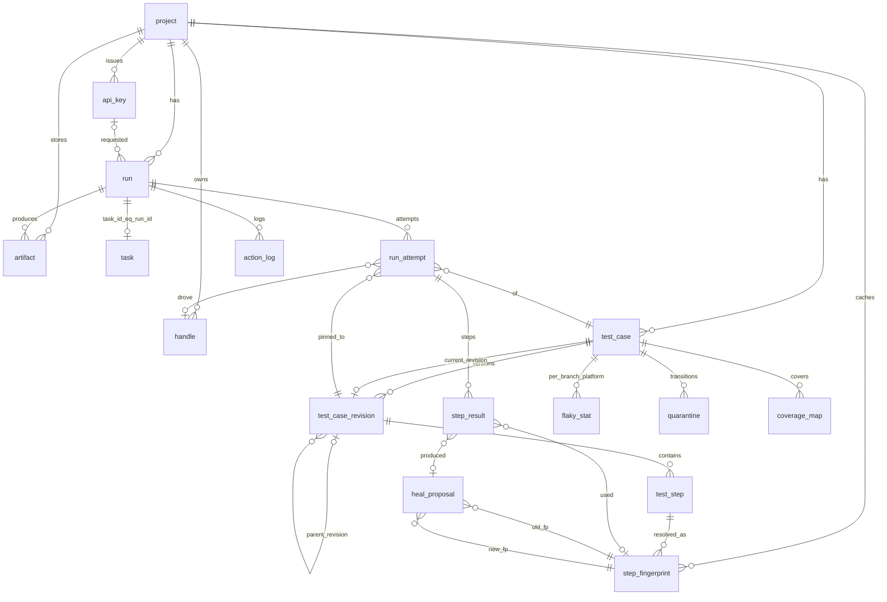

# Data model

QA Brain persists everything the LLM cannot remember between calls: what was executed (`action_log`), which runs and attempts happened (`run`, `run_attempt`, `step_result`), the intent-level tests and their immutable revisions (`test_case`, `test_case_revision`, `test_step`), the multi-signal locator cache that makes replay LLM-free (`step_fingerprint`), and the review queue for healing (`heal_proposal`). The schema is defined once in TypeScript with [Drizzle ORM](https://orm.drizzle.team/docs/overview) 0.45.2 and compiled into two dialects: SQLite through `@libsql/client` 0.17.4 for local stdio mode and PostgreSQL 18 through `pg` 8.23.0 for hosted mode. This document catalogues all 17 tables, the JSON shapes inside them, the migration strategy, and retention rules. The algorithms that read and write these tables are in [self-healing](./self-healing.md), [impact analysis](./impact-analysis.md), and [flaky and quarantine](./flaky-and-quarantine.md); the runtime that produces `action_log` rows is in [ARCHITECTURE.md](../ARCHITECTURE.md); the storage decision is [ADR-0006](./adr/0006-store-sqlite-local-postgres-hosted-drizzle.md).

## 1. Conventions

| Concern | Rule | SQLite (`@libsql/client`) | PostgreSQL 18 (`pg`) |
|---|---|---|---|
| Primary keys | UUIDv7 ([RFC 9562](https://www.rfc-editor.org/rfc/rfc9562)), **generated in the application** with the `uuidv7` 1.2.1 package so both dialects behave identically and ids sort by creation time | `text` (36-char lowercase) | `uuid`, plus `DEFAULT uuidv7()` as a safety net ([PostgreSQL 18 ships `uuidv7()` natively](https://www.postgresql.org/about/news/postgresql-18-released-3142/)) |
| Handles | `<kind>_<uuidv7>` text keys minted by the gateway (`rn_`, `bh_`, `dh_`, `sn_`, `lk_`), never bare UUIDs, so a handle is self-describing in logs | `text` PK | `text` PK |
| Timestamps (`ts`) | UTC, millisecond precision | `integer` epoch milliseconds (`integer({ mode: 'timestamp_ms' })`) | `timestamptz` |
| JSON (`json`) | Stable key order when the value feeds a hash | `text` with Drizzle `{ mode: 'json' }` | `jsonb` |
| Arrays | Always `json`, never dialect-specific array types | `text` JSON | `jsonb` (not `text[]`) |
| Enums | One exported `const` tuple per enum in `packages/store/src/schema/enums.ts`, shared by both dialect files and by the zod schemas in `packages/core` | `text({ enum })` + `CHECK (col IN (...))` | `pgEnum` |
| Booleans | | `integer({ mode: 'boolean' })` | `boolean` |
| Large counters | | `integer` | `bigint` |
| Partial indexes | Used for "active" rows | `CREATE INDEX … WHERE` via Drizzle `.where()` | same |
| Naming | `snake_case` tables and columns, singular table names, `<table>_<cols>_idx` / `_uq` index names; TypeScript properties are `camelCase` | | |
| Foreign keys | Declared in both dialects; `PRAGMA foreign_keys=ON` is set per libsql connection | | |
| Soft delete | Only `test_case.deleted_at`; everything else is append-only or hard-deleted by retention jobs | | |

Per-connection SQLite pragmas set by `sqlite-adapter.ts`: `journal_mode=WAL`, `busy_timeout=5000`, `foreign_keys=ON`, `synchronous=NORMAL`. The default local URL is `file:./.qa-brain/qa-brain.db` (config keys `store.driver: 'sqlite' | 'pg'`, `store.url`).

Scoring, similarity, and selection logic always runs in TypeScript over loaded rows. JSON path predicates such as `signals->>'testid'` are PostgreSQL-only pre-filters; the SQLite code paths load candidates by `step_key`/`platform` and filter in memory.

## 2. Entity-relationship diagram



## 3. Table catalogue

Column lists use the abbreviations from §1 (`id` = UUIDv7 PK unless stated, `ts`, `json`, `enum(...)`). `fk` marks a foreign key; `?` marks nullable. All `created_at` columns are set by the application at insert time.

### 3.1 Tenancy and access

**`project`** — one row per repository/team. Local mode seeds a single project with slug `local`.

| Column | Type | Notes |
|---|---|---|
| id | id | |
| slug | text | `uq(slug)`; `^[a-z0-9][a-z0-9-]{0,62}$` |
| name | text | |
| repo_url | text? | |
| default_branch | text | default `main`; flaky statistics are computed on this branch only |
| settings | json | `{ tracked_globs, smoke_tags, retries, thresholds, isolateCacheByEnvironment, max_changed_files }` |
| created_at | ts | |

**`api_key`** — hosted-mode credentials (`qab_<keyid>_<secret>`, printed once; see [security threat model](./security-threat-model.md)).

| Column | Type | Notes |
|---|---|---|
| id | id | |
| project_id | fk? → project | `NULL` = org-wide key |
| name | text | |
| prefix | text | first 8 characters of the key; `uq(prefix)` |
| key_hash | text | argon2id |
| scopes | json | string array, e.g. `["runs:write","tests:read"]` |
| created_by | text | |
| last_used_at, expires_at, revoked_at | ts? | |
| created_at | ts | |

Indexes: `api_key_project_idx (project_id) WHERE revoked_at IS NULL`.

**`handle`** — server-minted cross-call state ([ADR-0005](./adr/0005-server-minted-handles-not-sessions.md)). The 2026-07-28 MCP revision has no sessions, so every run, browser, device, or snapshot reference is an ordinary argument that the gateway validates against this table.

| Column | Type | Notes |
|---|---|---|
| id | text PK | `<kind>_<uuidv7>`, e.g. `rn_0198f3a0-…` |
| project_id | fk → project | |
| kind | enum(`run`,`browser`,`device`,`snapshot`,`lock`) | prefix `rn_`, `bh_`, `dh_`, `sn_`, `lk_` |
| owner | text | principal that minted it: `api_key.id` in hosted mode, `local` on stdio; checked on every resolve |
| upstream_ref | text? | Playwright context id or Appium `sessionId` |
| platform | enum(`web`,`android`,`ios`)? | |
| state | json? | kind-specific payload (`run`: `{ name, meta }`) |
| ttl_s | integer | `run` = 86400 (24 h), `browser`/`device` = 1800 idle, `snapshot` = 600, `lock` = 300 |
| expires_at | ts | |
| last_used_at, revoked_at | ts? | |
| created_at | ts | |

Indexes: `handle_expires_idx (expires_at) WHERE revoked_at IS NULL` (the sweeper runs every 5 min), `handle_owner_idx (owner)`.

### 3.2 Tests and revisions

**`test_case`** — the stable identity of a test; content lives in revisions.

| Column | Type | Notes |
|---|---|---|
| id | id | |
| project_id | fk → project | |
| key | text | the YAML `id:` (e.g. `checkout/add-to-cart`); `uq(project_id, key)` |
| path | text | repo-relative file path (`tests/checkout/add-to-cart.test.yaml`) |
| current_revision_id | fk? → test_case_revision | |
| owners, tags, platforms | json | string arrays |
| status | enum(`active`,`quarantined`,`disabled`,`attempt_to_fix`,`fixed`) | current state; transitions are logged in `quarantine` |
| first_seen_run_id | fk? → run | |
| last_run_at, deleted_at | ts? | |
| created_at | ts | |

Indexes: `test_case_project_status_idx (project_id, status)`.

**`test_case_revision`** — append-only. Rows are never updated or deleted; a content change inserts a new row and moves `test_case.current_revision_id`.

| Column | Type | Notes |
|---|---|---|
| id | id | |
| test_case_id | fk → test_case | |
| parent_revision_id | fk? → test_case_revision | |
| content_hash | text | sha256 of the canonical YAML with modules inlined; `uq(test_case_id, content_hash)` |
| content | json | parsed, module-resolved document ([test format](./test-format.md)) |
| source_text | text | the file as committed |
| module_hashes | json | `{ "auth/login": "<sha256>" }`; editing a module therefore creates a new revision of every test that uses it |
| git_sha, author | text? | |
| created_at | ts | |

Indexes: `test_case_revision_case_created_idx (test_case_id, created_at DESC)`.

**`test_step`** — one row per resolved step of a revision (module steps are expanded).

| Column | Type | Notes |
|---|---|---|
| id | id | |
| revision_id | fk → test_case_revision | |
| ordinal | integer | 0-based; `uq(revision_id, ordinal)` |
| step_key | text | platform- and environment-independent key (see [test format §6](./test-format.md#6-canonicalization-and-cache-keys)) |
| kind | enum(`navigate`,`act`,`assert`,`module`,`wait`,`data`) | |
| intent | text | natural-language text (after canonicalization of `${…}` references) |
| params | json | structured fields: `target`, `expect`, `with`, `set`, … |
| flags | json | `{ heal, cache, timeout, negative, only, skip }` |
| module_ref | text? | `auth/login` when the step came from a module |
| platform_overlays | json? | `{ android: {...}, ios: {...} }` |

Indexes: `test_step_key_idx (step_key)`.

### 3.3 Locator cache

**`step_fingerprint`** — the sidecar cache: every successful resolution of a step target on a platform stores the multi-signal fingerprint and the stable locator that `browser_generate_locator` returned. Snapshot refs (`[ref=e12]`) are never stored because they are per-snapshot and go stale ([Playwright MCP ref semantics](https://github.com/microsoft/playwright-mcp)).

| Column | Type | Notes |
|---|---|---|
| id | id | |
| project_id | fk → project | |
| step_key | text | |
| platform | enum(`web`,`android`,`ios`) | |
| cache_key | text | sha256, see [test format §6](./test-format.md#6-canonicalization-and-cache-keys) |
| signals | json | §4 below |
| locator | text | Playwright locator string, or Appium `strategy=selector` |
| locator_strategy | enum(`role`,`testid`,`id`,`label`,`text`,`css`,`xpath`,`accessibility_id`,`resource_id`,`class_chain`,`predicate`) | |
| region_hash | text | sha256 of the accessibility subtree (±2 levels, texts and roles only) around the target; validated against the live snapshot before a HIT is replayed, following [Stagehand's drift check](https://www.browserbase.com/blog/stagehand-caching) |
| crop_artifact_id | fk? → artifact | screenshot crop used by the T3 pHash tier |
| captured_at_run_id | fk → run | |
| verified_passes | integer | default 0 |
| status | enum(`active`,`superseded`,`rejected`) | |
| last_hit_at | ts? | |
| created_at | ts | |

Indexes: `step_fingerprint_active_uq (project_id, cache_key) WHERE status = 'active'` (at most one live entry per key), `step_fingerprint_step_platform_idx (step_key, platform)`, `step_fingerprint_status_idx (status)`. `rejected` rows are kept forever: the T1 scorer excludes any candidate equal to a rejected fingerprint, which is the "skip incorrect healings" feedback loop from [Healenium 2.1.9](https://api.github.com/repos/healenium/healenium/releases?per_page=3).

### 3.4 Runs and results

**`run`** — one invocation of the runner (`qa_run_start`/`qa_run_finish` in M0; `qa_run_suite` from M2).

| Column | Type | Notes |
|---|---|---|
| id | id | the `run_id` handle is `rn_` + this id |
| project_id | fk → project | |
| trigger | enum(`manual`,`ci`,`schedule`,`tia`,`burn_in`,`attempt_to_fix`) | |
| selection | json? | requested keys/tags or the TIA output |
| git_sha, branch, base_sha | text? | |
| platforms | json | e.g. `["web"]` |
| status | enum(`queued`,`running`,`passed`,`failed`,`cancelled`,`error`) | `error` = infrastructure only |
| infra_outage | boolean | default false; set by error-signature clustering |
| idempotency_key | text? | `uq(project_id, idempotency_key)`; a repeated `qa_run_suite` returns the existing run |
| requested_by_api_key_id | fk? → api_key | |
| task_id | text? fk → task | |
| started_at, finished_at | ts? | |
| summary | json? | `{ attempts, passed, failed, flaky, healed, quarantined, tokens_in, tokens_out, cost_usd }` |
| created_at | ts | |

Indexes: `run_project_branch_created_idx (project_id, branch, created_at DESC)`, `run_git_sha_idx (git_sha)`.

**`run_attempt`** — every execution of a test inside a run, including retries. Recording every attempt rather than the final status is what makes passed-on-retry detection possible ([Playwright `outcome()` semantics](https://playwright.dev/docs/api/class-testcase)).

| Column | Type | Notes |
|---|---|---|
| id | id | |
| run_id | fk → run | |
| test_case_id | fk → test_case | |
| revision_id | fk → test_case_revision | |
| platform | enum(`web`,`android`,`ios`) | |
| attempt_no | integer | 0-based; `uq(run_id, test_case_id, platform, attempt_no)` |
| branch, git_sha | text? | denormalized for the flaky query |
| status | enum(`pending`,`running`,`passed`,`failed`,`timed_out`,`error`,`cancelled`,`skipped`) | |
| outcome | enum(`expected`,`unexpected`,`flaky`,`skipped`,`unmapped`)? | set on the final attempt only |
| failure_category | enum(`infra`,`runtime_error`,`test_data`,`interaction_change`,`timing`,`selector`,`visual`)? | [QA Wolf's taxonomy](https://www.qawolf.com/blog/self-healing-test-automation-types) plus `infra` |
| error_signature | text? | `sha1(category \| tool \| normalized first error line)[0:12]` |
| handle_id | fk? → handle | browser/device handle used |
| heals_used, transient_steps_used | integer | guardrail counters (≤ 6 and ≤ 3 per attempt) |
| duration_ms | integer? | |
| started_at, finished_at | ts? | |

Indexes: `run_attempt_case_branch_platform_idx (test_case_id, branch, platform, started_at DESC)`, `run_attempt_run_signature_idx (run_id, error_signature)`.

**`step_result`** — per-step outcome inside an attempt.

| Column | Type | Notes |
|---|---|---|
| id | id | |
| attempt_id | fk → run_attempt | |
| step_id | fk → test_step | |
| ordinal | integer | `uq(attempt_id, ordinal)` |
| status | enum(`passed`,`failed`,`skipped`,`healed`,`unmapped`) | |
| cache_status | enum(`HIT`,`MISS`,`HEALED`,`BYPASS`) | |
| fingerprint_id | fk? → step_fingerprint | |
| heal_proposal_id | fk? → heal_proposal | |
| oracle | enum(`structured`,`llm`,`none`) | how an `assert` was judged |
| failure_category, error_signature, error_message | as above; message ≤ 1 KiB | |
| snapshot_artifact_id, screenshot_artifact_id | fk? → artifact | |
| llm_model | text? | |
| llm_tokens_in, llm_tokens_out | integer? | zero on a HIT |
| duration_ms | integer? | |
| started_at | ts | |

Indexes: `step_result_fingerprint_idx (fingerprint_id)`, `step_result_step_status_idx (step_id, status)`.

**`artifact`** — metadata only; bytes live on the filesystem (`artifacts.driver: 'fs'`) or an S3-compatible bucket (`'s3'`, see [ADR-0008](./adr/0008-artifacts-on-s3-compatible-storage.md)).

| Column | Type | Notes |
|---|---|---|
| id | id | |
| project_id | fk → project | |
| run_id, attempt_id | fk? | |
| kind | enum(`screenshot`,`crop`,`snapshot`,`trace`,`video`,`har`,`console`,`log`,`diff`,`yaml_patch`) | |
| bucket, key | text | `uq(bucket, key)` |
| sha256 | text | content hash; `artifact_sha256_idx` enables dedup |
| content_type | text | |
| bytes | bigint / integer | |
| expires_at | ts? | |
| created_at | ts | |

Indexes: `artifact_run_kind_idx (run_id, kind)`.

### 3.5 Audit

**`action_log`** — one row per `tools/call` that passes through the router, native or proxied. Values are redacted before the row is written; result bodies are never stored here. Columns are exactly those the M0 gateway writes.

| Column | Type | Notes |
|---|---|---|
| id | id | |
| ts_start | ts | |
| duration_ms | integer | |
| run_id | fk? → run | from `_meta["in.qabrain/runId"]` or a `run_id` argument |
| transport | enum(`stdio`,`http`) | |
| protocol_era | enum(`modern`,`legacy`) | `modern` = 2026-07-28 wire, `legacy` = 2025-11-25 handshake |
| principal | text? | bearer subject in hosted mode, `local` on stdio |
| upstream | text | `playwright`, later `appium`; `native` for `qa_*` |
| tool | text | public name, e.g. `web_click` |
| upstream_tool | text | e.g. `browser_click`; equals `tool` for natives |
| args_shape | json | keys and JSON types only: `{"target":"string","element":"string"}` |
| args_redacted | json? | values with secrets masked; `NULL` when `log.argsMode` is `shape` or `none` |
| args_hash | text | sha256 of canonical JSON of the raw arguments |
| is_error | boolean | |
| error_code | text? | `timeout`, `cancelled`, `upstream_unavailable`, `protocol_error`, `tool_error`, `blocked` |
| error_message | text? | ≤ 1 KiB |
| result_chars | integer | serialized size before the `maxResultChars` cap |
| result_kinds | text | comma-joined content types, e.g. `text,image` |
| result_digest | text | sha256 of the content array |
| traceparent | text? | W3C; see [observability](./observability.md) |
| client_name | text? | from `_meta` client info or the legacy `initialize` |

Indexes: `action_log_run_ts_idx (run_id, ts_start)`, `action_log_ts_idx (ts_start)`. Nullable `attempt_id`, `step_result_id`, and `handle_id` columns are added by an M2 migration when the runner starts correlating calls to steps; they are not in the M0 DDL.

### 3.6 Healing, flakiness, quarantine, impact

**`heal_proposal`** — healing never edits a test; it produces a reviewable proposal ([ADR-0009](./adr/0009-self-healing-as-tiered-proposals-with-approval.md), [self-healing](./self-healing.md)).

| Column | Type | Notes |
|---|---|---|
| id | id | |
| project_id, test_case_id, step_id, revision_id, run_id, attempt_id | fk | |
| kind | enum(`locator`,`timing`,`interaction`,`intent_text`) | `intent_text` proposals on `assert` steps are rejected at creation |
| tier | enum(`T0`,`T1`,`T2`,`T3`) | |
| old_fingerprint_id, new_fingerprint_id | fk → step_fingerprint | `uq(step_id, new_fingerprint_id)` — the same target is never re-proposed |
| score, margin | real | T1 similarity of the winner and `top − second` |
| candidates | json | top-k with per-attribute scores |
| evidence | json | `{ before_artifact_id, after_artifact_id, snapshot_excerpt_artifact_id, llm_rationale, verify_tool, verify_result }` |
| yaml_patch | text? | unified diff; `NULL` for `locator` proposals |
| status | enum(`proposed`,`auto_approved`,`approved`,`rejected`,`superseded`,`expired`) | |
| consecutive_passes | integer | auto-approve requires ≥ 3 on ≥ 2 distinct SHAs with `tier ∈ {T0,T1}`, `score ≥ 0.8`, `margin ≥ 0.1` |
| decided_by, feedback_reason | text? | |
| decided_at | ts? | |
| created_at | ts | |

Indexes: `heal_proposal_project_status_idx (project_id, status)`.

**`flaky_stat`** — rolling window per (test, branch, platform), maintained after every final attempt on `project.default_branch` and skipped when `run.infra_outage` is true.

| Column | Type | Notes |
|---|---|---|
| id | id | |
| project_id, test_case_id | fk | `uq(test_case_id, branch, platform)` |
| branch | text | |
| platform | enum | |
| window_size | integer | default 20 |
| executions, transitions | integer | |
| transition_score | real | `transitions / window_size`; alarm ≥ 0.3, recover ≤ 0.05 ([Buildkite transition monitor](https://buildkite.com/docs/pipelines/configure/tests/workflows/monitors)) |
| last_outcomes | text | e.g. `PPFPPPFP`, newest last, capped at `window_size` |
| passed_on_retry_shas | json | SHAs where the test both failed and passed |
| is_flaky, is_new | boolean | |
| burn_in_remaining | integer | starts at 10 for unknown tests ([Datadog Early Flake Detection](https://docs.datadoghq.com/tests/flaky_test_management/early_flake_detection/)) |
| alarmed_at, recovered_at | ts? | |
| updated_at | ts | |

**`quarantine`** — append-only transition log; `test_case.status` is the materialized current state.

| Column | Type | Notes |
|---|---|---|
| id | id | |
| project_id, test_case_id | fk | |
| state | enum (same values as `test_case.status`) | |
| previous_state | enum? | |
| reason | enum(`flaky_alarm`,`new_test_flaky`,`manual`,`broken_dependency`,`attempt_to_fix_passed`,`auto_unquarantine`,`grace_expired`) | |
| owner, issue_url | text? | `CHECK (state NOT IN ('quarantined','disabled') OR (owner IS NOT NULL AND issue_url IS NOT NULL))` |
| exit_criteria | json | default `{ "passes": 100, "days": 7 }` |
| consecutive_passes | integer | |
| fix_sha | text? | |
| grace_until | ts? | 14 days after `attempt_to_fix_passed` ([Datadog flaky management](https://docs.datadoghq.com/tests/flaky_management/)) |
| created_by | text | |
| created_at | ts | |

Indexes: `quarantine_case_created_idx (test_case_id, created_at DESC)`.

**`coverage_map`** — what each test touches, feeding the TIA union ([impact analysis](./impact-analysis.md)).

| Column | Type | Notes |
|---|---|---|
| id | id | |
| project_id, test_case_id | fk | |
| platform | enum | |
| kind | enum(`spec_file`,`app_file`,`route`,`url`,`api_route`,`component`) | |
| target | text | path, route pattern (`/orders/:id`), or URL |
| checksum | text? | file checksum at capture time (Ekstazi-style staleness) |
| source | enum(`static_graph`,`istanbul`,`v8`,`router`,`network_log`) | |
| captured_run_id | fk → run | |
| captured_at | ts | |
| expires_at | ts | 14 days after capture |

Indexes: `coverage_map_uq (test_case_id, platform, kind, target)`, `coverage_map_project_kind_target_idx (project_id, kind, target)`.

**`task`** — the [MCP Tasks extension](https://modelcontextprotocol.io/extensions/tasks/overview.md) view of long-running work. For `run_suite` tasks `task.id` equals `run.id`, so `taskId` in `CreateTaskResult` is the run id.

| Column | Type | Notes |
|---|---|---|
| id | text PK | |
| project_id | fk → project | |
| kind | enum(`run_suite`,`heal_batch`,`visual_batch`,`tia_select`) | |
| status | enum(`working`,`input_required`,`completed`,`failed`,`cancelled`) | |
| progress | json | `{ done, total, message }` |
| result, error, input_request | json? | |
| ttl_ms | integer | default 86400000 |
| poll_interval_ms | integer | default 2000 |
| created_by_api_key_id | fk? → api_key | |
| created_at, updated_at, expires_at | ts | |

Indexes: `task_status_expires_idx (status, expires_at)`.

## 4. `step_fingerprint.signals`

One JSON object per fingerprint, discriminated by the row's `platform`. The field set is the union of what [Similo++](https://link.springer.com/article/10.1007/s10664-026-10903-6), [Healenium](https://github.com/healenium/healenium-web/blob/master/src/main/java/com/epam/healenium/service/HealingService.java), and [mabl](https://help.mabl.com/hc/en-us/articles/19078583792404-How-auto-heal-works) capture; the T1 weights per field are listed in [self-healing](./self-healing.md). Missing fields are omitted, not written as `null`, because the scorer normalizes over fields present in the stored fingerprint.

```jsonc
{
  // web (platform = "web")
  "role": "button",                 // ARIA role from the snapshot
  "name": "Add to cart",            // accessible name
  "testid": "atc-btn",              // value of --test-id-attribute (default data-testid)
  "html_id": "add-to-cart",
  "name_attr": "add",               // <input name=…>
  "type": "submit",
  "aria_label": "Add to cart",
  "placeholder": null,
  "text": "Add to cart",            // visible text, trimmed
  "tag": "button",
  "classes": ["btn", "btn-primary"],
  "href": null,
  "css": "form#cart button.btn-primary",
  "xpath_id_rel": "//*[@id='cart']/div[2]/button[1]",
  "ancestor_path": ["html", "body", "main", "form#cart", "div.actions"],   // root → parent
  "neighbor_texts": ["Qty", "Blue hoodie", "$49.00"],                    // ≤ 6 nearest visible texts
  "bbox_norm": { "x": 0.61, "y": 0.42, "w": 0.12, "h": 0.04 },           // ÷ viewport
  "area_norm": 0.0048,
  "phash": "c3e1f0a5b2d49e17",       // 64-bit DCT pHash of the crop, hex
  "url": "https://shop.example.com/p/blue-hoodie",
  "title": "Blue hoodie – Example Shop",
  "viewport": { "w": 1280, "h": 720 },
  "captured_with": "playwright-mcp/1.62.1"
}
```

Mobile fingerprints (`platform = "android" | "ios"`) reuse `role`, `name`, `text`, `ancestor_path`, `neighbor_texts`, `bbox_norm`, `area_norm`, `phash`, and add:

```jsonc
{
  "accessibility_id": "add_to_cart",   // content-desc (Android) / accessibility id (iOS)
  "resource_id": "com.example.shop:id/btn_add",
  "class_name": "android.widget.Button",
  "xcui_type": null,                    // XCUIElementTypeButton on iOS
  "label": "Add to cart",
  "value": null,
  "content_desc": "Add to cart",
  "index": 2,                           // index among siblings in page source
  "bounds_norm": { "x": 0.58, "y": 0.81, "w": 0.36, "h": 0.06 },
  "synthesized_ref": "m14",             // ref minted by QA Brain from page-source XML
  "captured_with": "appium-mcp/1.92.4"
}
```

The cross-platform canonical key `role | canon(name)` maps to `content-desc` → `resource-id` → `text` on Android and `accessibility id` → `label` on iOS; when no mapping resolves, the step is recorded as `unmapped`, never matched by text alone.

## 5. Migrations

Schema source lives in `packages/store/src/schema/{enums,columns}.ts` (shared) and `packages/store/src/schema/{sqlite,pg}/*.ts` (one file per table group per dialect). Two [drizzle-kit](https://orm.drizzle.team/docs/kit-overview) 0.31.10 configs generate SQL:

```ts
// packages/store/drizzle.config.sqlite.ts
export default { dialect: 'sqlite', schema: './src/schema/sqlite/index.ts', out: './migrations/sqlite',
  dbCredentials: { url: process.env.QA_BRAIN_DB_URL ?? 'file:./.qa-brain/qa-brain.db' } };
// packages/store/drizzle.config.pg.ts
export default { dialect: 'postgresql', schema: './src/schema/pg/index.ts', out: './migrations/pg',
  dbCredentials: { url: process.env.QA_BRAIN_DB_URL! } };
```

| Mode | How migrations are applied | Driver |
|---|---|---|
| stdio (local) | `SqliteAdapter.migrate()` runs `migrate(db, { migrationsFolder })` from `drizzle-orm/libsql/migrator` at startup; a fresh `.qa-brain/qa-brain.db` is created on first `qa-brain serve`. `qa-brain doctor` reports pending migrations. | `@libsql/client` 0.17.4 (pure JS/WASM, no native build step — the reason `better-sqlite3` was not used) |
| HTTP (hosted) | Never on boot. `qa-brain db migrate` runs `drizzle-orm/node-postgres/migrator` as a one-shot Compose service; `qa-brain` and `worker` start only after it completes (`depends_on: condition: service_completed_successfully`, see [deployment](./deployment.md)) | `pg` 8.23.0 |

Rules: migrations are committed SQL files (`migrations/<dialect>/0000_*.sql` plus `meta/_journal.json`), generated by `pnpm --filter @qa-brain/store drizzle:generate:<dialect>` and never hand-edited after merge; a schema change is one PR touching both dialect files and both migration folders. CI applies the SQLite migrations to a temp file on ubuntu and windows and, from M5, the PG migrations to a `postgres:18` service container. The conformance test `packages/store/test/schema-conformance.test.ts` walks both dialect exports with Drizzle's `getTableName`/`getTableColumns` and fails if any table or column exists in one dialect only, or if an enum tuple differs from `enums.ts`.

## 6. Retention and partitioning

| Data | Local default | Hosted default | Mechanism |
|---|---|---|---|
| `action_log` | 30 days | 90 days | PG: monthly `PARTITION BY RANGE (ts_start)`, old partitions dropped by `qa-brain db prune`; SQLite: batched `DELETE … WHERE ts_start < ?` in the 5-minute sweeper |
| `artifact` bytes | 14 days | 30-day bucket lifecycle rule | `expires_at` + object-store lifecycle; rows pruned weekly |
| `handle`, `task` | `expires_at` | same | sweeper every 5 min |
| `run`, `run_attempt`, `step_result` | kept | kept | explicit `qa-brain db prune --runs-older-than` only |
| `test_case_revision`, `quarantine`, rejected `step_fingerprint` rows | never deleted | never deleted | append-only by design |
| `coverage_map` | 14 days | 14 days | `expires_at`; the nightly full run rewrites rows |

Partitioning is PostgreSQL-only. drizzle-kit does not emit partitioned DDL, so the `action_log` partition parent and first partitions arrive as a custom migration (`drizzle-kit generate --custom`) in M5; a worker cron job creates next month's partition, and the PG primary key becomes `(id, ts_start)` to satisfy the partition-key rule ([PostgreSQL partitioning](https://www.postgresql.org/docs/18/ddl-partitioning.html)). Design decision: in M0 `action_log` is a plain table in both dialects.

## 7. M0 scope

All 17 tables ship in this PR with migrations for both dialects and the conformance test, because adding a table later costs a migration while having it now costs nothing. Only three are read or written by M0 code:

| Table | M0 writer / reader | Exercised by |
|---|---|---|
| `action_log` | `packages/gateway/src/log/action-log.ts` writes one row per `tools/call`; `qa_run_log` reads by `run_id` | smoke test asserts rows for `web_navigate`, `web_snapshot`, `web_click` with `upstream='playwright'`, `is_error=0`, `args_shape.url='string'` |
| `run` | `qa_run_start` inserts (`trigger='manual'`, `status='running'`); `qa_run_finish` sets status/summary | unit + smoke |
| `handle` | `HandleStore.mint('run', owner, 86400000)` for `rn_` handles; `resolve` on every `qa_run_*` call; sweeper | unit tests for TTL expiry and owner mismatch |

`project` is seeded with slug `local` by the SQLite adapter so foreign keys hold; `api_key` stays empty in stdio mode. The remaining tables are created but untouched until M1 (`test_case*`), M2 (`step_fingerprint`, `run_attempt`, `step_result`, `artifact`), M3 (`heal_proposal`, `flaky_stat`), M4 (`coverage_map`), M5 (`api_key`, `task`), and M6 (`quarantine`) per the [roadmap](./roadmap.md). The PostgreSQL schema compiles and its migrations are generated in M0; CI runs them against a live database from M5.
