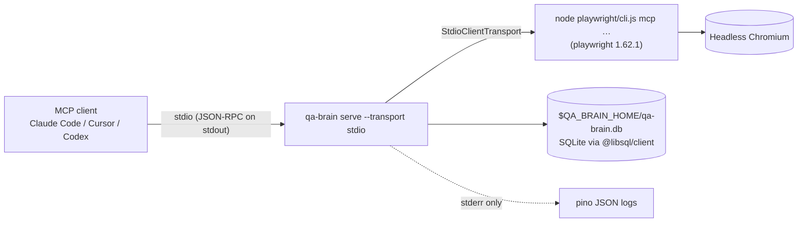
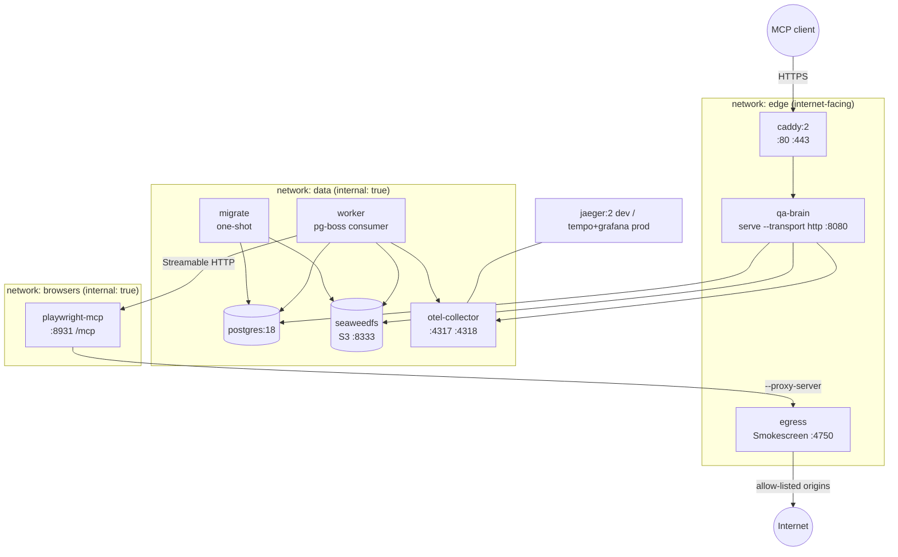

# Deployment

QA Brain runs in two shapes that share one binary and one configuration schema. **Local mode** is a stdio MCP server spawned by an IDE or CLI agent: it keeps its state in a SQLite file under `QA_BRAIN_HOME`, launches Playwright MCP as an in-process child, and opens no network listener. **Hosted mode** is a Docker Compose stack for a single team: the gateway serves Streamable HTTP behind Caddy, a worker consumes a Postgres-backed queue, browsers run in a hardened sidecar built from the official Playwright image, and every outbound byte from a browser passes through an allow-listing egress proxy. This document describes both shapes, the per-service hardening, secrets handling, migrations, and the single-VM production checklist. Ports, flags, and image names below are the ones committed under `deploy/` and `docker/`.

> **M0 status (2026-08-20).** The files under `deploy/` (`docker-compose.yml`, `docker-compose.dev.yml`, `docker-compose.prod.yml`, `.env.example`, `qa-brain.yaml`, `otel/collector.yaml`, `egress/acl.yaml`, `Caddyfile`) and `docker/` (`qa-brain.Dockerfile`, `browser.Dockerfile`, `egress/Dockerfile`, `seccomp_profile.json`) are shipped in this PR as **design artifacts**. The two application Dockerfiles are built (without push) by the `docker-build` job in `ci.yml`, but nothing here is wired to code yet: the M0 scaffold implements local stdio mode plus an HTTP handler that is unit-tested in-process. The `worker` command, Postgres/pg-boss wiring, SeaweedFS artifacts, API keys, and the hosted HTTP server arrive in **M5 (Feb 2027)**; see the [roadmap](./roadmap.md). Everything in section 2, "Local stdio mode", is implemented and exercised by `pnpm smoke`.

## 1. Two modes, one binary

| | Local (stdio) | Hosted (Compose) |
|---|---|---|
| Entry point | `qa-brain serve --transport stdio` | `qa-brain serve --transport http --host 0.0.0.0 --port 8080` + `qa-brain worker` |
| Clients | Claude Code, Cursor, Codex, Claude Desktop (see [client setup](./client-setup.md)) | Same clients over HTTPS with a bearer API key; CI jobs |
| Store | SQLite via `@libsql/client` 0.17.4 (`drizzle-orm/libsql`) | `postgres:18` via `pg` 8.23.0 |
| Queue | none (calls are synchronous) | pg-boss 12 on the same Postgres ([ADR-0007](./adr/0007-job-queue-pg-boss-on-postgres.md)) |
| Artifacts | filesystem, `$QA_BRAIN_HOME/artifacts` | SeaweedFS S3 bucket `qa-brain-artifacts`, presigned GET ([ADR-0008](./adr/0008-artifacts-on-s3-compatible-storage.md)) |
| Browser | Playwright MCP child process over stdio, spawned by the gateway | `playwright-mcp` sidecar over Streamable HTTP on an internal network |
| Network listener | none | Caddy 443 → qa-brain 8080 |
| Logs | pino JSON on stderr (stdout is the protocol channel) | pino JSON on stdout, rotated by the Docker `json-file` driver |
| Tracing | off (`QA_BRAIN_OTEL_EXPORTER=none`) | OTLP → collector → Jaeger (dev) or Tempo (prod); see [observability](./observability.md) |

Protocol behavior is identical in both modes: the stdio transport uses `serveStdio(factory, { legacy: 'serve' })` and the HTTP transport uses `createMcpHandler(factory, { legacy: 'stateless' })`, so both serve the 2026-07-28 revision and the 2025-11-25 handshake ([ADR-0003](./adr/0003-target-mcp-2026-07-28-dual-era.md)). Because the 2026-07-28 spec removed protocol sessions and the `Mcp-Session-Id` header ([changelog](https://modelcontextprotocol.io/specification/2026-07-28/changelog)), the hosted gateway is stateless per request; cross-call state lives in server-minted handles such as `rn_<uuidv7>` stored in the `handle` table, never in process memory.

## 2. Local stdio mode



### 2.1 `QA_BRAIN_HOME`

All mutable state lives under one directory, `QA_BRAIN_HOME` (default `./.qa-brain`, which is in `.gitignore`):

| Path | Purpose |
|---|---|
| `qa-brain.db` | SQLite database; URL `file:./.qa-brain/qa-brain.db` in `store.url` |
| `artifacts/` | screenshots, traces, snapshots written by native tools (`artifacts.driver: fs`) |
| `pw-out/` | Playwright MCP `--output-dir` (session logs, downloads, screenshots taken by `web_take_screenshot`) |
| `era-cache.json` | negotiated protocol era per upstream, keyed by `sha256(command, args, sorted env keys, adapter version)` |

Migrations run automatically on startup in stdio mode (`drizzle-kit` generated SQL under `packages/store/migrations/sqlite`), so a first run against an empty directory creates all 17 tables ([data model](./data-model.md)). The driver is `@libsql/client`, chosen because `better-sqlite3` 13.0.3 ships no prebuilt binary for Node 24 on Windows and would force every contributor to install Visual Studio build tools ([ADR-0006](./adr/0006-store-sqlite-local-postgres-hosted-drizzle.md)).

### 2.2 The in-process Playwright MCP child

The gateway does not call `npx` and does not depend on `@playwright/mcp` (0.0.79 depends on `playwright@1.63.0-alpha`, which would pull a second browser revision). Instead `@qa-brain/adapter-playwright` depends on `playwright@1.62.1`, resolves the package directory with `require.resolve('playwright/package.json')`, and spawns:

```text
node <playwright pkg dir>/cli.js mcp --headless --isolated --caps=testing \
  --snapshot-mode=full --image-responses=omit --codegen none \
  --output-dir <QA_BRAIN_HOME>/pw-out --timeout-action 5000 --timeout-navigation 30000
```

via `StdioClientTransport({ command: process.execPath, args, env, cwd, stderr: 'pipe' })` from `@modelcontextprotocol/client/stdio`. Spawning `node` directly sidesteps the Windows `.cmd` shim problem (Node ≥ 20 refuses to spawn `.cmd` files without `shell: true`) and guarantees that the MCP server, the browser revision, and the CI runner share one Playwright version. The verified handshake returns `serverInfo {name:"Playwright", version:"1.62.1"}` in about 700 ms and 29 tools with `--caps=testing`; the gateway lists 15 of them as `web_*` by default ([tool catalog](./tool-catalog.md)). `--isolated` keeps the browser profile in memory, and `--image-responses=omit` keeps screenshots out of the LLM context.

Shutdown follows the stdio transport's recommended sequence ([spec](https://modelcontextprotocol.io/specification/2026-07-28/basic/transports/stdio)): close stdin → wait 2 s → `SIGTERM` → wait 3 s → `SIGKILL`; on Windows the supervisor runs `taskkill /PID <pid> /T /F` so the `node → chromium` tree dies with the gateway. The smoke test asserts the child pid is gone after `client.close()`.

### 2.3 No network listener

In stdio mode the process binds no port: there is no `/healthz`, no HTTP MCP endpoint, and no exporter unless `QA_BRAIN_OTEL_EXPORTER=otlp` is set explicitly. `console.log` is rebound to stderr so no stray byte can corrupt the JSON-RPC stream on stdout. The only outbound connections are the ones the browser makes to the application under test. Relevant environment variables:

| Variable | Default | Meaning |
|---|---|---|
| `QA_BRAIN_HOME` | `./.qa-brain` | state directory (section 2.1) |
| `QA_BRAIN_CONFIG` | `./qa-brain.config.json` or `.yaml` | config file; `--config` overrides |
| `QA_BRAIN_LOG_LEVEL` | `info` | pino level; `--log-level` overrides |
| `QA_BRAIN_OTEL_EXPORTER` | `none` | `none` or `otlp` |
| `QA_BRAIN_TOKEN` | unset | bearer token for `--transport http` (local HTTP only; hosted mode uses hashed API keys) |
| `QA_BRAIN_E2E` | unset | `1` enables the `e2e` vitest project (`pnpm smoke`) |

`qa-brain doctor` checks Node ≥ 22.12, the resolved `playwright/cli.js`, that every configured flag appears in `playwright mcp --help`, that Chromium is present in the `ms-playwright` cache, that migrations are applied, and that `QA_BRAIN_HOME` is writable.

### 2.4 Local mode in a container

The browser image (section 4) also runs stdio mode for contributors who do not want Playwright's system dependencies on the host:

```bash
docker run -i --rm --init -v "$PWD/.qa-brain:/data" -e QA_BRAIN_HOME=/data \
  ghcr.io/chinmaydhokey/qa-brain-browser:1.62.1 qa-brain serve --transport stdio
```

`-i` keeps stdin open for JSON-RPC, `--init` gives the container a real PID 1 so Chromium zombies are reaped ([Playwright Docker docs](https://playwright.dev/docs/docker)), and the bind mount persists the SQLite file and artifacts.

## 3. Hosted topology



Three Docker networks enforce the trust boundaries. `edge` carries internet traffic (Caddy, the gateway, and the egress proxy). `data` is `internal: true` and hosts Postgres, SeaweedFS, the collector, the migrator, and the worker. `browsers` is `internal: true` and contains only the worker, the Playwright sidecar, and the egress proxy, so a browser that is prompt-injected into visiting an attacker URL can only reach the internet through Smokescreen's ACL and cannot reach Postgres or the object store at all. This is the network-level control the MCP security guidance asks for ([security best practices](https://modelcontextprotocol.io/docs/2026-07-28/tutorials/security/security_best_practices)); Playwright MCP's own `--allowed-origins`/`--blocked-origins` are explicitly guardrails that ignore redirects ([playwright-mcp#1210](https://github.com/microsoft/playwright-mcp/issues/1210)).

### 3.1 Service table

| Service | Image / command | Networks | Health | Notes |
|---|---|---|---|---|
| `qa-brain` | `ghcr.io/chinmaydhokey/qa-brain:<ver>` (FROM `node:22-bookworm-slim`, user `node`); `qa-brain serve --transport http --host 0.0.0.0 --port 8080 --config /config/qa-brain.yaml` | `edge`, `data` | `GET /healthz` (process up), `GET /readyz` (store ping + queue + every upstream `healthy` or `degraded`; 503 if any `failed`) | no published ports in prod; dev profile publishes `127.0.0.1:8080:8080` |
| `worker` | same image; `qa-brain worker --config /config/qa-brain.yaml` | `data`, `browsers` | `qa-brain worker --healthcheck` (queue heartbeat) | pg-boss consumer; connects to `http://playwright-mcp:8931/mcp`; spawns `appium-mcp` as a stdio child only when a mobile job arrives; `deploy.replicas` scalable |
| `playwright-mcp` | `ghcr.io/chinmaydhokey/qa-brain-browser:1.62.1` (section 4) | `browsers` | `wget -qO- http://127.0.0.1:8931/` (200 or 404 both mean up) | one browser context per connected HTTP client; never `--shared-browser-context` |
| `migrate` | `ghcr.io/chinmaydhokey/qa-brain:<ver>`; `qa-brain db migrate` | `data` | exits 0 | one-shot; section 7 |
| `postgres` | `postgres:18` (digest-pinned); `-c shared_buffers=256MB -c max_connections=100`; `POSTGRES_PASSWORD_FILE=/run/secrets/pg_password` | `data` | `pg_isready -U qa_brain` | volume `pgdata`; `shm_size: 256m`; PG 18 supplies native `uuidv7()` ([release notes](https://www.postgresql.org/about/news/postgresql-18-released-3142/)) though ids are app-generated |
| `seaweedfs` | `chrislusf/seaweedfs:3` (patch + digest pinned); `weed server -s3 -s3.port=8333 -s3.config=/etc/seaweedfs/s3.json -dir=/data -master.volumeSizeLimitMB=1024` | `data` | `wget -qO- http://127.0.0.1:9333/cluster/status` | volume `seaweed`; bucket `qa-brain-artifacts` with a 30-day lifecycle rule created by `qa-brain db migrate`; MinIO CE is no longer published ([background](https://medium.com/@rosgluk/minio-ce-is-effectively-dead-in-2026-heres-what-to-run-instead-2210130445c7)) |
| `egress` | built from `docker/egress/Dockerfile` (Stripe Smokescreen); `--listen-port 4750 --egress-acl-file /etc/smokescreen/acl.yaml` | `browsers`, `edge` | TCP probe 4750 | denies RFC1918, link-local, and `169.254.169.254` by default; resolves DNS at connect time (defeats rebinding); ACL lists allowed application-under-test origins per project |
| `otel-collector` | `otel/opentelemetry-collector-contrib` (tag + digest pinned by Renovate); `--config /etc/otelcol/collector.yaml` | `data` | `GET :13133` (health extension) | receivers OTLP 4317/4318; processors `memory_limiter`, `batch`, `attributes` (drops `gen_ai.tool.call.arguments` unless `QA_BRAIN_TRACE_ARGS=1`); exporters `otlp/jaeger` or `otlp/tempo`, `prometheus :8889` |
| `jaeger` | `jaegertracing/jaeger:2` all-in-one, UI 16686 | `data` | — | profile `dev` only |
| `tempo`, `grafana` | `grafana/tempo:2`, `grafana/grafana:11` | `data` | — | profile `observability` (prod, optional) |
| `caddy` | `caddy:2`; `Caddyfile` reverse-proxies `https://qa.example.com/mcp` → `qa-brain:8080`, passes `X-Accel-Buffering: no` through unchanged, 100 MB request body cap | `edge` | — | profile `prod`; ports 80/443; automatic HTTPS |

The gateway validates the `Host` and `Origin` headers itself (`hostHeaderValidation([...])`, `originValidation([...])` from `@modelcontextprotocol/node`) with the allow-list derived from `QA_BRAIN_PUBLIC_URL`, returning 403 on mismatch as the Streamable HTTP transport requires ([spec](https://modelcontextprotocol.io/specification/2026-07-28/basic/transports/streamable-http)). Caddy terminates TLS only; it does not rewrite MCP headers.

## 4. The browser sidecar

`docker/browser.Dockerfile` starts `FROM mcr.microsoft.com/playwright:v1.62.1-noble`, installs the built `qa-brain` workspace and `playwright@1.62.1` (the same pin as the adapter), and runs as `pwuser`. The official `mcr.microsoft.com/playwright/mcp` image was rejected because it forces `--no-sandbox`, is Chromium-only, and tracks `@playwright/mcp` 0.0.79 and therefore Playwright 1.63-alpha browsers ([Dockerfile](https://github.com/microsoft/playwright-mcp/blob/main/Dockerfile)). Building our own image keeps one Playwright version across the MCP server, the browsers, and the CI runner, and lets Chromium keep its sandbox because the container runs as a non-root user with the seccomp profile Playwright documents for untrusted sites ([Playwright Docker docs](https://playwright.dev/docs/docker)).

Command line for the sidecar (every flag verified against `playwright mcp --help` in 1.62.1):

```text
playwright mcp --headless --browser chromium --isolated \
  --port 8931 --host 0.0.0.0 --allowed-hosts playwright-mcp \
  --caps=testing --snapshot-mode=full --image-responses=omit --codegen none \
  --output-dir /artifacts --output-max-size 524288000 --save-session \
  --secrets /run/secrets/aut_secrets --proxy-server http://egress:4750 \
  --timeout-action 5000 --timeout-navigation 30000 --timeout-settle 500
```

Environment: `PLAYWRIGHT_MCP_PING_TIMEOUT_MS=60000`. Playwright MCP's HTTP mode sends a server-initiated ping and closes the session after 5 s without an answer, which surfaces as `Session not found` during any tool call longer than the heartbeat; since 0.0.77 this variable overrides the timeout and `0` disables it ([microsoft/playwright#41391](https://github.com/microsoft/playwright/pull/41391)). 60 s matches the gateway's `server.callTimeoutMs`. `--allowed-hosts playwright-mcp` is the sidecar's own DNS-rebinding guard (the worker addresses it by service name), `--secrets` points at a Compose secret file so application credentials never appear in argv or tool output, and `--output-max-size` (500 MiB) makes Playwright evict old files from `/artifacts` before the volume fills.

Container-level settings for `playwright-mcp`:

```yaml
playwright-mcp:
  image: ghcr.io/chinmaydhokey/qa-brain-browser:1.62.1
  init: true
  ipc: host                     # Playwright docs: avoids Chromium OOM in shared memory
  user: pwuser
  read_only: true
  tmpfs: ["/tmp:size=1g", "/home/pwuser/.cache"]
  volumes: ["artifacts:/artifacts"]
  cap_drop: [ALL]
  security_opt: ["seccomp=./docker/seccomp_profile.json", "no-new-privileges:true"]
  mem_limit: 2g
  cpus: 2
  networks: [browsers]
  secrets: [aut_secrets]
```

`docker/seccomp_profile.json` is Docker's default profile plus the `clone`/`unshare` user-namespace syscalls that Chromium's sandbox needs. `ipc: host` is the documented default for Playwright containers; swap it for `shm_size: 2g` when more than one tenant shares the VM. gVisor `runsc` or Kata is the upgrade path for multi-tenant hosting, out of scope here.

## 5. Hardening, health, restart, and log rotation

Every service gets the same baseline, expressed once as a YAML anchor in `deploy/docker-compose.yml`:

```yaml
x-hardened: &hardened
  init: true
  read_only: true
  tmpfs: ["/tmp"]
  cap_drop: [ALL]
  security_opt: ["no-new-privileges:true"]
  restart: unless-stopped
  logging:
    driver: json-file
    options: { max-size: "10m", max-file: "3" }
```

| Service | Deviations from the baseline |
|---|---|
| `qa-brain` | `mem_limit: 1g`, `cpus: 1`; `healthcheck: wget -qO- http://127.0.0.1:8080/healthz` every 30 s, 5 s timeout, 3 retries, 20 s start period; `depends_on: migrate: condition: service_completed_successfully` |
| `worker` | `mem_limit: 1g`; `healthcheck: qa-brain worker --healthcheck`; same `depends_on` |
| `playwright-mcp` | section 4 (`ipc: host`, seccomp, `user: pwuser`, `mem_limit: 2g`, `cpus: 2`, tmpfs sizes) |
| `postgres` | `read_only` not applied (data dir); `shm_size: 256m`; `healthcheck: pg_isready -U qa_brain` every 10 s |
| `seaweedfs` | `read_only` not applied; `cap_drop: [ALL]` kept |
| `egress` | `user: 65532`; `cap_drop: [ALL]`; TCP healthcheck on 4750 |
| `otel-collector` | `mem_limit: 512m` |
| `caddy` | needs `cap_add: [NET_BIND_SERVICE]` for 80/443; volumes `caddy_data`, `caddy_config` |

`restart: unless-stopped` rather than `always` so an operator's explicit `docker compose stop` sticks across reboots. The `json-file` rotation (30 MB per service) is the minimum the 2026 Compose-in-production consensus lists alongside pinning, healthchecks, and socket hygiene ([reference](https://vmfarms.com/blog/docker-compose-production-2026/)). The Docker socket is never mounted into any service.

## 6. Environment and secrets

`deploy/.env.example` documents every variable; copy it to `deploy/.env` (gitignored; `.gitignore` keeps only `deploy/.env.example`). Values interpolate into Compose and into `deploy/qa-brain.yaml` through the gateway's `${VAR}` / `${VAR:-default}` expansion, and every expanded value is added to the redaction set so it can never be logged.

| Variable | Example | Used by |
|---|---|---|
| `QA_BRAIN_PUBLIC_URL` | `https://qa.example.com` | Caddy site address; `http.allowedHosts` / `allowedOrigins` |
| `QA_BRAIN_DATABASE_URL` | `postgres://qa_brain@postgres:5432/qa_brain` (password from secret file) | `store.url` |
| `QA_BRAIN_S3_ENDPOINT`, `QA_BRAIN_S3_BUCKET` | `http://seaweedfs:8333`, `qa-brain-artifacts` | `artifacts` driver `s3` (`forcePathStyle: true`) |
| `QA_BRAIN_OTEL_EXPORTER`, `OTEL_EXPORTER_OTLP_ENDPOINT` | `otlp`, `http://otel-collector:4318` | gateway and worker tracing |
| `QA_BRAIN_LLM_PROVIDER`, `QA_BRAIN_LLM_MODEL` | `anthropic`, `claude-opus-5` | runner (M2+) |
| `ANTHROPIC_API_KEY` | — | runner; redacted |
| `GITHUB_APP_ID`, `GITHUB_APP_PRIVATE_KEY_FILE` | `/run/secrets/github_app_key` | GitHub integration (M4) |
| `QA_BRAIN_TRACE_ARGS` | unset | `1` keeps `gen_ai.tool.call.arguments` on spans |

Secrets that are files rather than values use Compose `secrets:` so they are mounted read-only under `/run/secrets` and never enter a process environment: `pg_password`, `admin_bootstrap_key`, `s3_credentials`, `aut_secrets` (the Playwright `--secrets` dotenv), and `github_app_key`. From M5 the encrypted variants live in git as `deploy/env/*.enc.env` under SOPS with age keys; until then the plain `.env` on the VM is acceptable for a student team and CI verifies with `git check-ignore .env` that it cannot be committed.

API keys are never environment variables. `qa-brain apikey create --project demo` generates `qab_<keyid>_<secret>`, prints it exactly once, and stores an argon2id hash in the `api_key` table; the gateway's `requireBearerAuth` verifier looks the key id up, verifies the hash in constant time, and attaches the project as the principal recorded in `action_log.principal` ([ADR-0012](./adr/0012-auth-api-keys-first-oauth21-resource-server-later.md)). The first key is bootstrapped from the `admin_bootstrap_key` secret file on first migration. The single static `QA_BRAIN_TOKEN` bearer exists only for local `--transport http` development and is flagged by `qa-brain doctor` when `http.host` is not a loopback address.

## 7. Migrations as a one-shot service

Schema changes never run implicitly in hosted mode. `migrate` runs `qa-brain db migrate`, which applies the Drizzle migrations from `packages/store/migrations/pg`, runs pg-boss's own schema migration, and creates the artifacts bucket with its lifecycle rule, then exits. `qa-brain` and `worker` declare `depends_on: migrate: condition: service_completed_successfully`, so a failed migration stops the stack before any request is served. pg-boss 12 does not auto-migrate across major versions ([pg-boss](https://github.com/timgit/pg-boss)), which is one more reason to keep this step explicit and visible in `docker compose logs migrate`. Rollback is a redeploy of the previous image tag; migrations are forward-only and additive.

```bash
docker compose -f deploy/docker-compose.yml -f deploy/docker-compose.prod.yml pull
docker compose -f deploy/docker-compose.yml -f deploy/docker-compose.prod.yml up -d
docker compose -f deploy/docker-compose.yml logs migrate   # must end with "applied N migrations"
```

## 8. Single-VM production notes

- **Sizing.** 4 vCPU / 8 GB RAM / 80 GB disk runs the full stack with two concurrent browser contexts; the `mem_limit` values in section 5 sum to about 5 GB, leaving headroom for page cache. Scale by raising `worker` replicas and `playwright-mcp` CPU first.
- **Command.** `docker compose -f docker-compose.yml -f docker-compose.prod.yml up -d` from `deploy/`. The dev overlay (`docker-compose.dev.yml`) adds Jaeger, publishes `127.0.0.1:8080` and `127.0.0.1:16686`, and bind-mounts `qa-brain.yaml` for editing.
- **Updates.** No Watchtower, no `:latest`. Renovate pins every image by digest (`docker:pinDigests`) and opens a PR; deploying is `git pull && docker compose up -d`, so the VM always runs what git says. OS security patches via `unattended-upgrades`.
- **Backups.** A daily cron runs `pg_dump -Fc` from the `postgres` container and a SeaweedFS volume snapshot, both copied to an off-VM S3 bucket; restore is tested monthly by replaying into the dev overlay.
- **Firewall.** `ufw default deny incoming; ufw allow 22,80,443/tcp`. Nothing else is published; Postgres, SeaweedFS, Jaeger, and the sidecar are reachable only on internal networks.
- **Host hygiene.** SSH keys only, Docker socket never mounted, `deploy/.env` mode `0600`.

## 9. Mobile story

There is deliberately no Android emulator in the Compose stack. Emulators need `/dev/kvm` (nested virtualization on the host) or, for Redroid, the `binder_linux`/`ashmem_linux` kernel modules with a privileged container; Docker Desktop on Windows and macOS can pass neither, and most hosted ARM CI runners lack KVM ([appium-docker-android](https://github.com/appium/appium-docker-android/releases), [budtmo/docker-android](https://github.com/budtmo/docker-android)). iOS simulators have no container option at all.

Instead the worker spawns the official `appium-mcp` (≥ 1.92, Node ≥ 22) as a stdio child only when a mobile job arrives, with `NO_UI=true APPIUM_MCP_ON_CLIENT_DISCONNECT=skip APPIUM_MCP_EVIDENCE=true REMOTE_SERVER_URL_ALLOW_REGEX='^https?://(appium\.internal|hub\.browserstack\.com)'`, and passes a `remoteServerUrl` pointing at one of: (a) a developer laptop running Android Studio's emulator and Appium 3, reached over Tailscale; (b) `budtmo/docker-android` on a KVM-capable VM; or (c) a device farm ([appium-mcp](https://github.com/appium/appium-mcp)). `APPIUM_MCP_ON_CLIENT_DISCONNECT=skip` matters because the default `delete_all` tears down every device session when the last MCP client disconnects, which a supervisor restart would trigger. CI Android runs on `ubuntu-latest` with the KVM udev rule and `ReactiveCircus/android-emulator-runner@v2` ([runner README](https://github.com/ReactiveCircus/android-emulator-runner/blob/main/README.md)); see [CI/CD](./ci-cd.md) and [ADR-0015](./adr/0015-mobile-via-appium-mcp-synthesized-refs-android-first.md). iOS is documented as macOS-only and is not deployed.

## 10. Related documents

- [ARCHITECTURE.md](../ARCHITECTURE.md) — process topology and request lifecycle
- [Security threat model](./security-threat-model.md) — T1–T15 with the milestone each mitigation lands in
- [Observability](./observability.md) — spans, metrics, logs, and the collector pipeline referenced above
- [CI/CD](./ci-cd.md) — `docker.yml` (GHCR multi-arch, SBOM, provenance, cosign) that produces the images named here
- [Client setup](./client-setup.md) — `.mcp.json`, Cursor, Codex, Claude Desktop, and the zero-code CI profile
