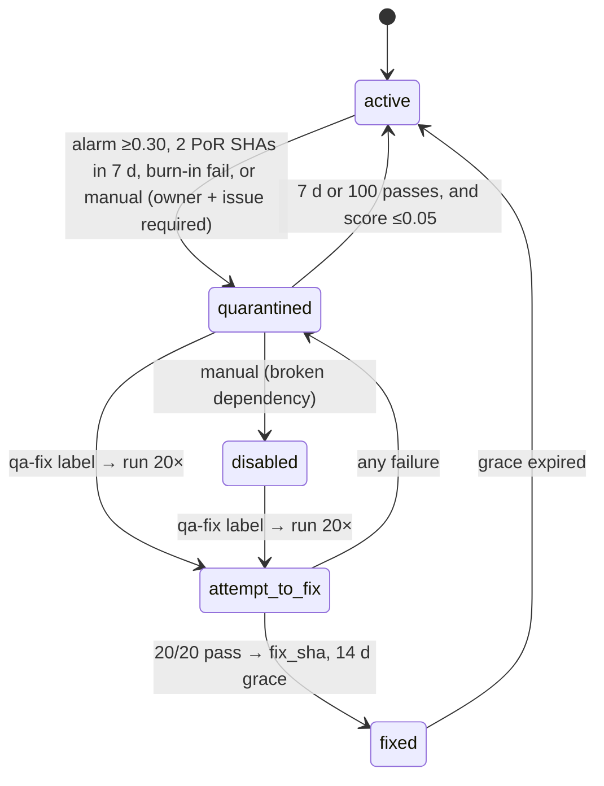

# Flaky tests and quarantine

A test that both passes and fails without any code change poisons every downstream signal: it blocks merges, inflates impact-analysis selections and teaches people to ignore red builds. QA Brain records every attempt of every test, derives four flakiness signals from that history on the project's default branch (passed-on-retry on the same commit, a transition score over a 20-execution window, a 10× burn-in for new tests, and error-signature clustering that separates infrastructure outages from genuine flakiness), and moves tests through an explicit quarantine state machine in which every non-active state carries an owner, an issue link and an exit criterion. Quarantined tests keep running and keep reporting but cannot fail the build; disabled tests are skipped; a `qa-fix:` label triggers a 20× attempt-to-fix run with a 14-day grace period. The tables involved (`run`, `run_attempt`, `flaky_stat`, `quarantine`, `test_case.status`) are defined in the [data model](./data-model.md); the failure categories come from [self-healing](./self-healing.md#2-failure-taxonomy); selection effects are in [impact analysis](./impact-analysis.md). Attempt recording and passed-on-retry ship in M3, the full state machine in M6 ([roadmap](./roadmap.md)).

## 1. Record every attempt

Flakiness cannot be computed from final statuses alone. Each execution writes one `run_attempt` row per (`run_id`, `test_case_id`, `platform`, `attempt_no`) with `status ∈ {pending, running, passed, failed, timed_out, error, cancelled, skipped}`, `failure_category`, `error_signature` and `duration_ms`. Retries (default 1 locally, 2 in CI, overridable per project in `project.settings.retries` and per call in `qa_run_suite({retries})`) create new attempt rows for `failed | timed_out | error`; they never overwrite the earlier row. The final attempt carries the `outcome`, which follows Playwright's `TestCase.outcome()` semantics — `expected`, `unexpected`, `flaky` (failed, then passed within retries) or `skipped` ([Playwright `TestCase`](https://playwright.dev/docs/api/class-testcase)) — plus QA Brain's `unmapped` for parity steps that could not be resolved on a declared platform. Like Playwright, the CI exit code is driven by whether the test is *ok*, not by the status of any single attempt.

Statistics are computed only from runs on `project.default_branch` and only from runs with `infra_outage = false`. Branch scoping keeps half-finished feature branches from quarantining the suite; the outage exclusion is explained in section 2.4.

## 2. Signals

### 2.1 Passed on retry (same SHA)

If one test has both a `failed` (or `timed_out`) and a `passed` attempt within the same `run` — therefore the same `git_sha` — the final outcome is `flaky` and the SHA is appended to `flaky_stat.passed_on_retry_shas`. This is the primary signal in every tool surveyed (Buildkite's default monitor, Datadog, Trunk) and it requires `retries > 0`; with retries disabled every flake looks like a hard failure. Two distinct passed-on-retry SHAs within 7 days are a quarantine trigger (section 3).

### 2.2 Transition score

For each (`test_case_id`, `branch`, `platform`), `flaky_stat` keeps the last `window_size = 20` final outcomes as a string (`last_outcomes`, e.g. `PPPFPPFFPP…`, newest last). With outcomes o₁ … o₂₀:

```text
transitions      = Σ_{i=2..20} [ oᵢ ≠ oᵢ₋₁ ]
transition_score = transitions / window_size          # 0.0 … 0.95
alarm            : transition_score ≥ 0.30            # ≥ 6 pass↔fail flips in the last 20 runs
recover          : transition_score ≤ 0.05            # ≤ 1 flip in the last 20 runs
```

A monotone change — twenty passes then twenty failures — produces exactly one transition and never alarms: that is a regression, not flakiness. The separate alarm and recover thresholds create hysteresis so a test does not oscillate in and out of quarantine. The mechanism is Buildkite Test Engine's transition-count monitor (score = transitions / window, distinct alarm and recover thresholds, branch-scoped) ([Buildkite monitors](https://buildkite.com/docs/pipelines/configure/tests/workflows/monitors)); the thresholds 0.30 / 0.05 are a design decision. `alarmed_at` and `recovered_at` are stamped when the score crosses a threshold. Retried `serial` groups can inflate transition counts; QA Brain counts one outcome per test per run, never per attempt, to avoid that.

### 2.3 New-test burn-in

A test key with no prior `run_attempt`, or none in the last 14 days, is `is_new`. On its first run it is executed 10 times (`run.trigger = 'burn_in'`, `flaky_stat.burn_in_remaining` counting down). Any failure during burn-in sets `is_flaky` with reason `new_test_flaky` and cannot fail the build; ten passes clear `is_new`. This follows Datadog's Early Flake Detection, which retries unknown tests up to ten times and re-classifies tests inactive for more than 14 days as new ([Datadog EFD](https://docs.datadoghq.com/tests/flaky_test_management/early_flake_detection/)); Spotify's Flakybot applies the same idea on pull requests by exercising changed tests repeatedly before merge ([Spotify](https://engineering.atspotify.com/2019/11/test-flakiness-methods-for-identifying-and-dealing-with-flaky-tests)).

### 2.4 Error-signature clustering and outage detection

Every failed attempt gets a compact signature:

```text
error_signature = sha1( failure_category | tool | normalize(first_error_line) )[0:12]
normalize(s)    = strip digits, UUIDs, hex runs ≥ 8, URLs and quoted paths; collapse whitespace; lowercase
```

`tool` is the QA Brain tool name that failed (`web_click`, `web_navigate`, …). Grouping failures by signature serves two purposes. First, reports and GitHub issues are deduplicated per signature (at most 5 issues per run; see [ci-cd](./ci-cd.md)). Second, it detects outages: if at least 30% of the attempts in one run (minimum 5 attempts) share a single signature whose category is `infra`, the run is marked `run.infra_outage = true`, no `flaky_stat` rows are updated from it, and no quarantine transition can be triggered by it. Spotify's Odeneye visualization made this distinction visible — scattered failures are flakiness, a solid column across many tests in one run is infrastructure ([Spotify](https://engineering.atspotify.com/2019/11/test-flakiness-methods-for-identifying-and-dealing-with-flaky-tests)); Trunk groups failures by signature so that a novel failure is not absorbed by an existing quarantine rule ([2026 flaky-tool landscape](https://www.shiplight.ai/blog/best-tools-flaky-tests-ci-cd)). Without this rule one broken CI runner would quarantine half the suite.

## 3. Quarantine state machine

`test_case.status` holds the current state; `quarantine` is an append-only transition log with `state`, `previous_state`, `reason`, `owner`, `issue_url`, `exit_criteria`, `consecutive_passes`, `fix_sha`, `grace_until`, `created_by`. A database CHECK enforces `state IN ('quarantined','disabled') ⇒ owner IS NOT NULL AND issue_url IS NOT NULL`: a quarantine without an owner and an issue is a permanent skip list, and the store refuses to create one. When the caller supplies no `issue_url`, QA Brain files the issue itself through the GitHub tool (M4+) with the failure signature, last attempts and artifact links, and stores the resulting URL.

| from → to | trigger | guard |
|---|---|---|
| `active` → `quarantined` | transition alarm (`score ≥ 0.30`); or ≥ 2 passed-on-retry SHAs within 7 days; or burn-in failure; or manual `qa_quarantine_set` | `owner` + `issue_url` required (issue auto-filed if absent); not from an `infra_outage` run |
| `quarantined` → `active` | automatic: 7 days elapsed **or** 100 consecutive passes, whichever comes first, **and** `transition_score ≤ 0.05` | — |
| `quarantined` → `disabled` | manual, for a broken dependency or an intentionally removed feature | `owner` + `issue_url` |
| `quarantined` / `disabled` → `attempt_to_fix` | commit message or PR label `qa-fix: <test key>` | runs the test 20× on the fixing branch (`run.trigger = 'attempt_to_fix'`) |
| `attempt_to_fix` → `fixed` | all 20 attempts pass | records `fix_sha`; `grace_until = now + 14 d` |
| `attempt_to_fix` → `quarantined` | any of the 20 attempts fails | previous owner and issue retained |
| `fixed` → `active` | `grace_until` elapsed | — |



The auto-unquarantine criterion (7 days or 100 executions) is Buildkite's recovery rule for its passed-on-retry monitor ([Buildkite monitors](https://buildkite.com/docs/pipelines/configure/tests/workflows/monitors)); requiring the transition score to be at or below the recover threshold on top of it is a design decision that prevents a test from exiting quarantine on the calendar alone. The attempt-to-fix flow (key in the commit message, 20 retries, 14-day grace during which the test is treated as quarantined on branches that do not contain the fix) is Datadog's Flaky Test Management remediation ([Datadog flaky management](https://docs.datadoghq.com/tests/flaky_management/)); QA Brain evaluates "contains the fix" with `git merge-base --is-ancestor <fix_sha> <head>` in the runner, falling back to `quarantined` treatment when the repository is unavailable.

## 4. How each state is treated

| state | executed? | counts toward gate? | in TIA selection? | in report | flags on result |
|---|---|---|---|---|---|
| `active` | yes | yes | yes | normal | — |
| `quarantined` | yes | **no** | no (unless `--include-quarantined`, i.e. `qa_impact_select({includeQuarantined: true})`) | shown with badge, failures listed under "quarantined" | `is_quarantined` |
| `disabled` | no (`status = skipped`) | no | no | listed as skipped with owner/issue | — |
| `attempt_to_fix` | 20× on the fixing branch; elsewhere as `quarantined` | no | yes (counts as active, so the fix gets exercised) | progress 12/20 | `is_quarantined` |
| `fixed` (in grace) | yes | yes on branches containing `fix_sha`; otherwise as `quarantined` | yes | badge "fixed, grace until …" | `is_quarantined` on stale branches |

The pass/fail gate of a run is:

```text
run.failed ⇔ ∃ attempt: outcome = unexpected ∧ ¬is_quarantined ∧ ¬is_new(burn-in)
```

Every `run_attempt` and every step result carries `is_flaky`, `is_quarantined`, `is_new` and `is_healed`, so reports, the GitHub Check Run annotations and the [impact-analysis](./impact-analysis.md) prioritization term `fail_rate_30d` can ignore quarantined failures consistently. TIA excludes quarantined tests from selection (they still run if `--include-quarantined` is passed), never selects disabled tests, and lists both under `notRun[]` with reason `quarantined` or `disabled`. The JUnit output marks quarantined failures as `<skipped message="quarantined: <issue_url>">` rather than `<failure>`, so consumers that only understand JUnit still see a green gate while the failure remains visible in the QA Brain report — the opposite of the dd-trace-js behavior that skipped Playwright tests instead of muting them.

## 5. `--fail-on-flaky`

By default a `flaky` outcome on an active test is reported, incremented in `flaky_stat`, and does not fail the build: the test did pass. Teams that want strictness opt in with `qa-brain run --fail-on-flaky` (or the `fail-on-flaky: true` input of the reusable Action), which mirrors Playwright's `--fail-on-flaky-tests` ([Playwright test CLI](https://playwright.dev/docs/test-cli)). Semantics:

- any `outcome = flaky` on a test that is not `is_quarantined` and not `is_new` makes the run exit non-zero with summary reason `flaky`;
- quarantined and burn-in flakes are still exempt — quarantine is containment and the flag must not punish a team for having diagnosed a problem;
- the flag does not change what is recorded: `flaky_stat` and the state machine see the same data with or without it.

## 6. Operational notes

- **Manual tools.** `qa_quarantine_set({test_key, state, owner, issue_url?, reason})` and `qa_quarantine_list({state?})` arrive in M6; until then the state is edited through `qa-brain db` commands. Both tools write a `quarantine` row and emit a log line with the principal.
- **Sweeper.** A scheduled job (pg-boss in hosted mode, an in-process timer in stdio mode) evaluates auto-unquarantine and grace expiry once per hour and the transition score after every run.
- **Metrics.** `qa_brain.flaky.rate` (flaky outcomes / final outcomes per project), `qa_brain.quarantine.count` by state, and `qa_brain.run.infra_outage` events are exported through the OTel pipeline described in [observability](./observability.md); a dashboard alone reduced Spotify's flake rate from 6% to 4% in two months, so visibility is treated as a feature, not an afterthought.
- **Numbers to be careful with.** Google's widely quoted 1.5% per-execution flake rate and 16% of tests flaking at some point come from secondary sources and are used here as motivation only; the thresholds in this document are design decisions that the [research track](./research-track.md) harness re-evaluates on the example applications.

## 7. References

- Playwright — [`TestCase.outcome()` / `ok()` / `results`](https://playwright.dev/docs/api/class-testcase), [test CLI (`--retries`, `--fail-on-flaky-tests`, `--repeat-each`)](https://playwright.dev/docs/test-cli)
- Buildkite Test Engine — [flaky monitors: transition count, passed on retry, recovery after 7 days / 100 executions](https://buildkite.com/docs/pipelines/configure/tests/workflows/monitors)
- Datadog — [Flaky Test Management: Active / Quarantined / Disabled / Fixed, attempt to fix (20×), 14-day grace](https://docs.datadoghq.com/tests/flaky_management/), [Early Flake Detection (10 retries, 14-day inactivity)](https://docs.datadoghq.com/tests/flaky_test_management/early_flake_detection/)
- Spotify — [Test flakiness: methods for identifying and dealing with flaky tests (Flakybot, Odeneye)](https://engineering.atspotify.com/2019/11/test-flakiness-methods-for-identifying-and-dealing-with-flaky-tests)
- Trunk and the 2026 tool landscape — [failure-signature grouping, quarantine = run but non-blocking](https://www.shiplight.ai/blog/best-tools-flaky-tests-ci-cd)
- Momentic — [L4 quarantine: "containment, not a repair"](https://momentic.ai/docs/reliability/auto-maintenance.md)
