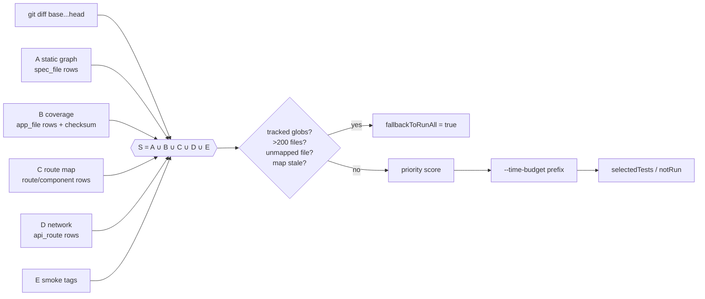

# Test Impact Analysis (TIA)

QA Brain's test impact analysis answers one question for every pull request: *which intent-level tests must run for this diff, and in what order?* It is deliberately a **safety-first layered union**, not a single oracle. Five independent evidence layers (static import graph, runtime coverage map, route↔component map, network-route map, and an always-run smoke set) each nominate tests; the selection is their union, and a short list of "tracked file" conditions forces a full run whenever the evidence cannot be trusted. Selected tests are then prioritized by a weighted score and trimmed to an optional `--time-budget`. This document specifies the inputs, the selection and prioritization formulas, the freshness rules, the `qa_impact_select` tool contract, and the known limitations. The decision record is [ADR-0010](./adr/0010-test-impact-analysis-layered-union.md); the storage tables are in the [data model](./data-model.md); the roadmap places layers A+B in M4 ([roadmap](./roadmap.md)).

## 1. Why a layered union

Regression test selection has two classic families. Static, graph-based selection (Google TAP, Jest `--findRelatedTests`, Playwright `--only-changed`) is cheap but only as complete as the graph; dynamic, coverage-based selection ([Ekstazi](https://users.ece.utexas.edu/~gligoric/papers/GligoricETAL15Ekstazi.pdf)) is safer but blind to anything that is not executed code — the static class-level tool STARTS shows roughly 3.19% safety violations relative to Ekstazi, which is why QA Brain treats coverage as the core and static analysis as additive. For end-to-end tests a spec-only import graph (the model behind [Playwright `--only-changed`](https://playwright.dev/docs/test-cli)) is weaker still: it does not contain the application code, so it can never see that a React component changed.

The union rule, the tracked-files bailout and the "when in doubt run more, never less" policy are borrowed from [Datadog Test Impact Analysis](https://docs.datadoghq.com/tests/test_impact_analysis/) and [testpick](https://registry.npmjs.org/testpick/latest); the prioritization features come from [Meta's Predictive Test Selection](https://engineering.fb.com/2018/11/21/developer-tools/predictive-test-selection/) and [Launchable](https://help.launchableinc.com/features/predictive-test-selection/). Momentic's `--ai-select` exposes the same two output fields QA Brain uses, `selectedTests` and `fallbackToRunAll` ([Momentic docs](https://momentic.ai/docs/ai/select.md)); its published 97.5% recall / 91.8% precision figures are vendor claims and are not used as targets here.

## 2. Inputs

| Input | Source | Stored as |
|---|---|---|
| Diff | `git diff --name-status <base>...<head>` (three-dot, merge-base) | transient; `run.base_sha`, `run.git_sha` |
| (A) Static import graph | YAML tests → `module:` references → fixture/data files in the test repo, built by `@qa-brain/test-format` when tests are saved | `coverage_map` rows `kind='spec_file'`, `source='static_graph'` |
| (B) Runtime coverage | Istanbul counters (`window.__coverage__` from `babel-plugin-istanbul` / `vite-plugin-istanbul` builds) or V8 precise coverage when Playwright runs in-process (`page.coverage.startJSCoverage()`, Chromium only) | `kind='app_file'`, `source='istanbul'` or `'v8'`, `checksum` = sha256 of the file at capture |
| (C) Route↔component map | Framework adapter: Next.js `app/` and `pages/` directories, React Router route config, Angular `routes` arrays; joined with the `url` rows each test visited | `kind='route'` and `kind='component'`, `source='router'` |
| (D) Network routes | `browser_network_requests` output from the action log, normalized (`/orders/123` → `/orders/:id`, query strings dropped), joined to backend handler files when the project supplies a server-side route map | `kind='api_route'`, `source='network_log'` |
| (E) Smoke set | Tests whose `tags` intersect `project.settings.smoke_tags` | `test_case.tags` |

Two implementation notes. Reading `window.__coverage__` requires `browser_evaluate`, which is **blocked** on the public tool surface as RCE-equivalent ([tool catalog](./tool-catalog.md)); the TIA collector therefore calls the upstream Playwright MCP client directly from gateway code at the end of each attempt, and the LLM never gains access to evaluation. And `coverage_map` is keyed `uq(test_case_id, platform, kind, target)`, so a test that exercises the same file on web and Android has two rows.



## 3. Selection

For a changed path `p` and test `t`, each layer contributes a reason:

- **static**: `p` is `t`'s own YAML file, a module it inlines (`test_case_revision.module_hashes`), or a fixture referenced by a `data:` step.
- **coverage**: a `coverage_map` row `(t, kind='app_file', target=p)` exists.
- **route**: `p` is a component file mapped to route `r` by the framework adapter, and `t` has a `url` row matching `r`.
- **network**: `p` is a handler file for an `api_route` that `t` called.
- **smoke**: `t` carries a smoke tag (selected regardless of the diff).
- **new**: `t` has zero `coverage_map` rows in any layer (never mapped, or all rows expired) — always selected until mapped.

`S = static ∪ coverage ∪ route ∪ network ∪ smoke ∪ new`. A test may be selected by several layers; all reasons are reported so a reviewer can see *why* a test ran.

### 3.1 Forced run-all

`fallbackToRunAll = true` (and `fallbackReason` set) when **any** of the following holds:

| Condition | Default | Rationale |
|---|---|---|
| A changed path matches `project.settings.tracked_globs` | `package.json`, `pnpm-lock.yaml`, `package-lock.json`, `yarn.lock`, `Dockerfile*`, `.env*`, `*config.{js,ts,json}` (vite, next, tsconfig, playwright, tailwind …), `i18n/**`, global stylesheets (`**/global*.css`, `**/app.css`), auth and layout components (`**/layout.*`, `**/auth/**`) | Coverage cannot see dependency, compiler, environment, locale or global-style changes ([Datadog](https://docs.datadoghq.com/tests/test_impact_analysis/) lists exactly these blind spots) |
| Changed files > `max_changed_files` | 200 | A large refactor or formatting commit is not a targeted change; Datadog's equivalent cutoff is 5,000 for monorepos — QA Brain is tuned for E2E suites of tens to hundreds of tests, so the bound is lower (design decision) |
| A changed application file has no `coverage_map` row in *any* layer | — | testpick's "when in doubt, run more, never less" ([testpick](https://registry.npmjs.org/testpick/latest)) |
| Map stale: no full run on `project.default_branch` in the last `stale_after_days` | 7 days | Stale maps under-select; see §5 |
| Diff unavailable (shallow clone, unknown `base`, detached worktree) | — | No evidence means no selection |

`max_changed_files` is a top-level key of `project.settings`; `stale_after_days` (7) and `entry_ttl_days` (14) live under `project.settings.thresholds.tia`. All three can be overridden per project. Tests can also opt out of selection individually with the tag `tia:always` (the analog of Datadog's `unskippable`).

### 3.2 Quarantined and disabled tests

Quarantined tests (`test_case.status='quarantined'`) are **excluded** from `selectedTests` and listed under `notRun` with reason `quarantined`, unless the caller passes `includeQuarantined: true`; even then they never affect the pass/fail gate ([flaky and quarantine](./flaky-and-quarantine.md)). Disabled tests are never selected; `attempt_to_fix` and `fixed` tests count as active. Failure-rate history is computed only from non-quarantined attempts on the default branch with `run.infra_outage=false`, so an outage week does not inflate priorities.

## 4. Prioritization and `--time-budget`

Selected tests are ordered by the formula recorded in [ADR-0010](./adr/0010-test-impact-analysis-layered-union.md):

```
priority = 0.4 · fail_rate_30d
         + 0.3 · (changed_files_covered / changed_files_total)
         + 0.2 · 1 / (1 + graph_distance)
         + 0.1 · (1 − duration_norm)
```

where

- `fail_rate_30d` = failed final attempts ÷ total final attempts for the test on `default_branch` in the last 30 days (0 when unknown);
- `changed_files_covered` = number of changed files the test reaches through any layer; `changed_files_total` = size of the diff after ignoring docs and images;
- `graph_distance` = 0 when the test's own YAML/module changed, 1 for a direct coverage or network hit, 2 for a route-map hit, 3 for smoke-only or `new`;
- `duration_norm` = the test's p50 duration ÷ the maximum p50 among selected tests (1 when no history).

The weights are a design decision, not a fitted model; the [research track](./research-track.md) measures precision/recall against run-all and can re-fit them. Smoke tests are pinned to the head of the list so that a budget never drops them. With `--time-budget 10m` (tool field `budget`), the runner takes the longest prefix whose summed p50 durations fit the budget and reports the rest under `notRun` with reason `budget`. Tests with no duration history are assumed to take the suite's p50 (or 60 s when the suite has no history).

## 5. Freshness and expiry

- The nightly full run on `project.default_branch` (`run.trigger='schedule'`) rewrites `coverage_map` for every test: `captured_run_id`, `captured_at`, fresh `checksum`s, `expires_at = captured_at + entry_ttl_days` (14 days).
- An entry is stale before expiry if its `checksum` no longer matches the file at `head` and the test has not run since; a stale `app_file` entry still counts as a hit, so staleness only ever selects more.
- `mapFreshness.staleEntries` in the output counts such rows; `mapFreshness.lastFullRunAt` is the timestamp of the last completed full run. If that timestamp is older than `stale_after_days`, the analyzer forces run-all (§3.1).
- Tests whose rows all expired revert to `new` and are selected until the next full run maps them again.

## 6. Output schema

```ts
// qabrain/impact-selection/v1 — registered as the Zod 4 output schema of qa_impact_select
type ImpactSelection = {
  selectedTests: Array<{
    key: string;
    platform: 'web' | 'android' | 'ios';
    priority: number;                       // §4, 0..1
    estimatedDurationMs?: number;           // p50 from run_attempt history
    reasons: Array<{ layer: 'static' | 'coverage' | 'route' | 'network' | 'smoke' | 'new'; evidence: string }>;
  }>;
  fallbackToRunAll: boolean;
  fallbackReason?: string;                  // set iff fallbackToRunAll
  notRun: Array<{ key: string; reason: 'budget' | 'quarantined' | 'disabled' | 'not_impacted' }>;
  mapFreshness: { lastFullRunAt: string | null; staleEntries: number };   // ISO-8601
};
```

The generated JSON Schema uses `additionalProperties:false` everywhere and no `minimum`/`maxLength` keywords, the subset that Anthropic structured outputs accept ([docs](https://platform.claude.com/docs/en/build-with-claude/structured-outputs)), so the same schema works as a tool output schema and as a runner `--json-schema`.

Example for the demo-day commit that renames "Add to cart" to "Add to bag" in `examples/shop`:

```json
{
  "selectedTests": [
    { "key": "smoke/home-loads", "platform": "web", "priority": 0.62,
      "estimatedDurationMs": 4100,
      "reasons": [{ "layer": "smoke", "evidence": "tag smoke" }] },
    { "key": "checkout/add-to-cart", "platform": "web", "priority": 0.58,
      "estimatedDurationMs": 18800,
      "reasons": [
        { "layer": "coverage", "evidence": "src/components/ProductCard.tsx (istanbul, run rn_0198a3…)" },
        { "layer": "route", "evidence": "src/components/ProductCard.tsx → /products/:id → visited" } ] },
    { "key": "checkout/cart-badge", "platform": "web", "priority": 0.41,
      "reasons": [{ "layer": "network", "evidence": "POST /api/cart → server/routes/cart.ts" }] },
    { "key": "search/first-result", "platform": "web", "priority": 0.33,
      "reasons": [{ "layer": "coverage", "evidence": "src/components/ProductCard.tsx (istanbul)" }] }
  ],
  "fallbackToRunAll": false,
  "notRun": [
    { "key": "account/change-password", "reason": "not_impacted" },
    { "key": "checkout/coupon-expired", "reason": "quarantined" }
  ],
  "mapFreshness": { "lastFullRunAt": "2026-08-19T02:14:07Z", "staleEntries": 0 }
}
```

## 7. The `qa_impact_select` tool

`qa_impact_select` is a native `qa_*` tool. In M0 it is a registered **stub**: hidden from `tools/list` unless `server.exposeStubs` is true and returning `isError` with the text `not implemented in M0` ([tool catalog](./tool-catalog.md)). The implementation lands in M4 together with the GitHub check run.

| Field | Type | Notes |
|---|---|---|
| `base` | string, required | commit-ish; in GitHub Actions the PR base SHA |
| `head` | string, required | commit-ish; defaults to the PR head SHA in the Action |
| `platforms` | `("web"\|"android"\|"ios")[]` | default: every platform the project declares |
| `budget` | string (`"10m"`, `"90s"`) | optional time budget; see §4 |
| `includeQuarantined` | boolean, default false | §3.2 |
| `dryRun` | boolean, default false | compute but do not record a `run` with `trigger='tia'` |

Output: `structuredContent` conforming to §6 plus a one-line text summary (`4 of 22 tests selected; 0 stale map entries`). Failures follow the gateway rule of `isError` text with a recovery hint, e.g. `diff unavailable: fetch-depth is 1; set actions/checkout fetch-depth: 0`. The CLI verb `qa-brain select --base-ref <ref> --head-ref <ref> [--time-budget 10m] [--json]` wraps the same function, and the reusable Action (`mode: select`, input `time-budget`) posts the selection as a check-run summary ([ci-cd](./ci-cd.md)).

Internally every layer implements the `ImpactAnalyzer` interface from `@qa-brain/core`:

```ts
export interface ImpactAnalyzer {
  readonly layer: 'static-imports' | 'dynamic-coverage' | 'route-map' | 'network-routes' | 'smoke-set';
  select(input: { diff: GitDiff; tests: TestRef[]; trackedFilesGlobs: string[] }):
    Promise<{ selected: TestRef[]; fallbackToRunAll: boolean; reasons: string[] }>;
}
```

Union, bailout, prioritization and budget are pure functions over the per-layer results; their unit tests (tracked-glob bailout, `>200` files, budget prefix, quarantine exclusion) are in the M0 test plan even though the tool is stubbed.

## 8. Limitations

- **Static graphs miss aliased and dynamic edges.** Jest's related-tests walk does not follow `moduleNameMapper` path aliases ([jest#10222](https://github.com/jestjs/jest/issues/10222)); the same holds for `tsconfig` `paths`, dynamic `import()`, dependency-injection registries and feature flags — the gap that motivated testpick ([testpick](https://registry.npmjs.org/testpick/latest)). Playwright's `--only-changed` supports Git only and has a documented setup-project dependency issue (#32070) ([Playwright test CLI](https://playwright.dev/docs/test-cli)). QA Brain's layer A is therefore confined to the test repository (YAML → modules → fixtures), where there are no aliases, and never claims to see application code.
- **Coverage misses non-code changes.** Datadog documents that coverage-based skipping cannot detect library-version, compiler-option, external-service or data-file changes ([Datadog TIA](https://docs.datadoghq.com/tests/test_impact_analysis/)); the tracked-globs list in §3.1 is the mitigation, and it is a list a project must maintain.
- **Coverage needs setup.** Istanbul requires an instrumented build of the application; V8 precise coverage needs the in-process Playwright embedding (M2) and is Chromium-only. Until one is configured, layer B is empty, every application-file change is "unmapped", and run-all is forced — safe but slow.
- **No off-the-shelf Playwright support from vendors.** Datadog's JavaScript TIA supports Jest, Mocha, Cucumber-js and Cypress but explicitly not Playwright or Vitest, and it skips whole files rather than individual tests ([Datadog JS setup](https://docs.datadoghq.com/intelligent_test_runner/setup/javascript/)). That absence is part of why QA Brain carries its own per-test map.
- **Route maps are per framework.** Layer C needs an adapter per router (Next.js, React Router, Angular in that order); projects using another router get layers A, B, D and E only.
- **Mobile.** Android coverage (JaCoCo) is not wired in the current roadmap; mobile selection relies on layers A, D (network log via the Appium session) and E, and `unmapped` mobile files force run-all on that platform only.
- **Precision is unmeasured until M4.** Until the harness reports precision and recall on `examples/shop`, the only guarantee is structural: every bailout condition errs toward running more.
