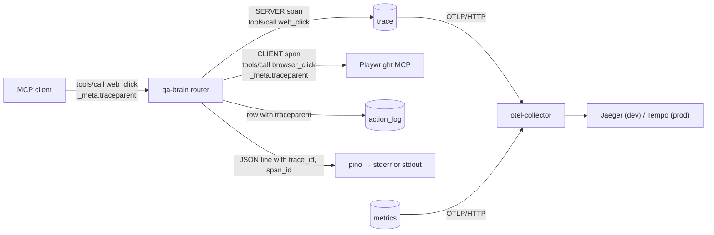

# Observability

QA Brain emits three correlated signals: OpenTelemetry traces that follow the GenAI MCP semantic conventions, OpenTelemetry metrics for call latency, error rate, healing outcomes, and LLM spend, and structured pino JSON logs. One W3C `traceparent` ties them together. It arrives in the `_meta` of an inbound `tools/call`, is forwarded in the `_meta` of every upstream call, is written to the `action_log.traceparent` column, and appears as `trace_id`/`span_id` on every log line. The gateway instruments itself by hand in `packages/gateway/src/otel.ts`; there is no auto-instrumentation layer. Tracing is off by default in stdio mode and is switched on with `QA_BRAIN_OTEL_EXPORTER=otlp`. The decisions behind this design are recorded in [ADR-0013](./adr/0013-observability-otel-genai-mcp-semconv.md).

> **M0 status (2026-08-20).** `packages/gateway/src/otel.ts` ships as a **no-op facade**: the router calls `telemetry.startServerSpan()` / `startClientSpan()` / `recordCall()` at the points described below, but the default implementation records nothing and the gateway has no `@opentelemetry/*` dependency yet. What is live in M0 is the correlation substrate: `_meta.traceparent` / `tracestate` / `baggage` passthrough, a minted `traceparent` when the client sends none, `action_log.traceparent`, and pino logs with redaction and the args-shape serializer. The OTLP-backed implementation and the collector pipeline land with hosted mode in **M5**. Note that the OTel MCP semantic conventions are at status **Development** ([semconv-genai `mcp.md`](https://github.com/open-telemetry/semantic-conventions-genai/blob/main/docs/gen-ai/mcp.md)); attribute names are pinned to the revision cited here and reviewed when Renovate bumps the OTel packages.

## 1. Signal flow



## 2. Spans

Span names follow the semconv pattern `"{mcp.method.name} {gen_ai.tool.name}"`: a `SERVER` span on the receiving side and a `CLIENT` span on the calling side, so one proxied call yields a parent `tools/call web_click` span and a child `tools/call browser_click` span in the same trace.

| Span | Kind | Created when | Key attributes |
|---|---|---|---|
| `tools/call <public name>` (e.g. `tools/call web_click`) | `SERVER` | router receives an inbound call, native or proxied | `mcp.method.name=tools/call`, `gen_ai.operation.name=execute_tool`, `gen_ai.tool.name=web_click`, `mcp.protocol.version=2026-07-28\|2025-11-25`, `network.transport=pipe\|tcp`, `jsonrpc.request.id`, `error.type`, `rpc.response.status_code`, `qa_brain.*` below |
| `tools/list` | `SERVER` | list request | `mcp.method.name=tools/list`, `mcp.protocol.version`, `network.transport` |
| `tools/call <upstream name>` (e.g. `tools/call browser_click`) | `CLIENT` | router forwards to an upstream `Client.callTool` | same semconv attributes with the upstream name, plus `qa_brain.upstream=web\|mobile\|db`, `server.address` for HTTP upstreams |
| `server/discover` or `ping` | `CLIENT` | health probe every 60 s | `mcp.method.name`, `qa_brain.upstream`, `error.type` on a strike |
| `qa_brain.upstream.restart` | `INTERNAL` | supervisor restarts a child | `qa_brain.upstream`, `qa_brain.restart.attempt` (1–5) |
| `qa_brain.heal` | `INTERNAL` | healing pipeline runs for a step (M3) | `qa_brain.heal.tier=T0\|T1\|T2\|T3`, `qa_brain.heal.outcome=success\|rejected\|no_candidate`, `qa_brain.heal.score`, `qa_brain.heal.margin` |
| `qa_brain.tia.select` | `INTERNAL` | test impact selection (M4) | `qa_brain.tia.selected`, `qa_brain.tia.fallback_run_all` |
| `qa_brain.llm.call` | `INTERNAL` | any LLM request from healing or the runner | `gen_ai.request.model`, `gen_ai.usage.input_tokens`, `gen_ai.usage.output_tokens`, `qa_brain.llm.cost_usd` |

`error.type` holds the gateway's error code (`timeout`, `cancelled`, `upstream_unavailable`, `upstream_error`, `unknown_tool`, `blocked_tool`, `invalid_args`, `not_implemented`, `internal`; the same enum as `action_log.error_code`) and the span status is `ERROR` whenever the result carries `isError: true`, matching rows with `action_log.is_error = 1`.

The custom namespace `qa_brain.*` carries domain context on every span created inside a run: `qa_brain.project_id`, `qa_brain.run_id` (`rn_<uuidv7>`), `qa_brain.test_id`, `qa_brain.step_id`, `qa_brain.upstream`, `qa_brain.principal` (`local` on stdio, the API key's project in hosted mode), and `qa_brain.client_name` from the client info in `_meta`. Two semconv attributes are opt-in only: `gen_ai.tool.call.arguments` and `gen_ai.tool.call.result`. The gateway never sets them unless `QA_BRAIN_TRACE_ARGS=1`, and even then it attaches the redacted arguments, never the raw ones; the collector's `attributes` processor deletes the key again unless the same variable is set on the collector. This is the action log's rule applied to spans: shape by default, redacted values on request, raw values never ([Docker MCP Gateway v0.43.1](https://github.com/docker/mcp-gateway/releases/tag/v0.43.1) adopted the same policy).

## 3. Propagation through `_meta`

The 2026-07-28 specification documents W3C trace context as `_meta` keys (SEP-414): `traceparent`, `tracestate`, and `baggage` ([changelog](https://modelcontextprotocol.io/specification/2026-07-28/changelog)). The TypeScript SDK exports them as constants, `TRACEPARENT_META_KEY`, `TRACESTATE_META_KEY`, and `BAGGAGE_META_KEY`, alongside the protocol keys `PROTOCOL_VERSION_META_KEY`, `CLIENT_CAPABILITIES_META_KEY`, `CLIENT_INFO_META_KEY`, and `SERVER_INFO_META_KEY`. The router's handling, in order:

1. **Extract.** Read `ctx.mcpReq._meta[TRACEPARENT_META_KEY]` (and `tracestate`, `baggage`). A valid value (`00-<32 hex trace-id>-<16 hex parent-id>-<2 hex flags>`, [W3C Trace Context](https://www.w3.org/TR/trace-context/)) becomes the parent of the `SERVER` span. If absent or malformed, the gateway mints a root `traceparent`, so calls from clients that do not propagate context (none of the four target clients do today) are still traceable.
2. **Strip everything else.** Inbound `_meta` is filtered to the three trace keys plus the SDK's protocol keys before anything is forwarded; MRTR fields (`inputResponses`, `requestState`) and unknown `_meta` keys never cross the gateway boundary.
3. **Inject.** The `CLIENT` span's context is written into the `_meta` of the upstream `callTool` params under the same keys, so a tracing-aware upstream continues the trace. `appium-mcp` does so when launched with `APPIUM_MCP_OTEL_ENABLED=true` ([appium-mcp](https://github.com/appium/appium-mcp)); Playwright MCP ignores the keys today, which is harmless.
4. **Baggage.** `run_id=rn_…` and `project_id` are carried as W3C baggage members once a run has started (`qa_run_start`), so spans created deep inside the worker, including LLM calls, can be attributed to a run without threading identifiers through every function signature.

## 4. Metrics

Metrics are recorded through `@opentelemetry/sdk-metrics` with the same resource as traces and exported over OTLP/HTTP to the collector, which exposes them to Prometheus on `:8889`.

| Instrument | Type | Attributes | Derived views |
|---|---|---|---|
| `mcp.server.operation.duration` | histogram (s) | `mcp.method.name`, `gen_ai.tool.name`, `error.type` | p50/p95 per tool; error rate = `error.type` present / total |
| `mcp.client.operation.duration` | histogram (s) | same + `qa_brain.upstream` | upstream latency (Playwright child vs. Appium child) |
| `qa_brain.tool.calls` | counter | `gen_ai.tool.name`, `qa_brain.upstream`, `error.type` | per-tool volume and error ratio |
| `qa_brain.heal.attempts` | counter | `qa_brain.heal.tier`, `qa_brain.heal.outcome` | heal success rate per tier (research-track metric) |
| `qa_brain.run.duration` | histogram (s) | `qa_brain.project_id`, `outcome` | wall time per run |
| `gen_ai.client.token.usage` | histogram | `gen_ai.token.type=input\|output`, `gen_ai.request.model` | tokens per run (summed via baggage `run_id`) |
| `qa_brain.llm.cost_usd` | counter | `gen_ai.request.model`, `qa_brain.project_id` | USD per run and per project; feeds `llm.budget_usd_per_run` |
| `qa_brain.upstream.restarts` | counter | `qa_brain.upstream` | child stability; alert at > 3 per hour |
| `qa_brain.queue.depth`, `qa_brain.queue.job.duration` | gauge, histogram | `queue` | pg-boss backlog (hosted only) |

The `mcp.*.operation.duration` instruments come from the semconv; the `qa_brain.*` names are project-specific and share the attribute vocabulary.

## 5. Logs

Logs are pino 10.3.1 JSON lines. In stdio mode they go to **stderr** only, because stdout is the JSON-RPC channel and the stdio transport forbids any other byte on it ([stdio transport](https://modelcontextprotocol.io/specification/2026-07-28/basic/transports/stdio)); `console.log` is rebound to stderr for the same reason. In HTTP mode they go to stdout and are rotated by Docker's `json-file` driver (`max-size: 10m`, `max-file: 3`; see [deployment](./deployment.md)).

Every line carries the fixed fields `time`, `level`, `msg`, `name=qa-brain`, `pid`, plus, where known, `trace_id`, `span_id`, `run_id`, `project_id`, `tool`, `upstream`, `upstream_tool`, `duration_ms`, `is_error`, and `error_code`. The `trace_id` and `span_id` values are the ones split out of the active `traceparent`, so a log line can be pasted into Jaeger's search field without transformation.

Redaction has two layers, and both run **before** a line is written or a row is persisted:

1. **pino `redact`** for structured paths: `['req.headers.authorization', '*.password', '*.token', '*.apiKey', '*.secret', 'env.*']`, censored to `[REDACTED]`.
2. **The core redactor** (`packages/core/src/redact.ts`), applied through a pino `formatters.log` hook to the merged object and to `msg`. It masks keys matching `/(pass(word|phrase)?|secret|token|api[-_]?key|authorization|auth|cookie|session[-_]?id|credential|private[-_]?key|bearer)/i`, values matching the token patterns (`github_pat_`, `ghp_`/`gho_`/`ghu_`/`ghs_`/`ghr_`, `sk-`, `xox[baprs]-`, `AKIA…`, JWTs, `Bearer …`, PEM private keys), and every literal value the config loader expanded from `${VAR}` references. Child stderr from Playwright MCP passes through the same redactor at `debug` level tagged `upstream=playwright`.

Tool arguments are never logged as values. A serializer replaces the `args` field with `argsShape(args)`, which keeps keys and replaces leaves with their `typeof` (`{"url":"string"}`, `{"fields":[{"name":"string","value":"string"}]}`), the same function that fills `action_log.args_shape`. The `log.argsMode` setting (`shape` default in hosted mode, `redacted` locally, or `none`) controls whether `args_redacted` is additionally persisted to the action log; it does not affect log lines, which always get the shape.

## 6. Correlation

| Key | Where it lives | How it is used |
|---|---|---|
| `traceparent` | `action_log.traceparent` (text, nullable); span context; log `trace_id`/`span_id` | `qa_run_log` returns it per row; reports render `http://localhost:16686/trace/<trace_id>` (Jaeger) or a Grafana Explore link (Tempo) next to each failed step |
| `run_id` (`rn_<uuidv7>`) | `action_log.run_id`, `run.id`, baggage, span attribute `qa_brain.run_id`, log field | groups every span, log line, and log row of one run; `task.id == run.id` when the Tasks extension is used |
| `args_hash` | `action_log.args_hash` (sha256 of canonical JSON) | dedup and the later step cache; correlates identical calls across runs without storing arguments |
| `_meta["in.qabrain/actionLogId"]` | result `_meta` returned to the client | lets an LLM or a report cite the exact audit row for a tool result |

The `action_log` row is written even when tracing is disabled, so the SQLite file is a complete audit trail in stdio mode; the exporter adds timing structure without changing what is persisted.

## 7. Local development stack

`deploy/docker-compose.dev.yml` adds a Jaeger v2 all-in-one service (`jaegertracing/jaeger:2`, OTLP on 4317/4318, UI on `127.0.0.1:16686`) and points the collector's `otlp/jaeger` exporter at it. Jaeger 2 speaks OTLP natively, so for a laptop the collector can even be skipped and the gateway can export straight to `http://localhost:4318`:

```bash
docker compose -f deploy/docker-compose.yml -f deploy/docker-compose.dev.yml up -d jaeger
QA_BRAIN_OTEL_EXPORTER=otlp OTEL_EXPORTER_OTLP_ENDPOINT=http://localhost:4318 \
  qa-brain serve --transport stdio
```

`pnpm dev:otel` wraps these two commands. In the UI at `http://localhost:16686`, each `tools/call web_*` span shows its `tools/call browser_*` child with the action-log id in its attributes.

## 8. Exporter configuration

| Variable | Values | Default | Effect |
|---|---|---|---|
| `QA_BRAIN_OTEL_EXPORTER` | `none`, `otlp` | `none` | `none` installs the no-op facade; `otlp` registers `NodeTracerProvider` + `MeterProvider` with OTLP/HTTP exporters |
| `OTEL_EXPORTER_OTLP_ENDPOINT` | URL | `http://localhost:4318` | collector or Jaeger base URL; standard OTel variable ([SDK environment variables](https://opentelemetry.io/docs/specs/otel/configuration/sdk-environment-variables/)) |
| `OTEL_EXPORTER_OTLP_PROTOCOL` | `http/protobuf` | `http/protobuf` | gRPC is not bundled (keeps the dependency set small) |
| `OTEL_SERVICE_NAME` | string | `qa-brain` (`qa-brain-worker` in the worker) | resource `service.name` |
| `OTEL_RESOURCE_ATTRIBUTES` | `k=v,…` | `deployment.environment=local` | merged into the resource |
| `OTEL_TRACES_SAMPLER` | `parentbased_always_on`, `parentbased_traceidratio` | `parentbased_always_on` | sampling; ratio via `OTEL_TRACES_SAMPLER_ARG` |
| `QA_BRAIN_TRACE_ARGS` | `1` | unset | attach redacted `gen_ai.tool.call.arguments` to spans |

The collector configuration in `deploy/otel/collector.yaml` is the minimal pipeline: `receivers: otlp (4317, 4318)` → `processors: memory_limiter, batch, attributes (delete gen_ai.tool.call.arguments unless QA_BRAIN_TRACE_ARGS=1)` → `exporters: otlp/jaeger` (dev) or `otlp/tempo` (prod), `prometheus (:8889)`, and `debug` at `basic` verbosity. Its health extension answers on `:13133` for the Compose healthcheck.

## 9. Packages and the no-auto-instrumentation decision

| Package | Line | Role |
|---|---|---|
| `@opentelemetry/api` | 1.x | span and meter API used by `otel.ts`; the only import outside the exporter module |
| `@opentelemetry/sdk-trace-node` | 2.x (2.8.0 at writing) | `NodeTracerProvider`, batch span processor |
| `@opentelemetry/sdk-metrics` | 2.x | `MeterProvider`, periodic exporting reader |
| `@opentelemetry/exporter-trace-otlp-http`, `@opentelemetry/exporter-metrics-otlp-http` | 0.2xx (experimental line) | OTLP/HTTP exporters |
| `@opentelemetry/resources`, `@opentelemetry/semantic-conventions` | 2.x, 1.x | resource detection, stable attribute constants |

Not used: `@opentelemetry/sdk-node` (still 0.x experimental while `sdk-trace-node` is 2.x) and `@opentelemetry/auto-instrumentations-node`, which would hook `http`, `pg`, and `fs` with generic spans that say nothing about MCP methods or tools. The gateway has two places where a span matters, the inbound handler and the upstream `callTool`, plus a few internal operations, so hand-written spans in one module are smaller, deterministic across Windows and Linux, and avoid the module-layout issues that pushed the community MCP instrumentations into manual mode ([openinference-instrumentation-mcp](https://www.npmjs.com/package/@arizeai/openinference-instrumentation-mcp)). Renovate groups all `@opentelemetry/*` packages into one PR so they move in lockstep.

## 10. Related documents

- [Deployment](./deployment.md) — collector, Jaeger, Tempo, and Grafana services and their networks
- [Data model](./data-model.md) — `action_log` columns referenced above
- [Security threat model](./security-threat-model.md) — T6 (secrets in logs and audit rows)
- [Research track](./research-track.md) — heal-rate, token, and cost metrics derived from these signals
- [ADR-0013](./adr/0013-observability-otel-genai-mcp-semconv.md) — decision record
