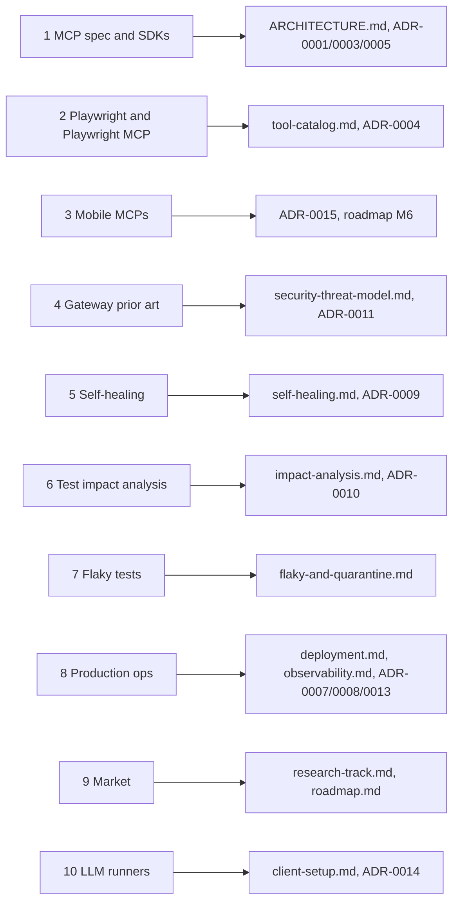

# Research Sources

This is the annotated bibliography behind the QA Brain blueprint. Every external claim, threshold, or version that appears in [ARCHITECTURE.md](../ARCHITECTURE.md), the topic documents in this folder, and the ADRs in [./adr/](./adr/) traces to an entry below. Entries are grouped by topic; each records the source, what QA Brain takes from it (a rule, a default, a counter-example, or a number), and the version or date observed when the material was collected on 2026-08-20. Numbers a vendor publishes about its own product are marked **(vendor-published)** and are used as motivation, never as design thresholds. Values with no external source are labeled *design decision* in the document that introduces them.

## 1. MCP specification and SDKs

| # | Source | Takeaway for QA Brain | Observed |
|---|---|---|---|
| 1 | [MCP changelog, revision 2026-07-28](https://modelcontextprotocol.io/specification/2026-07-28/changelog) | Stateless core: no `initialize`, no `Mcp-Session-Id`, mandatory `server/discover`, `ttlMs`/`cacheScope` on `tools/list`, Roots/Sampling/Logging deprecated. Drives ADR-0003. | Rev. 2026-07-28 |
| 2 | [MCP release post](https://blog.modelcontextprotocol.io/posts/2026-07-28/) | "Largest revision since launch"; TypeScript, Python, Go, C# SDKs shipped support the same day. | 2026-07-28 |
| 3 | [Spec: Tools](https://modelcontextprotocol.io/specification/2026-07-28/server/tools) | `tools/list` MUST NOT vary per connection; aggregating proxies SHOULD prefix names. Registry rules in [tool-catalog.md](./tool-catalog.md). | Rev. 2026-07-28 |
| 4 | [Spec: Versioning](https://modelcontextprotocol.io/specification/2026-07-28/basic/versioning) | Era model: probe `server/discover`, fall back to `initialize`, cache the verdict. Implemented as `mode:'auto'` plus `era-cache.json`. | Rev. 2026-07-28 |
| 5 | [Spec: Streamable HTTP](https://modelcontextprotocol.io/specification/2026-07-28/basic/transports/streamable-http) | POST-only; `Mcp-Method`/`Mcp-Name` validated (400, `-32020`); stream close is the cancel signal; Origin validation. Threats T8, T9. | Rev. 2026-07-28 |
| 6 | [Spec: stdio](https://modelcontextprotocol.io/specification/2026-07-28/basic/transports/stdio) | Only JSON-RPC on stdout; shutdown = close stdin, wait, SIGTERM, SIGKILL (Job Objects on Windows). ChildSupervisor sequence. | Rev. 2026-07-28 |
| 7 | [Spec: Multi Round-Trip Requests](https://modelcontextprotocol.io/specification/2026-07-28/basic/patterns/mrtr) | `requestState` is attacker-controlled; the router strips `inputResponses`/`requestState` at the proxy boundary. | Rev. 2026-07-28 |
| 8 | [Spec: Authorization](https://modelcontextprotocol.io/specification/2026-07-28/basic/authorization) and [client-credentials extension](https://modelcontextprotocol.io/extensions/auth/oauth-client-credentials) | OAuth 2.1 resource server, RFC 9728/8707, no token passthrough (T5); `private_key_jwt` for CI in M7 (ADR-0012). | Rev. 2026-07-28 |
| 9 | [Tasks extension](https://modelcontextprotocol.io/extensions/tasks/overview) and [extensions overview](https://modelcontextprotocol.io/docs/extensions/overview) | `CreateTaskResult` only when the caller declared `io.modelcontextprotocol/tasks`; `taskId` maps to `run.id`. `traceparent` in `_meta` (SEP-414). | 2026-07-28 |
| 10 | [MCP security best practices](https://modelcontextprotocol.io/docs/2026-07-28/tutorials/security/security_best_practices) | Handles are not authentication; block RFC1918 and 169.254.0.0/16; egress via Smokescreen; sandbox stdio children. T2, T4, T12. | 2026-07-28 ed. |
| 11 | [SEP-993 namespaces](https://github.com/modelcontextprotocol/modelcontextprotocol/issues/993) and [discussion #2036](https://github.com/modelcontextprotocol/modelcontextprotocol/discussions/2036) | Degradation near 20 tools; 1,000 tools = 674 KB of JSON; removed tools keep being called (stale history). Registry never deletes names at runtime. | 2026 |
| 12 | [TS SDK v2 upgrade guide](https://ts.sdk.modelcontextprotocol.io/v2/migration/upgrade-to-v2.html) and [releases](https://github.com/modelcontextprotocol/typescript-sdk/releases) | Split `@modelcontextprotocol/{server,client,core,node}`, Zod v4, ESM-first; v1.30.0 cannot speak 2026-07-28. Pinned 2.0.0 (ADR-0001). | 2.0.0 |
| 13 | [TS SDK v2: low-level server](https://ts.sdk.modelcontextprotocol.io/v2/advanced/low-level-server.html) | `setRequestHandler('tools/list' \| 'tools/call')` is the documented gateway path; thrown errors become `-32603`, so the router always returns `isError`. | 2.0.0 |
| 14 | [TS SDK v2: serving HTTP](https://ts.sdk.modelcontextprotocol.io/v2/serving/http.html) and [legacy clients](https://ts.sdk.modelcontextprotocol.io/v2/serving/legacy-clients.html) | `createMcpHandler` builds a fresh server per request (`legacy:'stateless'`); `serveStdio` (`legacy:'serve'`); `toNodeHandler` plus host validation. | 2.0.0 |
| 15 | [TS SDK v2: client connect](https://ts.sdk.modelcontextprotocol.io/v2/clients/connect.html) and [gateway page](https://ts.sdk.modelcontextprotocol.io/v2/advanced/gateway.html) | `connect(transport, {mode:'auto', prior})`, `StdioClientTransport`, `callTool` timeouts, `InMemoryTransport.createLinkedPair()`; no turnkey proxy exists. | 2.0.0 |
| 16 | [TS SDK v2: authorization](https://ts.sdk.modelcontextprotocol.io/v2/serving/authorization.html) | `requireBearerAuth({verifier})` with 401/403 and `WWW-Authenticate`; token issuance delegated to an external IdP. | 2.0.0 |
| 17 | [TS SDK: support-2026-07-28 note](https://github.com/modelcontextprotocol/typescript-sdk/blob/main/docs/migration/support-2026-07-28.md) | Proxy guidance: preserve `io.modelcontextprotocol/*` and `traceparent` keys; strip MRTR fields. | 2026-07 |
| 18 | [PrefectHQ FastMCP releases](https://github.com/PrefectHQ/fastmcp/releases) | Only mainstream library with a first-class proxy (`{prefix}_{tool}`, 300 s list cache). Naming reference, not a dependency. | 4.0.0b3 |

## 2. Playwright and Playwright MCP

| # | Source | Takeaway for QA Brain | Observed |
|---|---|---|---|
| 19 | [Playwright release notes](https://playwright.dev/docs/release-notes) | 1.59 `browser.bind()` and `ariaSnapshot({mode:'ai'})`; 1.62 bundles the MCP server as the `playwright mcp` subcommand, spawned from the pinned package's `cli.js`. | 1.62.1 |
| 20 | [`page.ariaSnapshot`](https://playwright.dev/docs/api/class-page#page-aria-snapshot) | `[ref=eN]` is per-snapshot; fingerprints persist `browser_generate_locator` output, never refs. | 1.62 |
| 21 | [playwright-mcp README](https://github.com/microsoft/playwright-mcp/blob/main/README.md) | Flag catalog; `--secrets` is "convenience, not security"; HTTP `/mcp`, one browser context per client. | 0.0.79 |
| 22 | [playwright-mcp releases](https://github.com/microsoft/playwright-mcp/releases) and [v0.0.79](https://github.com/microsoft/playwright-mcp/releases/tag/v0.0.79) | Monthly renames (`browser_run_code_unsafe` 0.0.72, `browser_find` 0.0.78, `--output-mode` removed 0.0.79). One adapter tool table, exact pins. | 2026-05 to 2026-08 |
| 23 | [@playwright/mcp on npm](https://registry.npmjs.org/@playwright/mcp/latest) | Depends on `playwright 1.63.0-alpha`; legacy-era server. Rejected for the server bundled in stable 1.62.1 (ADR-0001 note). | 0.0.79 |
| 24 | [Playwright MCP `config.d.ts`](https://raw.githubusercontent.com/microsoft/playwright/main/packages/playwright-core/src/tools/mcp/config.d.ts) | `ToolCapability` includes `testing`; `browser_run_code_unsafe` is "RCE-equivalent". Verified: `--caps=testing` yields 29 tools. | main, 2026-08 |
| 25 | [Playwright MCP `createConnection`](https://raw.githubusercontent.com/microsoft/playwright/main/packages/playwright-core/src/tools/mcp/index.ts) | In-process embedding for M2, when QA Brain owns the `BrowserContext`. | main, 2026-08 |
| 26 | [playwright-mcp Dockerfile](https://github.com/microsoft/playwright-mcp/blob/main/Dockerfile) and [Playwright Docker guide](https://playwright.dev/docs/docker) | Official image is Chromium-only with `--no-sandbox`; guide wants `--init --ipc=host`, `pwuser`, seccomp. Own image from `mcr.microsoft.com/playwright:v1.62.1-noble`. | v1.62 images |
| 27 | [PR #41391](https://github.com/microsoft/playwright/pull/41391) | HTTP sessions die after a 5 s unanswered ping; sidecar sets `PLAYWRIGHT_MCP_PING_TIMEOUT_MS=60000`. | since 0.0.77 |
| 28 | [playwright-mcp issue #1210](https://github.com/microsoft/playwright-mcp/issues/1210) | Origin lists ignore redirects; egress control must be network-level. | open |
| 29 | [Test Agents](https://playwright.dev/docs/test-agents) and [healer definition](https://github.com/microsoft/playwright/blob/main/packages/playwright/src/agents/playwright-test-healer.agent.md) | Healer edits source without approval and falls back to `test.fixme()`; counter-example for ADR-0009. Baseline B1 in [research-track.md](./research-track.md). | 1.56+ |
| 30 | [`plannerTools.ts`](https://raw.githubusercontent.com/microsoft/playwright/main/packages/playwright/src/mcp/test/plannerTools.ts), [issue #37789](https://github.com/microsoft/playwright/issues/37789), [issue #38109](https://github.com/microsoft/playwright/issues/38109) | Hidden `playwright-test` MCP (`test_run`, `planner_*`); tools renamed in 1.56; `*_setup_page` breaks on custom fixtures. | main, 2026-08 |
| 31 | [microsoft/playwright-cli](https://github.com/microsoft/playwright-cli) | About 27k tokens per task vs about 114k via MCP **(vendor-published)**. Motivates `web_find`, `--image-responses=omit`, `maxResultChars`. | 0.1.18 |
| 32 | [Test CLI](https://playwright.dev/docs/test-cli) and [`TestCase`](https://playwright.dev/docs/api/class-testcase) | `--only-changed` (Git-only spec graph), `--fail-on-flaky-tests`; `outcome()` is `expected \| unexpected \| flaky \| skipped` and needs `retries > 0`. Reused for `run_attempt.outcome`. | 1.62 |
| 33 | [Trace Viewer](https://playwright.dev/docs/trace-viewer) | `trace.playwright.dev/?trace=<url>` opens presigned trace links from reports. | 1.62 |

## 3. Mobile automation MCPs

| # | Source | Takeaway for QA Brain | Observed |
|---|---|---|---|
| 34 | [appium/appium-mcp](https://github.com/appium/appium-mcp) and [npm](https://registry.npmjs.org/appium-mcp/latest) | Official, weekly releases, Node 22+, embedded UiAutomator2/XCUITest; `NO_UI`, `REMOTE_SERVER_URL_ALLOW_REGEX`, `ON_CLIENT_DISCONNECT=skip`. Primary mobile upstream (ADR-0015). | 1.92.4, 2026-08-16 |
| 35 | [appium-mcp README](https://raw.githubusercontent.com/appium/appium-mcp/main/README.md) and [`find.ts`](https://raw.githubusercontent.com/appium/appium-mcp/main/src/tools/interactions/find.ts) | `appium_get_page_source` XML feeds synthesized `ref=mN`; element UUIDs have no staleness check, so refs expire after each action. | main, 2026-08 |
| 36 | [appium-mcp `cli/index.ts`](https://raw.githubusercontent.com/appium/appium-mcp/main/src/cli/index.ts) and [appium on npm](https://registry.npmjs.org/appium/latest) | `--httpStream` has no auth (internal network only); Appium 3.6.0 supports `^22.12`. | 2026-08 |
| 37 | [mobile-next/mobile-mcp](https://github.com/mobile-next/mobile-mcp) and [releases](https://github.com/mobile-next/mobile-mcp/releases) | 1.0.0 moved to the Go `mobilecli`; coordinates-only tools. Optional adapter. | 1.0.2, 2026-08-09 |
| 38 | [`mobile-device.ts`](https://raw.githubusercontent.com/mobile-next/mobile-mcp/main/src/mobile-device.ts) and [`index.ts`](https://raw.githubusercontent.com/mobile-next/mobile-mcp/main/src/index.ts) | No element refs; `--listen` is legacy SSE rejecting a second client (409). Spawn over stdio only. | main, 2026-08 |
| 39 | [Maestro MCP](https://docs.maestro.dev/get-started/maestro-mcp) and [WebdriverIO MCP](https://webdriver.io/docs/mcp/) | Maestro has no tap-by-ref tool (YAML only); @wdio/mcp uses selector strings and an external Appium. Fallbacks, not primaries. | CLI 2.8.0; 3.11.1 |
| 40 | [android-emulator-runner](https://github.com/ReactiveCircus/android-emulator-runner/blob/main/README.md) and [runner-images](https://github.com/actions/runner-images) | KVM udev rule on `ubuntu-latest`; macOS arm64 lacks nested virtualization. `android-e2e.yml` inputs. | v2.38.0 |
| 41 | [budtmo/docker-android](https://github.com/budtmo/docker-android) and [appium-docker-android](https://github.com/appium/appium-docker-android/releases) | Emulators need `/dev/kvm`; no iOS in Docker. Hosted mode uses a remote Appium URL. | emulator_14.0; v3.6.0-p0 |

## 4. MCP gateways and prior art

| # | Source | Takeaway for QA Brain | Observed |
|---|---|---|---|
| 42 | [Docker MCP Gateway docs](https://raw.githubusercontent.com/docker/mcp-gateway/main/docs/mcp-gateway.md) and [CLI reference](https://docs.docker.com/reference/cli/docker/mcp/gateway/run/) | `--tools server:tool`, `--log-calls`, `--block-secrets`, `--dry-run`. Mirrored by `qa-brain serve --dry-run` and `tools.allow/block`. | 2026-08 |
| 43 | [Docker MCP Gateway v0.43.1](https://github.com/docker/mcp-gateway/releases/tag/v0.43.1) | Bearer by default, SSRF guard, no tool shadowing, argument-shape logging after secret blocking. Hosted checklist in [security-threat-model.md](./security-threat-model.md). | 2026-06-25 |
| 44 | [Dynamic MCPs post](https://www.docker.com/blog/dynamic-mcps-stop-hardcoding-your-agents-world/) and [issue #5](https://github.com/docker/mcp-gateway/issues/5) | Discovery meta-tools; weak models break on incomplete schemas; per-session containers leaked. `longLived: true`, `additionalProperties:false`. | 2026 |
| 45 | [IBM ContextForge releases](https://github.com/IBM/mcp-context-forge/releases) and [configuration](https://ibm.github.io/mcp-context-forge/manage/configuration/) | Starting knobs: health 60 s / 5 s / 3 strikes, tool timeout 60 s, concurrency 10, 100 req/min. | 1.0.8, 2026-08-18 |
| 46 | [ContextForge #2230](https://github.com/IBM/mcp-context-forge/issues/2230), [Composio Sessions](https://docs.composio.dev/tool-router/overview), [Lasso mcp-gateway](https://github.com/lasso-security/mcp-gateway) | Meta-tool surfaces (`search_tools`/`execute_tool`) and SQLite call tracing; precedent for `qa_search_tools`, `qa_call_tool`, `action_log`. | 2026 |
| 47 | [sparfenyuk/mcp-proxy](https://github.com/sparfenyuk/mcp-proxy/blob/main/README.md), [TBXark/mcp-proxy](https://github.com/TBXark/mcp-proxy), [punkpeye/mcp-proxy](https://github.com/punkpeye/mcp-proxy) | Transport bridges; TBXark's `toolFilter {mode, list}`; punkpeye multiplexes clients onto one child and lists era-boundary limits. | 0.12.0; main |
| 48 | [MetaMCP namespaces](https://docs.metamcp.com/en/concepts/namespaces), [Microsoft mcp-gateway](https://github.com/microsoft/mcp-gateway/blob/main/README.md), [Lunar survey](https://www.lunar.dev/post/the-best-open-source-mcp-gateways-in-2026) | `{Server}__{tool}` eats the 64-char budget; session affinity is obsolete; no OSS gateway covers the full checklist. | 2026 |
| 49 | [python-sdk PR #850](https://github.com/modelcontextprotocol/python-sdk/pull/850) | Package-runner children leave grandchildren; kill the process group. Hence `taskkill /PID /T /F` and the smoke-test zombie guard. | merged |
| 50 | [Claude API: define tools](https://platform.claude.com/docs/en/agents-and-tools/tool-use/define-tools) and [tool search](https://platform.claude.com/docs/en/agents-and-tools/tool-use/tool-search-tool) | Names match `^[a-zA-Z0-9_-]{1,64}$`; accuracy degrades past 30 to 50 tools. 22-tool default, CI fails above 25. | 2026-08 |
| 51 | [Code execution with MCP](https://www.anthropic.com/engineering/code-execution-with-mcp) and [Claude Code MCP docs](https://code.claude.com/docs/en/mcp) | Progressive disclosure (98.7 % context cut **(vendor-published)**); `mcp__<server>__<tool>`, 25,000-token result cap. `maxResultChars = 80000`. | 2026-08 |

## 5. Self-healing locators and test repair

| # | Source | Takeaway for QA Brain | Observed |
|---|---|---|---|
| 52 | [Healenium `HealingService.java`](https://github.com/healenium/healenium-web/blob/master/src/main/java/com/epam/healenium/service/HealingService.java) | `LCSPathDistance` plus `HeuristicNodeDistance`; healed locator must match exactly one element. T1 `ancestor_path` LCS and the uniqueness gate. | master |
| 53 | [Healenium README](https://github.com/healenium/healenium-web/blob/master/README.md) and [how it works](https://healenium.io/docs/how_healenium_works) | `score-cap` 0.6, `recovery-tries` 1, `@DisableHealing`; runtime heal, report approval, never source edits. Origin of the 0.6 floor and `heal:false`. | healenium-web 3.5.8 |
| 54 | [Healenium releases](https://api.github.com/repos/healenium/healenium/releases?per_page=3) and [internals](https://www.automatetheplanet.com/healenium-self-healing-tests/) | 2.1.9 skips rejected heals; 2.2.1 adds a Playwright proxy; heuristic, not ML. Rejected fingerprints excluded forever; baseline B2. | 2.2.1, 2026-03-31 |
| 55 | [healenium-appium](https://github.com/healenium/healenium-appium) and [mobile healing taxonomy](https://www.drizz.dev/post/self-healing-mobile-tests-how-every-tool-actually-does-it) | LCS over Appium XML works; accessibility ids diverge across platforms, so parity reports `unmapped`. | 1.5.16 |
| 56 | [Similo++ (EMSE 2026)](https://link.springer.com/article/10.1007/s10664-026-10903-6) and [arXiv 2505.16424](https://arxiv.org/html/2505.16424) | 16 properties weighted 0.5 to 1.5, Jaro-Winkler/Jaccard, GA tuning; 98.8 % relocation on 10,376 pairs. Source of the T1 weight table. | 2026 |
| 57 | [VISTA (FSE 2018)](https://dl.acm.org/doi/10.1145/3236024.3236063) | Visual repair of about 81 % of breakages on 2,672 tests; T3 tie-break only. | 2018 |
| 58 | [arXiv 2312.05778](https://arxiv.org/html/2312.05778) and [VON Similo LLM, arXiv 2310.02046](https://arxiv.org/html/2310.02046v1) | Visible text is the most stable attribute; whole-page prompts averaged 21,733 tokens; LLM ranking was irreproducible. T2 gets 10 candidates, 3k tokens, never auto-approves. | 2025 / 2023 |
| 59 | [arXiv 2603.20358](https://arxiv.org/html/2603.20358v1) | Deterministic 10-tier chain, 3 to 5 s per heal vs 30 to 90 s for LLM rediscovery. Adopted as T0. | 2026-03 |
| 60 | [arXiv 2605.01471](https://arxiv.org/html/2605.01471) | Assertion weakening, silent deletion, 30 % non-convergence; bound to 6 or 7 attempts, approval for assertion changes. Guardrails in [self-healing.md](./self-healing.md). | 2026-05 |
| 61 | [mabl auto-heal](https://help.mabl.com/hc/en-us/articles/19078583792404-How-auto-heal-works) and [testRigor model](https://qaskills.sh/blog/testrigor-ai-testing-guide) | 35+ attributes incl. parent; intent stored instead of selector. Supports `ancestor_path`, `neighbor_texts`, and `act:` steps in [test-format.md](./test-format.md). | 2026 |
| 62 | [QA Wolf failure taxonomy](https://www.qawolf.com/blog/self-healing-test-automation-types) | Six categories (selector about 28 %, timing about 30 % **(vendor-published)**); classify before healing. | 2026-01-28 |
| 63 | [Stagehand caching](https://www.browserbase.com/blog/stagehand-caching) | Cache the resolved selector, validate a snapshot fingerprint, "a wrong cached click is worse than a slow click"; keys exclude variable values. `region_hash`, `cache_status`. | 2026-02-24 |

## 6. Test impact analysis and regression test selection

| # | Source | Takeaway for QA Brain | Observed |
|---|---|---|---|
| 64 | [Datadog Test Impact Analysis](https://docs.datadoghq.com/tests/test_impact_analysis/) and [JavaScript setup](https://docs.datadoghq.com/intelligent_test_runner/setup/javascript/) | Tracked files force full runs; bailout above 5,000 changed files; Playwright unsupported. `tracked_globs`, `max_changed_files`. | 2026-08 |
| 65 | [Launchable Predictive Test Selection](https://help.launchableinc.com/features/predictive-test-selection/) | `--confidence`/`--time` subsets with an observation mode. `--time-budget` and `notRun[]`. | 2026 |
| 66 | [Meta Predictive Test Selection](https://engineering.fb.com/2018/11/21/developer-tools/predictive-test-selection/) | Failure history and graph distance as features; reused in the priority formula. | 2018 |
| 67 | [Ekstazi](https://users.ece.utexas.edu/~gligoric/papers/GligoricETAL15Ekstazi.pdf) and [Ecosystem RTS / TAP](https://www.cs.cornell.edu/~legunsen/pubs/GyoriETAL18EcosystemRTS.pdf) | File-level dynamic dependencies with checksums are safer than static; reverse reachability needs hermetic builds. `coverage_map.checksum`, layered union. | 2015 / 2018 |
| 68 | [testpick](https://registry.npmjs.org/testpick/latest) and [Jest #10222](https://github.com/jestjs/jest/issues/10222) | "When in doubt, run more"; static graphs miss aliases and dynamic imports. Unmapped file triggers run-all. | 0.1.1 |
| 69 | [TDAD, arXiv 2603.17973](https://arxiv.org/abs/2603.17973) | Diff-to-test map cut agent regressions 70 %; supports exposing `qa_impact_select` to the LLM. | 2026-03 |
| 70 | [Momentic AI select](https://momentic.ai/docs/ai/select.md) | `selectedTests` plus `fallbackToRunAll`; 97.5 % recall / 91.8 % precision **(vendor-published)**. Output schema mirrored. | 2026-08 |

## 7. Flaky-test management

| # | Source | Takeaway for QA Brain | Observed |
|---|---|---|---|
| 71 | [Buildkite Test Engine monitors](https://buildkite.com/docs/pipelines/configure/tests/workflows/monitors) | Transition score = transitions / window with alarm and recover thresholds; passed-on-retry recovers after 7 days or 100 executions. Window 20, 0.3 / 0.05 are design values on this model. | 2026-08 |
| 72 | [Datadog Flaky Test Management](https://docs.datadoghq.com/tests/flaky_management/) | Active / Quarantined / Disabled / Fixed; attempt-to-fix 20x; 14-day grace. The quarantine state machine. | 2026-08 |
| 73 | [Datadog Early Flake Detection](https://docs.datadoghq.com/tests/flaky_test_management/early_flake_detection/) | New tests retried up to 10 times; inactive over 14 days counts as new. The 10x burn-in. | 2026-08 |
| 74 | [Spotify test flakiness](https://engineering.atspotify.com/2019/11/test-flakiness-methods-for-identifying-and-dealing-with-flaky-tests) | Odeneye: scattered failures vs a solid column (outage). Error-signature clustering, `run.infra_outage`. | 2019 |
| 75 | [Google flake numbers (secondary)](https://talent500.com/blog/google-flaky-test-mitigation-strategies/) and [flaky tooling survey](https://www.shiplight.ai/blog/best-tools-flaky-tests-ci-cd) | About 1.5 % per-execution flake rate **(secondary)**; quarantine needs owner, issue, exit criterion. Encoded as the `quarantine` CHECK. | 2026 |

## 8. Production operations

| # | Source | Takeaway for QA Brain | Observed |
|---|---|---|---|
| 76 | [pg-boss](https://github.com/timgit/pg-boss) | SKIP LOCKED + LISTEN/NOTIFY, transactional enqueue with Drizzle, dead-letter redrive, Node 22.12+. Chosen queue (ADR-0007). | 12.27.0 |
| 77 | [BullMQ PostgreSQL backend](https://docs.bullmq.io/guide/postgresql) | Postgres backend shipped 2026-07-30, about 1.5 to 2x slower than Redis, explicit migrations. Too new for M5. | 6.1.2 |
| 78 | [graphile-worker](https://www.npmjs.com/package/graphile-worker) and [Temporal docker-compose](https://github.com/temporalio/docker-compose) | Pre-1.0 worker; archived compose repo and heavy operations. Both rejected. | 0.17.3; archived 2026-01 |
| 79 | [MinIO CE status](https://medium.com/@rosgluk/minio-ce-is-effectively-dead-in-2026-heres-what-to-run-instead-2210130445c7) | Community images stopped 2025-10-23. SeaweedFS chosen (ADR-0008), RustFS as a one-variable swap. | 2026 |
| 80 | [PostgreSQL 18](https://www.postgresql.org/about/news/postgresql-18-released-3142/) and [system-versioned tables](https://hypirion.com/musings/implementing-system-versioned-tables-in-postgres) | Native `uuidv7()`; append-only revisions with content hash and parent pointer. `test_case_revision` in [data-model.md](./data-model.md). | 18 |
| 81 | [OTel GenAI MCP semconv](https://github.com/open-telemetry/semantic-conventions-genai/blob/main/docs/gen-ai/mcp.md) and [openinference-instrumentation-mcp](https://www.npmjs.com/package/@arizeai/openinference-instrumentation-mcp) | Span `{mcp.method.name} {gen_ai.tool.name}`, `network.transport=pipe`, arguments opt-in. Hand-rolled spans on `sdk-trace-node` 2.x ([observability.md](./observability.md)). | Development; 0.2.4 |
| 82 | [gVisor](https://gvisor.dev/), [Compose in production 2026](https://vmfarms.com/blog/docker-compose-production-2026/), [secrets tooling](https://infisical.com/blog/best-secret-management-tools) | `runsc` as the multi-tenant upgrade; single-VM Compose is adequate with pinning and healthchecks; SOPS+age from M5. [deployment.md](./deployment.md). | 2026 |
| 83 | [LiteLLM proxy budgets](https://docs.litellm.ai/docs/proxy/users) | Hierarchical `max_budget`/`budget_duration`; optional spend cap for T14. | 2026 |

## 9. AI testing market and competitors

| # | Source | Takeaway for QA Brain | Observed |
|---|---|---|---|
| 84 | [Momentic](https://momentic.ai/) and [auto-maintenance](https://momentic.ai/docs/reliability/auto-maintenance.md) | Closest analogue: YAML `act`/`assert`, four-layer ladder (L2 transient recovery capped at 3, L4 quarantine). Our healing contract follows it. | 2026-08 |
| 85 | [Momentic step cache](https://momentic.ai/docs/reliability/step-cache.md) and [changelog](https://momentic.ai/changelog) | Multi-signal cached steps, per-step `cache: false`, `isolateCachesByEnvironment`; one PR per root cause. | 2026-08 |
| 86 | [Explore](https://momentic.ai/docs/coding-agents/explore.md), [MCP server](https://momentic.ai/docs/coding-agents/mcp-server.md), [pricing](https://momentic.ai/pricing) | Diff-to-journey mapping; stdio-only MCP; 1 credit per step, $125 per 10,000. Meter in steps, publish cost per run. | CLI 2.54+ |
| 87 | [QA Wolf tool roundup](https://www.qawolf.com/blog/the-12-best-ai-testing-tools-in-2026) and [mabl MCP Server](https://www.mabl.com/mabl-mcp-server) | Managed service ($60K to $250K+/yr, estimate); mabl exposes "find tests related to code changes" over MCP, validating `qa_impact_select`. | 2026 |
| 88 | [Meticulous](https://www.meticulous.ai/how-it-works) and [Stagehand releases](https://github.com/browserbase/stagehand/releases) | Deterministic replay with recorded responses; MIT act/observe primitives. Reference designs and license checks. | 3.7.0 |
| 89 | [Shiplight](https://www.shiplight.ai/) and [self-healing survey](https://www.shiplight.ai/blog/best-self-healing-test-automation-tools) | YAML in git with mid-run locator cache and PR-diff heals, no mobile; recovery rates **(vendor-published)**. | 2026 |
| 90 | [Octomind shutdown](https://stackpick.net/tools/octomind/) | Discontinued May 2026; authoring plus plain Playwright was not enough. Evidence for the history and maintenance layer. | 2026-05 |
| 91 | [OSS landscape](https://getautonoma.com/blog/open-source-ai-test-generation-tools-2026), [browser-use](https://browser-use.com/changelog), [Skyvern](https://www.skyvern.com/blog/skyvern-changelog-june-2026/), [Shortest](https://github.com/antiwork/shortest), [Checksum](https://www.checksum.ai/) | License matrix (Skyvern AGPL-3.0, Stagehand MIT); browser agents lack history and healing semantics; Checksum's 70 % self-resolve **(vendor-published)**. | 2026 |
| 92 | [testRigor](https://getautonoma.com/blog/testrigor-pricing), [Autify](https://bug0.com/knowledge-base/autify-pricing), [TestSprite](https://bug0.com/knowledge-base/testsprite-pricing), [pricing spread](https://www.test-lab.ai/blog/ai-testing-pricing), [SmartBear Reflect](https://reflect.run/) | Public price points (TestSprite $19/$69, Aximo $99/$450, Bug0 $2,500/mo); most enterprise pricing is quote-only. Thesis context. | 2026-07 |
| 93 | [QAby field data](https://qaby.ai/blog/claude-code-playwright-tests-guide) and [TestQuality architecture](https://testquality.com/playwright-test-agents-mcp-architecture-2026/) | Agents drift past 15 to 20 steps and fail on OAuth/2FA (355,654 events); about 114K vs 27K tokens per run **(single-vendor datasets)**. Short specs, seeded auth, result caps. | 2026-06 |
| 94 | [TestDino ecosystem view](https://testdino.com/blog/playwright-ai-ecosystem) and [Codex + Playwright MCP pipeline](https://codex.danielvaughan.com/2026/04/20/codex-cli-playwright-e2e-testing-agent-driven-test-generation/) | Accessibility tree over screenshots; role-based locators only; healed tests flagged for review. | 2026-04 / 06 |

## 10. LLM runners, client configuration, and pricing

| # | Source | Takeaway for QA Brain | Observed |
|---|---|---|---|
| 95 | [Claude Agent SDK: MCP](https://code.claude.com/docs/en/agent-sdk/mcp) and [claude-agent-sdk on PyPI](https://pypi.org/project/claude-agent-sdk/) | `allowedTools: ["mcp__qa-brain__*"]`, `alwaysLoad: true`, `MCP_TIMEOUT`, 25,000-token output cap. | 0.3.237 / 0.2.142 |
| 96 | [Claude Code headless](https://code.claude.com/docs/en/headless) | `claude -p --bare --mcp-config --allowedTools --output-format stream-json --json-schema`; `mcp_server_errors[]` gates CI. Zero-code profile in [client-setup.md](./client-setup.md). | v2.1.221+ |
| 97 | [Anthropic MCP connector](https://platform.claude.com/docs/en/agents-and-tools/mcp-connector) | Public HTTPS only; `@anthropic-ai/sdk/helpers/beta/mcp` `mcpTools` + `toolRunner` for local stdio. Anthropic driver (ADR-0014). | beta `mcp-client-2025-11-20` |
| 98 | [Anthropic pricing](https://platform.claude.com/docs/en/about-claude/pricing) and [structured outputs](https://platform.claude.com/docs/en/build-with-claude/structured-outputs) | `claude-opus-5` $5/$25, `claude-sonnet-5` $2/$10, `claude-haiku-4-5` $1/$5 per MTok **(vendor list prices)**; no `budget_tokens`/`temperature`; `output_config.format` schemas without `min`/`max`. | 2026-08-20 |
| 99 | [OpenAI models](https://developers.openai.com/api/docs/models) and [Gemini pricing](https://ai.google.dev/gemini-api/docs/pricing) | `gpt-5.6-terra` $2/$12, `gemini-3.7-flash` $0.75/$3.75 through 2026-12-31 **(vendor list prices; OpenAI pricing page 403 to automated fetch)**. Benchmark equivalents. | 2026-08-20 |
| 100 | [OpenAI Agents SDK](https://openai.github.io/openai-agents-python/mcp/), [Vercel AI SDK](https://ai-sdk.dev/docs/ai-sdk-core/mcp-tools), [langchain-mcp-adapters](https://pypi.org/project/langchain-mcp-adapters/), [Google ADK](https://adk.dev/tools-custom/mcp-tools/), [LiteLLM MCP](https://docs.litellm.ai/docs/mcp), [Codex config](https://learn.chatgpt.com/docs/extend/mcp?surface=cli), [Cursor MCP](https://cursor.com/docs/context/mcp), [remote servers / Claude Desktop](https://modelcontextprotocol.io/docs/develop/connect-remote-servers) | Client-loop survey (our OpenAI-compatible driver uses the `openai` SDK directly, covering Ollama); `bearer_token_env_var`, `${env:NAME}`, Claude Desktop remote attach only via Connectors (OAuth, M7). | 2026-08 |

## Verification notes

- npmjs.com and openai.com pages returned HTTP 403 to automated fetches; versions were corroborated with `npm view` or GitHub releases, and the toolchain pins in the facts sheet (`@modelcontextprotocol/*` 2.0.0, `playwright` 1.62.1, `@libsql/client` 0.17.4) were verified by installing them.
- GitHub release pages omit the year on current-year dates; dates above were cross-checked against registries.
- Entries 31, 62, 70, 75, 89, 91, 93 carry vendor or secondary figures and are cited as motivation only. Design thresholds (0.6 score floor, 0.1 margin, 20-execution window, 10x burn-in, 60 s / 5 s / 3-strike probes) trace to entries 53, 56, 71, 73, and 45 and are re-validated by the harness in [research-track.md](./research-track.md).
