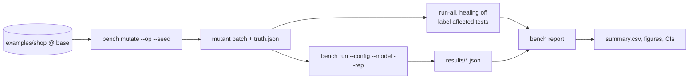

# Research Track: Benchmarking Self-Healing and Test Impact Analysis

QA Brain is an engineering project with one research question attached: *under controlled UI changes, how much do tiered, approval-gated locator healing and layered test impact analysis improve on the current alternatives, at what cost in tokens and time, and without weakening a single assertion?* This document specifies the benchmark harness that answers it — the applications under test, the mutation operators, how ground truth is derived, the metrics, the baselines B0–B2, the measurement protocol with pinned models and pre-registered thresholds, the result formats, the threats to validity, and the thesis chapter outline. The harness is built in M7 and the campaign runs in M8 ([roadmap](./roadmap.md)); the directory layout and CLI are in [research/bench/README.md](../research/bench/README.md). The mechanisms being measured are specified in [self-healing](./self-healing.md) and [impact-analysis](./impact-analysis.md).

## 1. Motivation and prior evidence

Published numbers on locator repair come from two kinds of sources that the thesis keeps apart.

**Peer-reviewed, reproducible.** Similo++ reaches 99.4% exact-match relocation on a 10,376-pair benchmark over 30 sites and 16 versions, and HybridSimilo relocates 98.8% versus 95.8% for the original Similo ([Empirical Software Engineering 2026](https://link.springer.com/article/10.1007/s10664-026-10903-6), [arXiv 2505.16424](https://arxiv.org/html/2505.16424)). VISTA repaired about 81% of 2,672 breakages across 86 releases with image matching ([FSE 2018](https://dl.acm.org/doi/10.1145/3236024.3236063)). A heuristic-then-LLM re-ranking pipeline lifted correct matches from 68 to 97 of 139 broken statements, and found whole-page prompts average 21,733 tokens ([arXiv 2312.05778](https://arxiv.org/html/2312.05778)). The zero-cost accessibility-tree approach heals in 3–5 s per element versus 30–90 s for full LLM rediscovery ([arXiv 2603.20358](https://arxiv.org/html/2603.20358v1)). Most importantly, the enterprise study of autonomous repair agents reports 12% hallucinated interactions, assertion weakening such as `toBe(5)` → `toBeTruthy()`, silent test deletion, 30% non-converging repair loops, and nominal 70% convergence that drops to 50% once weakened or deleted tests are excluded ([arXiv 2605.01471](https://arxiv.org/html/2605.01471)). The VON Similo LLM result could not be reproduced in 2026 because of undocumented model settings ([arXiv 2310.02046](https://arxiv.org/html/2310.02046v1)).

**Vendor-published — marketing claims, not targets.** The following figures appear in product pages or vendor blogs, were not independently benchmarked, and are cited in the thesis only as motivation:

| Claim | Source | Status |
|---|---|---|
| 97.5% recall / 91.8% precision for diff-based test selection | [Momentic `--ai-select`](https://momentic.ai/docs/ai/select.md) | marketing claim |
| 75–90%+ recovery for intent re-derivation; ~75% for the Playwright healer; 85–95% for "AI-native" rebinding | [Shiplight blog](https://www.shiplight.ai/blog/best-self-healing-test-automation-tools) | vendor comparison, directional only |
| "~70% of failures resolve" via automatic fix PRs | [Checksum](https://www.checksum.ai/) | marketing claim |
| Run 20% of tests for 90% confidence | [Launchable](https://help.launchableinc.com/features/predictive-test-selection/) | typical-case claim |
| ~1.5% per-execution flake rate, ~16% of tests flake | [secondary blog](https://talent500.com/blog/google-flaky-test-mitigation-strategies/) | low confidence |
| ~114K tokens per MCP-driven test vs ~27K via CLI skill | [TestQuality](https://testquality.com/playwright-test-agents-mcp-architecture-2026/) | single-vendor dataset |

Meta's result — 2× infrastructure cost reduction while catching >95% of individual failures and >99.9% of faulty changes ([Meta PTS](https://engineering.fb.com/2018/11/21/developer-tools/predictive-test-selection/)) — is peer-reviewed but comes from a monorepo with millions of tests, so it is context, not a target.

## 2. Harness design

### 2.1 Applications under test

| App | Stack | Tests | Platforms | Arrives |
|---|---|---|---|---|
| `examples/shop` | React 19 + Vite, client-side router, `/api/*` served by a small Node handler; product list, product page, cart, checkout, account | 22 intent-level YAML tests, 6 modules | web | M2–M3 (replaces `examples/static-site` for everything except the smoke test) |
| `examples/todo-android` | Jetpack Compose, single activity; list, detail, settings | 8 tests sharing 5 intents with `shop` where semantics allow | android | M6 |

Both apps are deterministic (seeded data, no network beyond `localhost`), so every failure is attributable to the mutation, the healer, or the model.

### 2.2 Mutation operators

`bench mutate --op <op> --seed <n>` applies an operator to a random eligible element chosen by a seeded PRNG and emits a git patch plus a `truth.json` describing the transformed element before and after (role, accessible name, `data-testid`, id-relative XPath, bounding box). The healer never sees `truth.json`.

| Operator | What changes | Expected outcome | Heal tier expected to solve |
|---|---|---|---|
| `rename-text` | visible text / accessible name of a button or link | `heal` | T1 (text and aria-label weights) |
| `move-element` | reparent the element within the same view | `heal` | T1 (ancestor_path LCS, neighbor_texts) |
| `restyle` | churn CSS classes and HTML ids | `heal` | T0 (role+name) |
| `remove-element` | delete the element | `fail` — any heal is a false heal | none |
| `add-banner` | insert a cookie overlay intercepting clicks | `heal` via L2 transient recovery, category `interaction_change` | classifier, not T0–T3 |
| `change-route` | move a page to a new URL | `propose-only` — `intent_text` proposal, never auto-approved | proposal pipeline |
| `reorder-list` | permute items in the product list | `heal`, with a deliberate sibling ambiguity | T1 margin rule; T3 tie-break |
| `wrap-in-shadow-dom` | wrap the target in an open shadow root | `heal` (Playwright role locators pierce open shadow DOM); closed roots are out of scope, a known limit of accessibility-tree healing ([arXiv 2603.20358](https://arxiv.org/html/2603.20358v1)) | T0/T1 |

10 seeds × 8 operators × 2 apps = **160 mutants**; mobile operators are the Compose equivalents (`contentDescription` rename, `testTag` churn, reparenting within a `Column`). Operators and seeds are frozen and committed before T2/T3 are implemented so that the tiers are not tuned to the test set.

### 2.3 Ground truth

For each mutant the harness first runs the whole suite with healing disabled (`--heal=off`). Tests that fail are **affected**; tests that pass are **unaffected** and form the TIA negative set. Each affected test inherits the operator's label: `heal`, `propose-only`, or `fail`. A healed step is **correct** only if the locator the healer verified resolves to the element recorded in `truth.json` (compared by role + accessible name + id-relative XPath); anything else is a false heal even if the test went green. For TIA, the truth of "which tests should run" is exactly the affected set from the run-all.

## 3. Metrics

| Metric | Definition | Source of data |
|---|---|---|
| Heal success rate | correctly healed steps ÷ steps labeled `heal` | `step_result.cache_status='HEALED'` ∧ `heal_proposal` ∧ truth match |
| False-heal rate | heals onto a wrong element ÷ all heals attempted (includes `fail`-labeled mutants) | truth mismatch |
| Assertion-weakening rate | assertion steps whose `expect`, `negative`, or text changed, or tests deleted/`fixme`d ÷ tests | diff of test definitions before/after; **must be 0** for QA Brain by construction, measured for baselines |
| Auto-approve precision | auto-approved proposals that are correct ÷ auto-approved | `heal_proposal.status='auto_approved'` |
| TIA precision / recall | selected ∩ affected ÷ selected; selected ∩ affected ÷ affected; plus `fallbackToRunAll` frequency | `qa_impact_select` output vs truth |
| Tokens and USD per run | Σ `gen_ai.usage.input_tokens`, `gen_ai.usage.output_tokens` per attempt; cost = uncached·P_in + cached·0.1·P_in + cache_write·1.25·P_in + output·P_out at list prices | OTel spans ([GenAI semconv](https://github.com/open-telemetry/semantic-conventions-genai/blob/main/docs/gen-ai/mcp.md)), `step_result.llm_tokens_*` |
| Wall time | per healed step and per run, p50/p95 | `step_result.duration_ms`, `run_attempt.duration_ms` |
| Convergence | repair iterations until pass or give-up; share of non-converging cases | `run_attempt.heals_used`, `needs_human` |

List prices used for USD (2026-08-20): `claude-opus-5` $5/$25 per MTok, `claude-sonnet-5` $2/$10 ([Anthropic pricing](https://platform.claude.com/docs/en/about-claude/pricing)); `gpt-5.6-terra` $2/$12 ([OpenAI models](https://developers.openai.com/api/docs/models)); Ollama is reported as $0 API cost with GPU wall-seconds instead. Prices are recorded in the campaign manifest because they drift.

## 4. Baselines and configurations

| Id | System | Notes |
|---|---|---|
| B0 | Raw Playwright MCP (playwright 1.62.1, `--caps=testing`) + `claude-opus-5` re-authoring the failing step from a fresh `browser_snapshot` | The "LLM + Playwright MCP" status quo; mobile variant uses `appium-mcp` |
| B1 | Playwright healer agent installed with `playwright init-agents --loop=claude` ([Playwright test agents](https://playwright.dev/docs/test-agents)) | Edits spec files directly, no approval gate, marks stubborn tests `test.fixme()`; runs against a generated `.spec.ts` twin of the YAML suite; web only |
| B2 | Healenium 2.2.1 Playwright proxy ([releases](https://api.github.com/repos/healenium/healenium/releases?per_page=3), [how it works](https://healenium.io/docs/how_healenium_works)) | LCS + weighted node distance, `score-cap` 0.6, no margin check; web only; Java/Postgres backend in compose |
| Q1 | QA Brain T0+T1 | deterministic, no LLM |
| Q2 | QA Brain T0+T1+T2 | LLM re-rank over ≤ 10 candidates, ≤ 3k tokens |
| Q3 | QA Brain T0+T1+T2+T3 | adds pHash tie-break (Hamming ≤ 10) |

## 5. Protocol

- **Repetitions.** 3 per cell; medians reported with bootstrap 95% confidence intervals (1,000 resamples).
- **Models.** Pinned ids `claude-opus-5`, `claude-sonnet-5`, `gpt-5.6-terra`, and one open-weights model served by Ollama through the OpenAI-compatible driver, chosen at campaign start and recorded in `manifest.json`. Anthropic ids from 4.6 onward are dateless pinned snapshots; `temperature` is rejected by the Claude 5 family and is not set for any provider. `output_config.effort` is fixed at `medium`.
- **Run matrix.** The full model sweep runs on Q2 and B0 (the two LLM-dependent systems); Q3 and B1 run on `claude-sonnet-5` only; Q1 and B2 have no model. Cells: 160 mutants × (2 systems × 4 models + 2 systems × 1 model + 2 systems) × 3 reps = 5,760 test-suite runs, executed in the hosted compose stack with 4 browser workers.
- **Pre-registered thresholds.** Healing constants are frozen before the campaign: T1 accept `score ≥ 0.6 ∧ margin ≥ 0.1`, auto-approve `score ≥ 0.8` after 3 consecutive passes on ≥ 2 SHAs, ≤ 3 heals per step and ≤ 6 per test, per-tier time boxes 10/20/60/10 s. Hypotheses: H1 Q2 heal success ≥ B0 at ≤ 25% of B0's tokens; H2 Q1–Q3 false-heal rate ≤ 2% and lower than B2 on `reorder-list`; H3 assertion weakening = 0 for Q1–Q3, > 0 observed for at least one of B0/B1; H4 TIA recall ≥ 0.95 with precision ≥ 0.5 and `fallbackToRunAll` in ≤ 15% of mutants. These are design decisions registered in the repository before any data is collected; the result tables report them pass/fail.
- **Isolation.** Each cell runs in a fresh browser context (`--isolated`), fresh SQLite store, seeded app data; `examples/todo-android` cells use `ReactiveCircus/android-emulator-runner@v2` on a KVM-enabled runner ([README](https://github.com/ReactiveCircus/android-emulator-runner/blob/main/README.md)).

## 6. Result formats

Every cell produces one JSON document (`research/bench/results/<campaign>/<mutant>/<system>/<model>/rep<k>.json`) with the manifest hash, mutant id and label, per-test outcomes, per-step heal records (tier, score, margin, correct), token and cost totals, and wall times. `bench report` aggregates them into `summary.csv` (one row per cell), `by-operator.csv`, and `hypotheses.json` (H1–H4 with CIs), and renders the figures used in the thesis from Jupyter notebooks under `research/bench/notebooks/`. Raw snapshots and screenshots referenced from results are stored as artifacts (`artifact.kind='snapshot'|'screenshot'|'diff'`) and linked by id, not copied.

## 7. Threats to validity

- **Internal — authorship bias.** The same team designs the healer and the mutation set. Mitigations: operators and seeds are frozen before T2/T3 exist; `truth.json` is never visible to the system; B0–B2 are run with their documented defaults and the exact command lines are published.
- **Construct — "green" is not "correct".** Heal success is measured against `truth.json`, not against test status, precisely because a wrong sibling click can pass; assertion weakening is diffed mechanically for every system.
- **External — two small apps.** 22 + 8 tests on a React and a Compose app do not represent Angular, server-rendered, or iOS applications; the route-map layer is only exercised for React Router. Results are reported per operator rather than as one headline number.
- **Reliability — model non-determinism and drift.** Three repetitions and pinned model ids bound run-to-run variance but not provider-side changes over months; every result carries the model id, the date, and the recorded prices, and the deterministic configuration Q1 is the drift-free reference.
- **Conclusion — small N per cell.** 10 seeds per operator yield wide intervals for rare events such as false heals; intervals are reported and the operator-level analysis is treated as exploratory.
- **Baseline fairness.** B1 requires a `.spec.ts` twin suite and B2 a Java backend; both translations may disadvantage the baseline, so the twin generator and compose files are published for audit.
- **Vendor claims.** None of the figures in §1's second table is used as a target or comparison point.

## 8. Thesis chapter outline

1. **Problem and gap** — LLM + browser MCP exists; persistence, healing with approval, change-aware selection, and web/mobile parity do not exist as one open-source gateway (positioning against Momentic, Playwright Test Agents, Healenium, Shiplight).
2. **Background** — regression test selection (TAP, Ekstazi, Datadog TIA, Meta PTS); locator repair (Healenium, Similo/Similo++, VISTA, 2312.05778, 2603.20358); autonomous repair failure modes (2605.01471); MCP 2026-07-28 and the gateway pattern.
3. **QA Brain architecture** — dual-era gateway, curated tool surface, handles, store ([ARCHITECTURE](../ARCHITECTURE.md)).
4. **Healing and TIA design** — fingerprints, T0–T3, proposals and the approval gate; layered union, bailouts, prioritization.
5. **Benchmark methodology** — §2–§6 of this document, including the pre-registration.
6. **Results** — per-operator and per-model tables, cost curves, TIA precision/recall, hypothesis verdicts.
7. **Threats to validity** — §7.
8. **Conclusion and future work** — iOS, closed shadow DOM, GA-tuned weights on the harness, contract testing.

The chapter draft is due at the end of M8 and reviewed before the M9 demo day.
