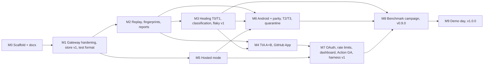

# Roadmap: M0 (September 2026) to M9 (June 2027)

QA Brain is a 10-month, 3–4 person project that ships an MCP gateway for autonomous web and mobile testing. This document is the delivery plan: four parallel workstreams, ten monthly milestones with goals, deliverables, demos, owners and exit criteria, the dependency graph between milestones, a definition of done, the demo-day script that M9 is measured against, and the cut line that says what is dropped first if the team falls behind. It is written to be turned into GitHub milestones and issues on day one; figures that are targets rather than measurements are marked as such. The architecture it delivers is described in [ARCHITECTURE.md](../ARCHITECTURE.md) and the ADRs under [docs/adr](./adr/0001-gateway-on-mcp-sdk-v2-low-level-server.md).

## Workstreams

Each stream has a single accountable owner; the two repository maintainers ([CODEOWNERS](../.github/CODEOWNERS)) review across streams. With three people, streams C and D share an owner until M5; with four, each stream has one.

| Stream | Scope | Packages / paths | Primary docs |
|---|---|---|---|
| **A — gateway and transports** | Low-level MCP server, tool registry, router, upstream supervisor, dual-era negotiation, stdio and Streamable HTTP transports, auth, hosted deployment, observability | `packages/gateway`, `packages/adapter-playwright`, `apps/qa-brain`, `deploy/`, `docker/` | [ARCHITECTURE.md](../ARCHITECTURE.md), [deployment](./deployment.md), [security threat model](./security-threat-model.md), [observability](./observability.md) |
| **B — store, healing, TIA** | Drizzle schemas (SQLite and Postgres), test format, fingerprints, T0–T3 healing, failure classification, impact analysis, flaky detection and quarantine | `packages/store`, `packages/test-format`, `packages/healing` | [data model](./data-model.md), [test format](./test-format.md), [self-healing](./self-healing.md), [impact analysis](./impact-analysis.md), [flaky and quarantine](./flaky-and-quarantine.md) |
| **C — mobile and parity** | appium-mcp adapter, synthesized `ref=mN` snapshots, `mobile_*` tools, platform overlays, parity matrix, Android CI | `packages/adapter-appium` (new in M6), `.github/workflows/android-e2e.yml` | [ADR-0015](./adr/0015-mobile-via-appium-mcp-synthesized-refs-android-first.md), [tool catalog](./tool-catalog.md) |
| **D — runner, GitHub, dashboard, research** | Provider-agnostic LLM runner, zero-code `claude -p` CI profile, GitHub App (PR diff, Check Runs, issues), reusable Action, minimal dashboard, benchmark harness, thesis | `apps/runner` (M1), `apps/action` (M4), `research/bench` | [ci-cd](./ci-cd.md), [client setup](./client-setup.md), [research track](./research-track.md), [ADR-0014](./adr/0014-provider-agnostic-llm-runner.md) |

## Milestone table

Dates are calendar months starting 2026-09-01; each milestone closes on the last working day of its month with a tagged pre-release (`v0.<M>.0`) and a recorded demo. "Owners" are workstream letters.

| M | Month | Goal and deliverables | Demo | Owners | Exit criteria |
|---|---|---|---|---|---|
| **M0** | Sep 2026 | This pull request: 15 ADRs, architecture, ops and security docs, this roadmap; TypeScript monorepo scaffold (`@qa-brain/core`, `store` with all 17 tables, `adapter-playwright`, `gateway`, `qa-brain` CLI); gateway proxies a curated 22-tool surface from `playwright@1.62.1`'s bundled MCP server over stdio with an `action_log`; `ci.yml` green on `ubuntu-latest` and `windows-latest` | `QA_BRAIN_E2E=1 pnpm smoke`: `tools/list` returns 22 sorted names with `ttlMs`, `web_navigate` + `web_snapshot` + `web_click` against `examples/static-site`, SQLite `action_log` rows with redacted args, child process tree dead after close | all | PR merged to `main`; ADRs 0001–0015 `Accepted`; smoke green on both OSes; `qa-brain doctor` all PASS |
| **M1** | Oct 2026 | Gateway hardening: config schema frozen, `${VAR}` expansion with redaction set, health probe 60 s / 5 s / 3 strikes, backoff restart 1 s → 30 s × 5, URL guard on every `url` argument, `server/discover` for modern clients; store schema v1 with migrations for both dialects; `qabrain/test/v1` YAML + `qa_test_save` / `qa_test_get` / `qa_test_list` implemented; runner skeleton with the Anthropic driver (`@anthropic-ai/sdk` `toolRunner`, default model `claude-opus-5`) | An LLM session authors a test through MCP; the YAML is persisted as a `test_case_revision` and reloaded on restart | A, B, D | ≥ 20 unit tests in `packages/gateway`; Windows child-cleanup test passes; config round-trips through `qa-brain serve --dry-run` |
| **M2** | Nov 2026 | Deterministic replay: `qa_run_test` executes a stored test without an LLM, capturing a `step_fingerprint` per step (signals list in [data model](./data-model.md)); run history (`run`, `run_attempt`, `step_result`); HTML + JUnit report via `qa_report_generate`; in-process Playwright embedding option for the worker; zero-code CI profile (`claude -p --bare --mcp-config`); reusable Action design doc; `examples/shop` (React + Vite, 22 tests) created for healing and TIA work | Replay the smoke suite 10 times without an LLM; report shows `cache_status=HIT` on every step | A, B, D | 10 consecutive replays, zero flakes; JUnit consumed by GitHub's test summary |
| **M3** | Dec 2026 | Healing T0 (10-tier deterministic chain) and T1 (weighted similarity, accept iff top ≥ 0.6 and margin ≥ 0.1); `heal_proposal` rows with score, margin, candidates, evidence; `qa_heal_list` / `qa_heal_show` / `qa_heal_review`; failure classification (`infra`, `runtime_error`, `test_data`, `interaction_change`, `timing`, `selector`, `visual`) before any heal; flaky v1 (every attempt recorded, passed-on-retry on the same SHA); visual baseline with pixelmatch; thesis proposal submitted | Rename a button in `examples/shop`; replay fails on `selector`, T1 proposes the renamed element with score and margin, and the proposal appears in the report diff | B, D | Proposal visible in the HTML report with score/margin; assertion-weakening rate 0 on the fixture suite; no auto-approval below the [auto-approve rule](./self-healing.md) |
| **M4** | Jan 2027 | Test impact analysis layers A (static import graph) and B (coverage map) with `qa_impact_select` → `{selectedTests, fallbackToRunAll, notRun, mapFreshness}`; tracked-glob and > 200-file run-all bailout; GitHub App: PR diff, Check Run `QA Brain`, one upserted PR comment, issue filing with signature dedup (max 5 per run); `db_` upstream (Postgres MCP) for data verification | Open a PR on `examples/shop`; the Action selects a subset, posts reasons per test, and creates a Check Run with annotations | B, D | Precision and recall of selection measured against run-all on `examples/shop` and recorded in `research/bench` |
| **M5** | Feb 2027 | Hosted mode: Streamable HTTP via `createMcpHandler(factory, {legacy:'stateless'})`, Postgres 18, pg-boss 12 worker, SeaweedFS artifacts with 15-minute presigned GETs, Smokescreen egress ACL, OTel traces and metrics, API keys (`qab_<keyid>_<secret>`, argon2id), `io.modelcontextprotocol/tasks` for `qa_run_suite`; `docker.yml` publishes signed multi-arch images | `docker compose up`, then Cursor connects over HTTP with a bearer key and runs a suite as a task; the trace appears in Jaeger | A | Threat-model items T7–T11 mitigated; `/readyz` reflects DB, queue and upstream state; image signed with cosign |
| **M6** | Mar 2027 | Android: `appium-mcp` adapter with synthesized `ref=mN` from page-source XML, `mobile_*` tools, platform overlays, parity matrix; `android-e2e.yml` on a weekly schedule (`ubuntu-latest` + KVM + `ReactiveCircus/android-emulator-runner@v2`); healing T2 (LLM re-rank over ≤ 10 candidates, never auto-approved) and T3 (pHash Hamming ≤ 10 tie-break); quarantine state machine with owner + issue guard | The same intent test runs on web and on the Android emulator; the parity matrix shows per-step status and `unmapped` entries | C, B | Android CI green for three consecutive weekly runs; T2 proposals carry rationale and `chosen_ref ∈ candidates` validation |
| **M7** | Apr 2027 | OAuth 2.1 resource server (Keycloak in compose; client-credentials extension for CI), per-key rate limits (100 RPM, 10 concurrent, 2 browsers); minimal dashboard (runs, proposals, quarantine); reusable Action GA on the Marketplace; benchmark harness v1 (`bench mutate`, 8 operators × 10 seeds × 2 apps) | Claude Desktop attaches to the hosted gateway as a custom connector via OAuth; harness emits a metrics JSON for one mutation campaign | A, D | Action listed; harness produces `heal_success_rate`, `false_heal_rate`, `assertion_weakening_rate`, TIA precision/recall, tokens and USD per run |
| **M8** | May 2027 | Benchmark campaign against baselines B0 (raw Playwright MCP + LLM re-authoring), B1 (Playwright healer agent), B2 (Healenium); iOS documentation (macOS only, not deployed); performance pass (snapshot compaction, step cache); docs freeze; `v0.9.0` | Results tables and plots in `research/bench/results` | D (+B) | Thesis results chapter drafted and reviewed by the supervisor; 3 repetitions per configuration completed |
| **M9** | Jun 2027 | Demo day; `v1.0.0`; thesis final; cut-line cleanup (remove stubs that did not ship, archive unfinished branches) | The six-step script below, end to end, from a fresh clone | all | Tag `v1.0.0`; images signed; `qa-brain doctor` and `pnpm smoke` pass on a machine no team member has configured |

## Dependencies between milestones

The critical path is M0 → M1 → M2 → M3 → M6 → M8 → M9: replay must exist before fingerprints are captured, fingerprints before healing, web healing before it is ported to synthesized mobile refs, and both before the benchmark can compare them. M5 (hosted mode) runs in parallel on stream A and blocks M6 only because the worker spawns the `appium-mcp` child; a laptop fallback (stdio worker plus local emulator) keeps M6 unblocked if M5 slips.

## Definition of done

A milestone is closed only when every item below holds; the exit criteria in the table are additional, milestone-specific gates.

1. **CI green** on `ubuntu-latest` and `windows-latest` for `pnpm lint`, `pnpm typecheck`, `pnpm test`, and `QA_BRAIN_E2E=1 pnpm smoke`; the default `tools/list` still has at most 25 entries (Anthropic reports selection accuracy degrading past 30–50 tools, see [Tool Search](https://platform.claude.com/docs/en/agents-and-tools/tool-use/tool-search-tool)).
2. **Docs match code**: every new tool is in the [tool catalog](./tool-catalog.md), every schema change in the [data model](./data-model.md), and every reversal of an earlier decision has a new ADR that supersedes the old one rather than an edit.
3. **A changeset exists** for each user-visible change and the pre-release tag `v0.<M>.0` is cut by `release.yml`.
4. **Security posture unchanged or better**: no new tool outside the allowlist, `browser_run_code_unsafe` and `browser_evaluate` still blocked, no inbound `Authorization` header forwarded to an upstream, `pnpm audit --prod --audit-level high` clean.
5. **Demo recorded** (screen capture plus exact commands) and reproduced by a second team member from a clean clone.
6. **Measurements committed** under `research/bench/results/<milestone>/` wherever the milestone claims a number.

## Demo-day script (M9)

The script exercises every workstream in six steps on `examples/shop` (22 web tests) and `examples/todo-android` (8 tests). Figures in parentheses are illustrative targets chosen at design time, not measured results; M8 replaces them with the benchmark's numbers.

1. **Change the app.** Push a commit that renames "Add to cart" to "Add to bag" in `examples/shop`.
2. **Select.** The reusable Action runs `qa-brain select --base-ref main --head-ref HEAD`; TIA picks 4 of 22 tests and posts the reasons per test (`static`, `coverage`, `route`, `smoke`) in the PR comment marked `<!-- qa-brain-report -->`.
3. **Heal.** Step 3 of `checkout.yaml` fails with category `selector`; T1 proposes the renamed button (score 0.87, margin 0.31), verifies it with `web_verify_element_visible`, and the proposal appears as a diff in the PR comment with before/after screenshots. Nothing is auto-approved; the reviewer approves it with `qa_heal_review`.
4. **Parity.** `android-e2e.yml` runs the same intent suite on the API 35 emulator; the parity matrix is posted with per-step status and any `unmapped` steps called out rather than silently matched.
5. **Regression.** A deliberately broken discount rule fails an `assert` step; the classifier labels it `regression`, not `selector`, healing is skipped, and a GitHub issue is filed with repro steps, the failing snapshot excerpt and a trace link.
6. **Cost and trace.** The report shows token usage and cost per run (target under $0.50 with `claude-opus-5`) next to a Jaeger trace whose spans follow the OTel GenAI MCP conventions (`mcp.method.name`, `gen_ai.tool.name`), correlated through `action_log.traceparent`.

## Cut line

If the team is behind at the M6 checkpoint, scope is removed in this order, one item at a time, with the decision recorded in the milestone issue:

1. Dashboard UI (M7) — reports and `qa_*` tools remain the interface.
2. OAuth 2.1 resource server (M7) — hosted mode stays on API keys; the [auth ADR](./adr/0012-auth-api-keys-first-oauth21-resource-server-later.md) already anticipates this.
3. T3 visual tier and visual regression (M3/M6) — T0–T2 remain.
4. TIA layer C (route ↔ component map) — layers A and B plus the smoke set remain.
5. Quarantine automation — the state machine stays manual (`qa_quarantine_set` with owner and issue).
6. Parity *report* — Android execution stays; the matrix is dropped.

Never cut: the gateway core, store and deterministic replay, T0/T1 healing with the approval gate, TIA layers A and B, GitHub integration, and the benchmark harness. These are the thesis contribution and the reason the project is more than "LLM plus Playwright MCP".

## Why the milestones are ordered this way

- **Replay before healing.** A locator cannot be healed until there is a recorded fingerprint of it from a passing run; this is the Healenium model (store the path of every successfully located element, heal on failure) described in [How Healenium works](https://healenium.io/docs/how_healenium_works), and the reason M2 precedes M3.
- **Deterministic tiers before LLM tiers.** The zero-cost approach in [arXiv 2603.20358](https://arxiv.org/html/2603.20358v1) reports 3–5 s per healed element against 30–90 s for full LLM re-discovery; T0/T1 (M3) therefore ship three months before T2 (M6), and T2 can never auto-approve, following guardrail 3 of [arXiv 2605.01471](https://arxiv.org/html/2605.01471), which also motivates the 6-heals-per-test bound.
- **Flakiness signals before quarantine.** The transition-score monitor (alarm ≥ 0.3, recover ≤ 0.05 over 20 executions) and passed-on-retry detection follow [Buildkite's test monitors](https://buildkite.com/docs/pipelines/configure/tests/workflows/monitors); the 10× burn-in follows [Datadog Early Flake Detection](https://docs.datadoghq.com/tests/flaky_test_management/early_flake_detection/). Both need per-attempt history (M2/M3) before the state machine (M6).
- **Hosted mode mid-project.** The stateless 2026-07-28 revision (no `initialize`, mandatory `server/discover`, tasks as the `io.modelcontextprotocol/tasks` extension) is summarized in the [spec changelog](https://modelcontextprotocol.io/specification/2026-07-28/changelog) and the [tasks extension](https://modelcontextprotocol.io/extensions/tasks/overview); M5 adopts it once stdio is stable, and the [client-credentials extension](https://modelcontextprotocol.io/extensions/auth/oauth-client-credentials) arrives with OAuth in M7.
- **Android after web healing.** [appium-mcp](https://github.com/appium/appium-mcp) returns element UUID refs and page-source XML but no Playwright-style snapshot, so M6 synthesizes `ref=mN` and reuses the M3 pipeline unchanged; Android CI uses `ubuntu-latest` with the KVM udev rule from the [android-emulator-runner README](https://github.com/ReactiveCircus/android-emulator-runner/blob/main/README.md). iOS is macOS-only and is documented in M8 rather than built.
- **Benchmark last, designed first.** The harness (M7) and campaign (M8) compare QA Brain against the [Playwright healer agent](https://playwright.dev/docs/test-agents), which edits test source with no approval gate, and Healenium, whose default `score-cap` of 0.6 has no margin check; the benchmark quantifies that difference.

## Tracking

Each milestone is a GitHub milestone named `M<n> <Mon YYYY>`; each deliverable is an issue labeled with its workstream (`ws:A` … `ws:D`). Heal false positives found during dogfooding are filed with the [heal-false-positive template](../.github/ISSUE_TEMPLATE/heal-false-positive.yml) so they become benchmark fixtures. This file is revised at each milestone close.
