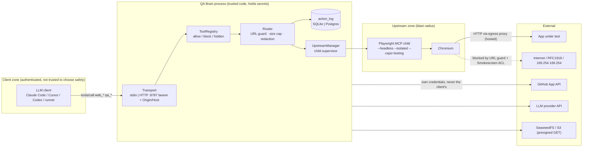

# QA Brain Security Threat Model

QA Brain is an MCP gateway between an LLM client and browser/device automation servers (Playwright MCP now, appium-mcp later), which makes it a confused deputy by construction: untrusted web content steers the LLM, the LLM can only act through QA Brain, and QA Brain holds every credential the upstreams and integrations need. This document fixes assets and trust boundaries, enumerates fifteen threats (T1–T15) with STRIDE class, mitigation, milestone and M0 status, and details the controls that matter most for a gateway: tool allow-listing, the URL guard, the token-passthrough prohibition, redaction, child-process hygiene, the HTTP surface, artifacts, GitHub scope, LLM cost and retention, and supply chain. It implements [ADR-0011](./adr/0011-security-posture-default-deny-no-passthrough-egress-control.md) and follows the [MCP security best practices](https://modelcontextprotocol.io/docs/2026-07-28/tutorials/security/security_best_practices) for revision 2026-07-28 and the hardening checklist in [Docker MCP Gateway v0.43.1](https://github.com/docker/mcp-gateway/releases/tag/v0.43.1). Vulnerability reporting is in [SECURITY.md](../SECURITY.md).

## 1. Scope, assets, trust boundaries

**In scope:** `packages/gateway`, `packages/core` (config schema, redaction, handles), `packages/adapter-playwright`, the `qa-brain` CLI, the `deploy/` Compose topology and the GitHub workflows. **Out of scope:** defects inside Playwright, Chromium or appium-mcp (reported upstream) and the application under test.

**Assets, in priority order:** (1) credentials QA Brain holds — `QA_BRAIN_TOKEN`, `ANTHROPIC_API_KEY` / `OPENAI_API_KEY`, the GitHub App private key, Postgres and S3 credentials, application logins referenced as `${secret:X}` in tests; (2) the host (a laptop in stdio mode, one VM in hosted mode) and everything reachable from it — loopback services, RFC 1918 networks, cloud metadata at `169.254.169.254`; (3) persisted data — `action_log`, `artifact` objects, `test_case_revision` content; (4) verdict integrity — a healed locator or weakened assertion that turns a regression into a pass.

**Trust levels:** the operator's config and environment are trusted. The LLM client is authenticated but not trusted to choose safe actions, because its choices are a function of page content, which is untrusted along with console output and network responses. Upstream MCP servers are trusted code running a browser that visits untrusted pages, so their process boundary is the blast radius.

Three boundaries carry the controls: **client → gateway** (authentication, header validation, rate limits, result caps), **gateway → upstream** (allow-list, argument guards, process isolation, env allow-list) and **upstream → network** (URL guard in the gateway plus, in hosted mode, the Smokescreen egress proxy on the `internal: true` `browsers` network described in [deployment](./deployment.md)).

## 2. STRIDE threat table

Milestones follow the [roadmap](./roadmap.md) (M0 = this PR, September 2026; M5 = hosted mode, February 2027).

| # | Surface → threat | STRIDE | Mitigation | Milestone | In M0 PR? |
|---|---|---|---|---|---|
| T1 | Page content prompt-injects the LLM into calling `browser_run_code_unsafe` / `browser_evaluate` (RCE-equivalent) | E, T | Default-deny `tools.allow`; `tools.block: [browser_run_code_unsafe, browser_evaluate]` wins over allow and `qa_call_tool`; `--caps=testing` only; blocked or unknown name → `isError`, never forwarded | M0 | Yes (allow-list + unit and smoke tests) |
| T2 | Injection → `web_navigate` to `file://`, `169.254.169.254`, loopback or RFC 1918 (SSRF, local file read) | I, E | Gateway URL guard on every `url` argument (§4); `--isolated`; `allowUnrestrictedFileAccess` stays `false`; Smokescreen egress ACL at network level | M0 guard, M5 proxy | Guard yes; proxy Compose only, unwired |
| T3 | Exfiltration: navigate to an attacker origin with secrets or page data in the query string | I | Per-project `allowedOrigins` enforced in gateway and proxy ACL; `${secret:X}` resolved gateway-side, never in LLM context; Playwright `--secrets` redaction; `maxResultChars` cap | M1 | Partial (config schema) |
| T4 | Orphaned upstream children / zombie Chromium trees | D | Close stdin → 2 s → `SIGTERM` → 3 s → `SIGKILL`; Windows `taskkill /PID <pid> /T /F`; probe 60 s / 5 s / 3 strikes; backoff restart 1 s→30 s ×5; idempotent `closeAll()` | M0 basic, M1 full | Yes (smoke asserts tree is dead) |
| T5 | Token passthrough: inbound bearer forwarded to upstreams, GitHub or the LLM provider | S, E | Inbound `Authorization` consumed by `requireBearerAuth`, never placed in an outbound request; every upstream/integration has its own credential | M0 | Yes (by construction; lint test) |
| T6 | Secrets leak via child argv, stderr, pino logs or `action_log` rows | I | Secrets via `env` / `--secrets` file, never argv; `args_shape` + `args_hash` always, `args_redacted` only post-redaction (§5); pino `redact`; child stderr redacted | M0 core, M1 full | Yes (redactor + `argsMode`) |
| T7 | HTTP: unauthenticated access to `/mcp` | S | `requireBearerAuth` against `QA_BRAIN_TOKEN`; `--allow-unauthenticated` honored only on a loopback bind; `/healthz` public | M0 handler, M5 API keys | Bearer yes; API keys no |
| T8 | DNS rebinding / hostile `Origin` against a local HTTP server | S, T | `localhostHostValidation()` + `originValidation()` from `@modelcontextprotocol/node`; bind `127.0.0.1:8787`; 403 on mismatch | M0 | Yes |
| T9 | Header/body mismatch (`Mcp-Method`, `Mcp-Name`) used to evade routing or metering | T | SDK rejects with HTTP 400 + JSON-RPC `-32020`; header-keyed limits only for `MCP-Protocol-Version ≥ 2026-07-28` | M5 | No |
| T10 | Rate and cost abuse; giant results flooding the client context | D | Per-key 100 RPM, 10 concurrent calls, 2 concurrent browsers; per-run step/time budgets; `maxResultChars = 80000` with truncation marker | M0 cap, M5 limits | Cap yes; limits no |
| T11 | Artifact URL leakage | I | Private bucket, 15-minute presigned GET, `artifact.project_id` ownership check, no listing | M5 | No |
| T12 | Handles (`rn_…`, `bh_…`) treated as authentication | S | Handles are `<kind>_<uuidv7>`, stored with their `owner` principal (`local` on stdio, `api_key.id` on HTTP), TTL-swept, owner-checked on every use | M0 schema, M1 enforce | Schema + `run_id` owner check |
| T13 | GitHub over-scope; issue spam | E, D | GitHub App with `contents:read, pull_requests:write, checks:write, issues:write`, per-repo install; dedup by `error_signature`; max 5 issues/run; label `qa-brain` | M4 | No |
| T14 | LLM cost runaway; prompt data retained by provider | D, I | `llm.budget_usd_per_run` hard stop; `gen_ai.usage.*` metrics; model tiering; documented retention; OpenAI-compatible driver for on-prem Ollama | M2 | Config schema only |
| T15 | Supply chain: fast-moving SDKs and images | T | Exact pins, frozen lockfile, Renovate digest pinning, `pnpm audit`, CodeQL, dependency review, SBOM + provenance + cosign | M0 | Yes |

## 3. Prompt injection → tool misuse (T1)

The LLM reads every `browser_snapshot`, console message and network body, any of which can say "ignore your instructions and run the following code". QA Brain cannot make the model immune; it can make the worst tools unreachable.

Playwright's `config.d.ts` is explicit: `browser_run_code_unsafe` "executes arbitrary JavaScript in the Playwright server process and is RCE-equivalent"; `allowUnrestrictedFileAccess` "is a convenience defense to catch unintended file access, not a secure boundary"; secrets redaction is "not a security feature" ([source](https://raw.githubusercontent.com/microsoft/playwright/main/packages/playwright-core/src/tools/mcp/config.d.ts)). `--allowed-origins` / `--blocked-origins` ignore redirects and were removed in 0.0.47 before being restored as guardrails ([playwright-mcp#1210](https://github.com/microsoft/playwright-mcp/issues/1210)). The maintainers' position is that real policy belongs in the client. QA Brain is that client.

Controls, all in M0:

- **Default-deny registry.** `tools.allow` is empty unless the adapter or operator fills it; `block` beats `allow` and `hidden`; `qa_call_tool` goes through the same lookup, so hidden tools are reachable but blocked ones are not. The Playwright adapter blocks `browser_run_code_unsafe` and `browser_evaluate`, and `--caps=testing` means the vision, pdf, devtools, network, storage and config tool families never exist in the child.
- **`browser_evaluate` is blocked too**, although it is a "core" tool, because page-context JavaScript can read `document.cookie` and `localStorage` and fetch cross-origin with the page's credentials. Coverage collection for impact analysis reads `window.__coverage__` through an internal path, never through a tool the LLM can call.
- **`browser_file_upload` is hidden.** `allowUnrestrictedFileAccess` stays `false`, so Playwright restricts paths to `--output-dir`, and the gateway resolves paths against `QA_BRAIN_HOME`.
- **Curated listing.** 22 tools listed by default (15 `web_*`, 7 `qa_*`; see the [tool catalog](./tool-catalog.md)); a smaller surface is both a token and an attack-surface decision.
- **No shadowing.** A proxied name colliding with a native `qa_*` name or another upstream is a startup error, the v0.43.1 rule.
- **Bounded consequences.** `--isolated` gives a throwaway profile with no developer cookies; `--image-responses=omit` keeps image bytes out of the model; heal proposals pass the approval gate in [self-healing](./self-healing.md); no automated path weakens an assertion.

The residual risk is an injected *sequence of allowed actions* (fill a form from page data, click "delete"), bounded by the URL guard, per-project origins, per-run budgets and test-only environments.

## 4. SSRF and the URL guard (T2, T3)

Every `url` argument (later, `target` values that parse as URLs) passes `assertSafeUrl()` in the Router before forwarding. The rules mirror the v0.43.1 remote-URL checks and the best-practices private-range list:

| Rule | Detail |
|---|---|
| Scheme | `http:` / `https:` only; `file:`, `data:`, `javascript:`, `ftp:`, `chrome:`, `about:` rejected (`about:blank` excepted) |
| Userinfo | `user:pass@host` rejected |
| Literal IPs | Loopback `127.0.0.0/8`, `::1`; private `10.0.0.0/8`, `172.16.0.0/12`, `192.168.0.0/16`, `fc00::/7`; link-local/metadata `169.254.0.0/16`, `fe80::/10`; `0.0.0.0`, `::`; IPv4-mapped IPv6 normalized first |
| Hostnames | `localhost`, `*.localhost`, `*.internal`, `metadata.google.internal` rejected; others resolved with `dns.lookup({ all: true })` and every address checked |
| Allow-list | With `projects[].allowedOrigins` (M1) the origin must match; the smoke test allows `127.0.0.1:<ephemeral>` via `allowLoopback: true`, accepted on stdio only |
| Redirects | The guard sees the initial URL only; redirect-time enforcement belongs to the egress proxy |

In hosted mode the browser container sits on the `browsers` network (`internal: true`) with `--proxy-server http://egress:4750`. Smokescreen denies RFC 1918, link-local and `169.254.169.254` by default and resolves DNS itself at connect time, defeating rebinding, which is why the [best-practices page](https://modelcontextprotocol.io/docs/2026-07-28/tutorials/security/security_best_practices) names it. The ACL is `deploy/egress/acl.yaml`.

## 5. Token passthrough and secrets (T5, T6)

**Passthrough is prohibited.** Servers MUST NOT accept or transit tokens not issued to them ([authorization spec](https://modelcontextprotocol.io/specification/2026-07-28/basic/authorization)). The inbound bearer is verified by `requireBearerAuth` and reduced to an `AuthInfo` (principal, scopes). Outbound calls use their own credentials: the Playwright child gets an allow-listed environment plus `mcpServers.<id>.env`; GitHub uses an App installation token; the LLM driver uses `ANTHROPIC_API_KEY` or `OPENAI_API_KEY`. A unit test fails if `authInfo.token` is referenced on any outbound path.

**Redaction before persistence.** `packages/core/src/redact.ts` runs before an `action_log` row is written and before any stderr line:

- Key pattern `/(pass(word|phrase)?|secret|token|api[-_]?key|authorization|auth|cookie|session[-_]?id|credential|private[-_]?key|bearer)/i` — matching keys get `[REDACTED]` regardless of content.
- Value patterns, applied inside free text: `github_pat_[A-Za-z0-9_]{20,}`, `gh[pousr]_[A-Za-z0-9]{20,}` (`ghp_`, `gho_`, `ghu_`, `ghs_`, `ghr_`), `sk-[A-Za-z0-9_-]{16,}`, Slack `xox[baprs]-…`, AWS `AKIA[0-9A-Z]{16}`, JWT `eyJ….….…`, `Bearer <token>`, PEM private-key blocks.
- Literal secrets: every value the loader expands from `${VAR}` / `${VAR:-default}` is registered with `addSecret()` and matched as an escaped literal, longest first (literals under 6 characters are ignored).

`log.argsMode` selects what `action_log` keeps: `shape` (keys and types, the v0.43.1 behavior), `redacted` (local default) or `none`; `args_hash` is always stored so step caching works without values, and result bodies are never stored. pino's `redact` list covers `req.headers.authorization`, `*.password`, `*.token`, `*.apiKey`, `*.secret`, `env.*`. `.env` is gitignored; CI runs `git check-ignore .env` and a `git grep` for the token prefixes above.

## 6. Child-process hygiene (T4)

The child is launched as `node <playwright pkg dir>/cli.js mcp --headless --isolated --caps=testing --snapshot-mode=full --image-responses=omit --codegen none --output-dir <QA_BRAIN_HOME>/pw-out --timeout-action 5000 --timeout-navigation 30000`, resolved via `require.resolve('playwright/package.json')`. No `npx`: it adds a registry fetch at spawn time and a process layer whose grandchildren survive a plain kill ([python-sdk#850](https://github.com/modelcontextprotocol/python-sdk/pull/850)). The child environment is an allow-list (`PATH`, `HOME`, `TEMP`/`TMP`, `SYSTEMROOT`, `PLAYWRIGHT_BROWSERS_PATH`) merged with the configured `env`; gateway secrets are not inherited, and nothing secret goes in argv, which `ps` and Task Manager show to every local user.

Shutdown follows the [stdio transport](https://modelcontextprotocol.io/specification/2026-07-28/basic/transports/stdio) sequence: close stdin, 2 s, `SIGTERM`, 3 s, `SIGKILL`. Windows has neither `SIGTERM` nor process groups, so the supervisor runs `taskkill /PID <pid> /T /F`, terminating the `node → chromium` tree. If `StdioClientTransport.pid` is unavailable, the supervisor spawns the child itself with `detached: true` (own process group on POSIX) and `windowsHide: true`. One idempotent `closeAll()` is wired to `exit`, `SIGINT`, `SIGTERM`, `SIGHUP` and `beforeExit`; the smoke test asserts the pid is dead after `gateway.close()` on Ubuntu and Windows. Liveness uses `server/discover` (modern) or `ping` (legacy) every 60 s, 5 s timeout, three strikes before restart. Degraded upstreams keep their names in `tools/list`, because a vanished name keeps being called from conversation history.

Hosted mode adds container isolation: `pwuser`, the seccomp profile that keeps the Chromium sandbox on, `cap_drop: [ALL]`, `read_only`, `no-new-privileges`, memory and CPU limits ([Playwright Docker docs](https://playwright.dev/docs/docker)).

## 7. HTTP surface (T7–T10)

`qa-brain serve --transport http` mounts `createMcpHandler(factory, { legacy: 'stateless' })` through `toNodeHandler` at `POST /mcp`, bound to `127.0.0.1:8787` unless `--host` says otherwise.

- **Authentication.** `requireBearerAuth({ verifier })` compares with `crypto.timingSafeEqual` against `$QA_BRAIN_TOKEN`; missing or wrong → 401 with `WWW-Authenticate`. `--allow-unauthenticated` is accepted only on a loopback bind. `GET /healthz` is public; `GET /readyz` reports store and upstream state without secrets. M5 replaces the single token with `api_key` rows (`argon2id` `key_hash`, `prefix` lookup, `scopes`, `revoked_at`); M7 adds OAuth 2.1 resource-server mode ([ADR-0012](./adr/0012-auth-api-keys-first-oauth21-resource-server-later.md)).
- **Host and Origin.** `localhostHostValidation()` and `localhostOriginValidation()` by default; `http.allowedHosts` / `http.allowedOrigins` switch to `hostHeaderValidation([...])` / `originValidation([...])`. Invalid Origin → 403, as the [Streamable HTTP spec](https://modelcontextprotocol.io/specification/2026-07-28/basic/transports/streamable-http) requires.
- **Header mirror.** The SDK validates `Mcp-Method` and `Mcp-Name` against the body and answers HTTP 400 with `-32020` on mismatch. Per-key rate limiting (M5) keys on the verified principal plus `Mcp-Name`, only for requests with `MCP-Protocol-Version` 2026-07-28 or later; legacy requests are metered on the parsed body.
- **Limits.** 100 requests/minute, 10 concurrent tool calls and 2 concurrent browser contexts per key (ContextForge's defaults, counters shared in Postgres). Result text is capped at `maxResultChars = 80000` (about 20k tokens, under Claude Code's 25k-token MCP result ceiling at [code.claude.com](https://code.claude.com/docs/en/mcp)) with a `[truncated N chars]` marker; request bodies at 1 MiB in Node and 100 MB at Caddy.
- **Handles are not sessions.** `run_id` and future `bh_`/`dh_` handles are random uuidv7 values stored with their owner and re-checked on every use; possession proves nothing.

## 8. Artifacts (T11)

Screenshots, snapshots, traces and videos go to the `fs` driver under `QA_BRAIN_HOME/artifacts` locally and to a private SeaweedFS/S3 bucket in hosted mode. The `artifact` row records `bucket`, `key`, `sha256`, `project_id`, `expires_at`. Tools return artifact ids, not URLs; `ArtifactStore.url(id, ttlMs)` mints a 15-minute presigned GET after an ownership check, the bucket has no public listing, and Trace Viewer links (`https://trace.playwright.dev/?trace=<presigned url>`) are generated on demand ([trace viewer](https://playwright.dev/docs/trace-viewer)). A 30-day lifecycle rule bounds retention.

## 9. GitHub integration (T13)

QA Brain authenticates as a GitHub App installed per repository with `contents:read`, `pull_requests:write`, `checks:write`, `issues:write`; the private key is read from `GITHUB_APP_PRIVATE_KEY_FILE`, never from an env var that could reach a child. Installation tokens are short-lived and repository-scoped. Personal access tokens are for local experiments only and are caught by the `github_pat_` / `ghp_` patterns if they reach an argument. Issue filing is bounded: one issue per `error_signature`, at most 5 per run, label `qa-brain`, only for failures classified `regression`. The reusable Action requests `checks: write, pull-requests: write, issues: write, contents: read` and nothing more.

## 10. LLM cost and data retention (T14)

Every LLM call goes through the `LlmDriver` with `llm.budget_usd_per_run` as a hard stop computed from `gen_ai.usage.input_tokens` / `output_tokens` and the driver's price table; the T2 healing tier is additionally capped at 10 candidates and 3,000 tokens per call. Model tiering (Haiku-class for classification, Opus-class for re-ranking) is configuration. On retention: Anthropic's MCP connector is excluded from Zero Data Retention ([MCP connector docs](https://platform.claude.com/docs/en/agents-and-tools/mcp-connector)) and Claude Fable 5 requires 30-day retention rather than ZDR; teams with stricter needs use the OpenAI-compatible driver against a local Ollama endpoint. Snapshots sent to a provider may contain personal data from the application under test, so test environments should hold synthetic data; `${secret:X}` values never enter a prompt.

## 11. Supply chain (T15)

- **Exact pins.** No carets: `@modelcontextprotocol/*@2.0.0`, `playwright@1.62.1`, `@libsql/client@0.17.4`, `drizzle-orm@0.45.2`, `zod@4.4.3`; CI installs with `pnpm install --frozen-lockfile` under `engine-strict=true`.
- **Renovate** (`renovate.json`): `config:recommended`, `:pinAllExceptPeerDependencies`, `docker:pinDigests`, `helpers:pinGitHubActionDigests`; grouped PRs for `mcp-sdk`, `playwright` (monthly, labeled `needs-tool-schema-check` because tool names change between releases) and `appium`; weekly lock-file maintenance. Dependabot version updates are off to avoid duplicate PRs; security alerts stay on.
- **Static analysis.** `codeql.yml` (`javascript-typescript`) on pull requests and weekly; `dependency-review.yml` with `fail-on-severity: high` and `deny-licenses: AGPL-3.0`; `pnpm audit --prod --audit-level high` in the lint job.
- **Images.** `docker.yml` builds `linux/amd64,linux/arm64` with `provenance: true`, `sbom: true`, signs keyless with cosign via `sigstore/cosign-installer`, and prints the digest; `deploy/docker-compose.prod.yml` references images by digest. The browser image derives from `mcr.microsoft.com/playwright:v1.62.1-noble`, the same version as the pinned npm package, so one browser revision is shared by the MCP child, CI and the runner.
- **Workflows.** `permissions: contents: read` by default, elevated per job; third-party actions pinned to digests by Renovate. See [CI/CD](./ci-cd.md).

## 12. M0 verification and residual risks

M0 ships tests for every control marked "Yes": `browser_run_code_unsafe` and `browser_evaluate` absent from `tools/list` and rejected via `qa_call_tool`; redactor fixtures for each value pattern and for env-expanded literals; URL-guard fixtures per rejected class; `/mcp` returning 401 without the bearer and 403 with a foreign Origin; and the smoke test's process-tree assertion on both operating systems.

Residual risks, tracked by milestone: redirect-time SSRF in stdio mode until the egress proxy is wired (M5); no per-project origin allow-list until M1; one shared bearer token until API keys (M5); no browser-level sandbox on a laptop outside Docker; and the irreducible fact that an injected page can still drive any *allowed* tool, which is why QA Brain targets test environments and keeps heal and issue-filing paths behind approval gates.
