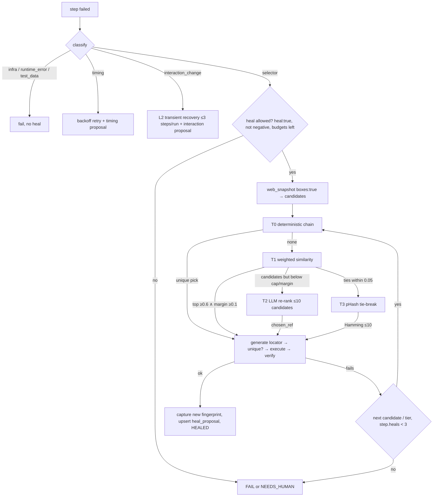

# Self-healing locators

QA Brain treats a broken locator as a *classification and repair* problem, not as a prompt to an LLM. Every successfully executed step leaves behind a multi-signal element fingerprint; when a later run cannot find that element, the gateway first classifies the failure (only `selector` failures are healable), then walks a four-tier ladder — T0 deterministic fallback chain, T1 weighted attribute similarity, T2 LLM re-rank over a short candidate list, T3 perceptual-hash tie-break — each gated by a uniqueness check and a post-action verification. The healed locator is used for the current run only and is recorded as a `heal_proposal` with score, margin, candidates and evidence; it becomes the primary locator only after human review or after a narrow auto-approve rule is satisfied. Assertions are never modified, attempts are bounded (3 per step, 6 per test attempt), and rejections feed back as permanent negative examples. This document specifies the pipeline that [`packages/healing`](../packages/healing) implements (pure functions `classify()`, `score()` and the T0 chain ship in M0 with fixture tests; T1 runtime integration lands in M3, T2/T3 in M6 per the [roadmap](./roadmap.md)). Table definitions are in the [data model](./data-model.md); the step cache that feeds healing is in the [test format](./test-format.md); the decision record is [ADR-0009](./adr/0009-self-healing-as-tiered-proposals-with-approval.md).

## 1. Why a ladder, and why proposals

Three results from the literature shape the design:

- Selector-only healing leaves most failures unresolved. QA Wolf's January 2026 taxonomy attributes roughly 28% of failures to selectors, 30% to timing, 14% to test data, 10% to interaction changes, 10% to visual assertions and 8% to runtime errors ([QA Wolf, self-healing types](https://www.qawolf.com/blog/self-healing-test-automation-types)). A healer that only re-resolves selectors must therefore classify first and refuse to "heal" what is not a selector problem.
- Deterministic and weighted-attribute methods are cheap and very accurate on real drift. The zero-cost accessibility-tree approach reports 3–5 s per healed element versus 30–90 s for full LLM rediscovery ([arXiv 2603.20358](https://arxiv.org/html/2603.20358v1)); Similo++ reaches 99.4% exact-match on a 10,376-pair benchmark ([Nass et al., EMSE 2026](https://link.springer.com/article/10.1007/s10664-026-10903-6)). An LLM is only justified as a re-ranker over a pre-filtered list — whole-page prompts averaged 21,733 tokens and the LLM performed best with simple pre-selection ([arXiv 2312.05778](https://arxiv.org/html/2312.05778)).
- Autonomous repair loops misbehave without guardrails: 12% hallucinated interactions, assertion weakening (`toBe(5)` → `toBeTruthy()`), silent test deletion, and 30% of repair families never converging ([arXiv 2605.01471](https://arxiv.org/html/2605.01471)). Playwright's healer agent edits test source directly and marks stubborn tests `test.fixme()` ([playwright-test-healer.agent.md](https://github.com/microsoft/playwright/blob/main/packages/playwright/src/agents/playwright-test-healer.agent.md)); Healenium applies the healed locator at runtime, never writes it back, and routes approval through a report ([How Healenium works](https://healenium.io/docs/how_healenium_works)). QA Brain adopts the Healenium model plus a reviewable diff, following Momentic's four-layer ladder (L1 in-run re-resolution, L2 capped transient recovery, L3 reviewable permanent fix, L4 quarantine) ([Momentic auto-maintenance](https://momentic.ai/docs/reliability/auto-maintenance.md)).

## 2. Failure taxonomy

Classification runs before any repair and is recorded on `step_result.failure_category` and `run_attempt.failure_category`. Heuristics are evaluated top to bottom; the first match wins. `infra` is always evaluated first so an outage is never mistaken for drift.

| `failure_category` | Heuristics (first match wins) | Action |
|---|---|---|
| `infra` | navigation timeout to `baseUrl`; `net::ERR_*`; browser context or device gone; upstream MCP `isError` with a degraded/restarting hint; document HTTP 5xx; emulator offline | attempt `status=error`; retry once; no heal; feeds the outage clustering in [flaky-and-quarantine](./flaky-and-quarantine.md) |
| `runtime_error` | uncaught exception in `web_console_messages` (level `error`) during the step; XHR/fetch 5xx during the step; app crash dialog (`mobile_list_crashes` on mobile) | fail, no heal |
| `test_data` | 4xx on form submit; validation text such as "already exists" / "invalid credentials" appears; the `auth/login` module failed | fail, no heal |
| `interaction_change` | target found but not actionable: overlay, modal or cookie banner intercepts pointer events; element disabled; element off-screen | L2 transient recovery (dismiss / scroll) with at most 3 generated steps per run, then an `interaction` proposal |
| `timing` | target appears within 2× the step timeout on re-check; spinner visible or pending network requests at failure time | one backoff retry; `timing` proposal (raise `timeout` or insert `wait`) |
| `selector` | target not found or not unique; page loaded; no navigation error | T0 → T3 ladder (this document) |
| `visual` | step passed, visual checkpoint diff above threshold | report only |

An assertion that fails against an element that *was* located correctly is not a healing case at all; it is surfaced as a product regression in the report and, in CI mode, becomes an issue candidate (see [ci-cd](./ci-cd.md)). This mirrors Momentic's rule that "real product regressions and infrastructure failures remain failures".

## 3. Element fingerprint capture

A fingerprint is captured for every `act`/`assert` step that targets an element, at the moment the step passes. It is stored in `step_fingerprint` keyed by `cache_key` (see [test-format](./test-format.md)) and is the input to every tier.

Capture uses only two Playwright MCP tools plus a gateway-internal probe:

1. `web_snapshot` with `boxes: true` — the accessibility tree from `page.ariaSnapshot({mode: 'ai'})` with `[ref=eN]` references and `[box=x,y,width,height]` per node ([Playwright `ariaSnapshot`](https://playwright.dev/docs/api/class-page#page-aria-snapshot)). From this tree the gateway derives `role`, `name`, `text`, `bbox_norm`, `area_norm`, `ancestor_path` (root → target, one entry per ancestor with role and accessible name) and `neighbor_texts` (the 6 nearest visible texts by box distance).
2. `web_generate_locator` (exposed by `--caps=testing`, hidden from the default tool list but callable through `qa_call_tool`) — turns the chosen ref into a stable Playwright locator such as `getByRole('button', { name: 'Add to cart' })` or `getByTestId('add-to-cart')`. The locator string becomes `step_fingerprint.locator`; `locator_strategy` is parsed from it (`role|testid|id|label|text|css|xpath`).
3. A gateway-internal DOM probe, executed on the gateway's own privileged connection and never exposed to the LLM (the same channel that reads Istanbul coverage for [impact analysis](./impact-analysis.md)), fills DOM-only signals: `testid`, `html_id`, `name_attr`, `type`, `aria_label`, `placeholder`, `tag`, `classes[]`, `href`, a short `css` path and `xpath_id_rel` (XPath relative to the nearest ancestor with an `id`). `browser_evaluate` and `browser_run_code_unsafe` stay blocked for the model; see [security-threat-model](./security-threat-model.md).
4. Optionally a crop: `web_take_screenshot` with the element ref and a `filename` writes a PNG into the Playwright `--output-dir` (the gateway launches Playwright MCP with `--image-responses=omit`, so images are never returned inline); the gateway reads the file, stores it as an `artifact` of kind `crop` and records a 64-bit DCT perceptual hash in `signals.phash`.

The stored `signals` JSON therefore has the shape `{role, name, testid, html_id, name_attr, type, aria_label, placeholder, text, tag, classes[], href, css, xpath_id_rel, ancestor_path[], neighbor_texts[], bbox_norm{x,y,w,h}, area_norm, phash, url, title}`. Missing attributes are stored as absent, not as empty strings, because the scorer normalizes over the attributes present (section 5.2). Additionally `region_hash` — a hash of the accessibility subtree around the target — is stored for Stagehand-style cache validation: on replay the gateway recomputes it against the live snapshot and treats drift as a cache `MISS` rather than clicking blindly ("a wrong cached click is worse than a slow click", [Stagehand caching](https://www.browserbase.com/blog/stagehand-caching)).

Two rules are absolute. First, **refs are never persisted as locators**: `[ref=eN]` values are numbered per snapshot and are invalidated by the next snapshot or any page change ([Playwright MCP README](https://github.com/microsoft/playwright-mcp)); only the `web_generate_locator` output plus the fingerprint is stored. Second, values of `${secret:…}` variables never enter a fingerprint, a candidate payload or an LLM prompt; the redaction set from the config loader is applied before persistence ([observability](./observability.md)).

## 4. Pipeline overview



Every tier must produce a locator that resolves to exactly one element (Healenium validates that each healed locator resolves to exactly one not-previously-returned element; [HealingService.java](https://github.com/healenium/healenium-web/blob/master/src/main/java/com/epam/healenium/service/HealingService.java)), and every tier is time-boxed: T0 10 s, T1 20 s, T2 60 s, T3 10 s.

## 5. Tiers

### 5.1 T0 — deterministic fallback chain

T0 re-derives a locator from the stored fingerprint in the 10-tier order of the zero-cost accessibility-tree paper ([arXiv 2603.20358](https://arxiv.org/html/2603.20358v1)), stopping at the first rung that resolves to exactly one element in the fresh snapshot:

1. `role` + `name` → 2. `role` only → 3. `data-testid` (`testid`) → 4. HTML `id` → 5. `aria_label` exact → 6. `aria_label` contains → 7. `href` fragment → 8. class exact → 9. class contains → 10. visible `text`.

Resolution uses `web_find` (text or regex search in the snapshot, returning nodes with context) and `web_generate_locator` on the single surviving ref. T0 needs no LLM and completes in one snapshot round-trip. Because rungs 8–10 are only as stable as the team's CSS discipline and locale, a T0 pick is also scored with the T1 function against the other candidates so that `score` and `margin` are always populated; the auto-approve rule in section 8 reads them.

### 5.2 T1 — weighted similarity (Similo++ style)

T1 computes a weighted similarity between the stored fingerprint and every interactive node of the fresh snapshot whose role or tag family matches (buttons and links, text inputs, selects, checkboxes/switches, list items). Weights follow Similo's 0.5–1.5 stability range ([Similo, arXiv 2505.16424](https://arxiv.org/html/2505.16424)); the two additional properties `type` and `aria_label`, Jaro-Winkler and Jaccard similarities come from Similo++ ([Nass et al., EMSE 2026](https://link.springer.com/article/10.1007/s10664-026-10903-6)); the ancestor-path LCS mirrors Healenium's `LCSPathDistance`. Visible text gets a high weight because it is the most consistent attribute across versions ([arXiv 2312.05778](https://arxiv.org/html/2312.05778)).

| attribute | weight | similarity function |
|---|---|---|
| `testid` | 1.5 | equality |
| `html_id` | 1.5 | equality |
| `role` + `name` | 1.5 | role equality × Jaro-Winkler(name) |
| `text` | 1.25 | Jaro-Winkler |
| `aria_label` | 1.25 | Jaro-Winkler |
| `placeholder` | 1.0 | Jaro-Winkler |
| `name_attr` | 1.0 | equality |
| `neighbor_texts` | 1.0 | Jaccard over tokens |
| `ancestor_path` | 1.0 | LCS ratio |
| `xpath_id_rel` | 1.0 | LCS ratio |
| `type` | 0.75 | equality |
| `classes` | 0.75 | Jaccard |
| `href` | 0.75 | Levenshtein ratio on the URL path |
| `tag` | 0.5 | equality |
| `bbox_norm` | 0.5 | 1 − min(1, euclid(center distance)) |
| `area_norm` | 0.5 | 1 − \|Δ\| / max |

The score is the weighted mean over attributes **present in the stored fingerprint** (total weight 15.75 when all are present); an attribute missing on the candidate contributes 0. The starting weights are a design decision; the [research track](./research-track.md) tunes them with a genetic algorithm on the benchmark harness, as Similo++ did (+5.62% on the original 809-pair benchmark).

Acceptance: `top ≥ 0.6` (Healenium's default `score-cap`, [healenium-web README](https://github.com/healenium/healenium-web/blob/master/README.md)) **and** `top − second ≥ 0.1` **and** the generated locator is unique. The margin test is the defense against the classic Healenium false heal in list and grid UIs, where a wrong sibling scores nearly as high as the right one. Candidates equal to any `rejected` fingerprint for this step — by locator string or by the (`testid`, `html_id`, `role`+`name`) triple — are excluded before scoring.

### 5.3 T2 — LLM re-rank

T2 runs only when T1 produced candidates but failed the cap or margin test, i.e. when the deterministic evidence is ambiguous. It calls the project's configured `LlmDriver.complete({prompt, schema, effort})` ([ADR-0014](./adr/0014-provider-agnostic-llm-runner.md)) with a strict contract:

- **System prompt (fixed):** "Choose the element that matches the original intent. Abstain with `chosen_ref: null` if unsure. Never pick an element outside the list. Never propose changes to assertions."
- **User payload (≤ 3,000 tokens):** `{intent, url, old_fingerprint (compact), candidates[k ≤ 10]: [{ref, role, name, text, testid, bbox, ancestor_summary, t1_score}], snapshot_excerpt}` where `snapshot_excerpt` is the output of `web_find` with the fingerprint's `name`/`text` as text or regex — never the full page.
- **Output JSON Schema:**

```json
{
  "type": "object",
  "additionalProperties": false,
  "required": ["chosen_ref", "confidence", "rationale", "rejected_refs"],
  "properties": {
    "chosen_ref":    { "type": ["string", "null"] },
    "confidence":    { "type": "number", "minimum": 0, "maximum": 1 },
    "rationale":     { "type": "string", "maxLength": 300 },
    "rejected_refs": { "type": "array", "items": { "type": "string" } }
  }
}
```

Post-conditions: `chosen_ref` must be one of the candidate refs (anything else is treated as abstain), the locator is regenerated with `web_generate_locator` and must be unique, and the `rationale` is stored in `heal_proposal.evidence.llm_rationale`. T2 output is **never auto-approved**: the VON Similo LLM result could not be reproduced because of undocumented model settings ([arXiv 2310.02046](https://arxiv.org/html/2310.02046v1)), and guardrail 3 of [arXiv 2605.01471](https://arxiv.org/html/2605.01471) requires human approval for anything an LLM chose. Token usage is recorded on `step_result.llm_tokens_in/out` and in the `gen_ai.client.token.usage` metric.

### 5.4 T3 — visual tie-break

T3 compares the stored crop's 64-bit DCT pHash with the pHash of each remaining candidate's crop (captured the same way as in section 3). A Hamming distance ≤ 10 is a match. T3 is used only (a) when two or more T1 candidates lie within 0.05 of each other, or (b) to confirm a T2 choice. It is never sole evidence: VISTA repaired ~81% of breakages on 2,672 test cases across 86 releases ([Stocco et al., FSE 2018](https://dl.acm.org/doi/10.1145/3236024.3236063)), but appearance alone cannot distinguish identical-looking siblings.

## 6. Post-heal verification

A candidate is accepted only after the step is executed with the healed locator **and** verification passes:

1. If the step carries an `expect` oracle, or the next step is an `assert`, run that oracle through `web_verify_text_visible`, `web_verify_element_visible`, `web_verify_value` or `web_verify_list_visible`.
2. Otherwise call `web_verify_element_visible(role, accessibleName)` on the healed element.
3. The healed element's role family must equal the old one (button ↔ link is allowed inside the "activatable" family; button → textbox is not) unless the T2 rationale explicitly justifies the change.

Verification failure moves on to the next candidate or tier; it does not count as a successful heal.

## 7. Guardrails

| Guardrail | Value | Source |
|---|---|---|
| heal attempts per step | ≤ 3 | design decision; Healenium `recovery-tries` analog |
| heals per test attempt | ≤ 6, then `run_attempt.status` is annotated `needs_human` and the remaining steps are not healed | [arXiv 2605.01471](https://arxiv.org/html/2605.01471) recommends 6–7 |
| assertions | never modify `expect`, `negative` or assertion text; `intent_text` proposals touching an `assert` step are rejected at creation | [arXiv 2605.01471](https://arxiv.org/html/2605.01471) guardrail 3 |
| disabled steps | `negative: true`, `heal: false`, and every `data` step | Healenium `@DisableHealing` for absence checks |
| classification first | `infra` evaluated before any other category | guardrail 4 (auto-isolate infra failures) |
| live validation | every locator validated against the live page (uniqueness) before acting | guardrail 1 |
| per-tier time boxes | T0 10 s · T1 20 s · T2 60 s · T3 10 s | design decision |
| transient recovery | ≤ 3 generated steps per run | [Momentic L2](https://momentic.ai/docs/reliability/auto-maintenance.md) |

`heal: false` is available per step and via `defaults:` in the YAML file; `--no-heal` on the CLI disables the ladder for a whole run (useful for the benchmark baselines in [research-track](./research-track.md)).

## 8. Proposals, approval and feedback

Every successful heal upserts a `heal_proposal` row: `kind` (`locator|timing|interaction|intent_text`), `tier` (`T0..T3`), `score`, `margin`, `old_fingerprint_id`, `new_fingerprint_id`, `candidates` (top-k with per-attribute scores), `evidence` (`before_artifact_id`, `after_artifact_id`, `snapshot_excerpt_artifact_id`, `llm_rationale`, `verify_tool`, `verify_result`), `yaml_patch` (unified diff; null for `locator`), and `status` (`proposed|auto_approved|approved|rejected|superseded|expired`). The unique index on (`step_id`, `new_fingerprint_id`) prevents re-proposing the same target; repeated successful uses increment `consecutive_passes` instead.

**Runtime semantics (Healenium model).** While a proposal is `proposed`, the original fingerprint stays `active` and primary; the proposal's locator is tried first only within the run that produced it and in later runs where the primary fails again.

**Auto-approve rule.** A proposal becomes `auto_approved` — its fingerprint `active`, the old one `superseded`, the sidecar cache updated — only when all of the following hold:

```text
kind = 'locator'
∧ tier ∈ {T0, T1}
∧ score ≥ 0.8
∧ margin ≥ 0.1
∧ consecutive_passes ≥ 3   (distinct runs, on ≥ 2 distinct git SHAs)
```

Everything else — T2/T3 tiers, `timing`, `interaction` and `intent_text` kinds, or any score below 0.8 — waits for `qa_heal_review`. Proposals not decided within 30 days expire (`expired`) and are re-created if the drift recurs.

**Negative feedback loop.** `qa_heal_review(id, 'rejected', reason)` marks the new fingerprint `rejected` and stores `feedback_reason`. Rejected fingerprints are excluded from every future candidate list for that step, forever — Healenium 2.1.9 added the same "skip incorrect healings according to the user's feedback" behavior ([Healenium releases](https://api.github.com/repos/healenium/healenium/releases?per_page=3)). Three rejections on one step make the report suggest `heal: false` for that step, and the repository's `heal-false-positive.yml` issue template collects the case for the benchmark corpus.

## 9. How proposals surface

| Surface | Shape |
|---|---|
| `qa_heal_list({status?, test_key?, limit?})` | compact rows `{id, test_key, step_ordinal, kind, tier, score, margin, status, created_at}` |
| `qa_heal_show({id})` | the full proposal: old → new locator, changed-signals table, candidates with per-attribute scores, evidence artifact links, `yaml_patch` |
| `qa_heal_review({id, decision: 'approved'\|'rejected', reason?})` | records `decided_by` (principal from the bearer token or local user), `decided_at`; on approval flips fingerprint status and supersedes the old one |
| resource `qabrain://proposals/{id}` | Markdown rendering of the same proposal for MCP clients that support resources: sidecar diff, before/after screenshots, snapshot excerpt and — for `timing`, `interaction`, `intent_text` — the unified YAML diff |
| GitHub PR (CI mode, M4+) | the YAML diff opened as one PR per root cause (all steps broken by the same rename are grouped by matching `old_fingerprint.name`/`text` and `url`), with the evidence embedded in the PR comment marked `<!-- qa-brain-report -->` |

In M0 only the stub `qa_heal_locator` exists (hidden unless `server.exposeStubs`); the tools above arrive with T0/T1 in M3. Heal attempts are observable as the `qa_brain.heal` span and the `qa_brain.heal.attempts` counter with attributes `tier` and `outcome ∈ {success, rejected, no_candidate}` ([observability](./observability.md)).

## 10. Pseudocode

```text
heal_step(step, fp, ctx):
  cat = classify(ctx.error, ctx.page_state)            # §2, infra first
  if cat != selector or step.flags.heal == false or step.flags.negative or step.kind == data:
      return FAIL(cat)
  if ctx.attempt.heals_used >= 6 or step.heals >= 3:
      return NEEDS_HUMAN
  snap  = web.snapshot(boxes = true)
  cands = extract_candidates(snap, fp)                 # same role/tag family, minus rejected
  for tier in [T0, T1, T2, T3]:                        # time-boxed 10 s / 20 s / 60 s / 10 s
      pick = tier(fp, cands, step)                     # {ref, score, margin} | null
      if pick == null: continue
      loc = web.generate_locator(pick.ref)
      if not unique(loc): continue
      ok = execute(step, loc) and verify(step, pick)   # §6
      step.heals += 1; ctx.attempt.heals_used += 1
      if ok:
          newfp = capture_fingerprint(pick.ref, loc, ctx.run_id)   # §3
          prop  = upsert_proposal(kind = 'locator', tier, pick.score, pick.margin,
                                  fp, newfp, evidence(snap, pick))
          return HEALED(prop)
      if step.heals >= 3: break
  return FAIL(selector)

score(fp, cand, rejected):
  if matches_any(cand, rejected): return 0
  num = den = 0
  for (attr, w, sim) in WEIGHTS:                       # table in §5.2
      if fp[attr] is missing: continue                 # normalize over attributes present in fp
      den += w
      num += w * (cand[attr] is missing ? 0 : sim(fp[attr], cand[attr]))
  return num / den

t1(fp, cands):
  ranked = sort_desc([(c, score(fp, c, rejected_for(step))) for c in cands])
  top, second = ranked[0].score, ranked[1].score if len(ranked) > 1 else 0
  if top >= 0.6 and top - second >= 0.1: return {ref: ranked[0].ref, score: top, margin: top - second}
  if top - second < 0.05: return T3.tie_break(ranked[:k])
  return null                                          # T2 receives ranked[:10]
```

The M0 fixture tests in `packages/healing` cover: exact match → 1.0; sibling ambiguity → margin < 0.1 rejected; rejected exclusion → 0; missing-attribute normalization; T0 rung order and uniqueness; classifier heuristics.

## 11. Mobile notes

Mobile healing runs the same ladder over a synthesized snapshot ([ADR-0015](./adr/0015-mobile-via-appium-mcp-synthesized-refs-android-first.md)). `appium_get_page_source` returns the UiAutomator2/XCUITest XML hierarchy; the mobile adapter converts it into a Playwright-style tree with `[ref=mN]` references and maps classes to roles (`Button` → button, `EditText` → textbox, `CheckBox`/`Switch` → checkbox/switch, clickable `TextView` → link/button; `XCUIElementType*` on iOS). Fingerprints use the same `step_fingerprint` table, discriminated by `platform`, with the additional signals `{accessibility_id, resource_id, class_name, label, value, content_desc, index, bounds_norm, xcui_type}`. Weights for the mobile family: `accessibility_id`/`content_desc` 1.5 eq, `resource_id` 1.5 eq, `label`/`text` 1.25 JW, `class_name` 0.75 eq, `index` 0.5 eq, `bounds_norm` 0.5 — the web table otherwise applies unchanged. This is the approach healenium-appium (1.5.16) takes by running LCS over the XML page source ([healenium-appium](https://github.com/healenium/healenium-appium)). Accessibility ids diverge between Android and iOS; the parity report flags such steps as `unmapped` instead of matching by text ([architecture](../ARCHITECTURE.md)). Element UUIDs from `appium_find_element` are treated like refs: never persisted.

## 12. References

- Healenium — [How Healenium works](https://healenium.io/docs/how_healenium_works), [HealingService.java](https://github.com/healenium/healenium-web/blob/master/src/main/java/com/epam/healenium/service/HealingService.java), [README (`score-cap`, `recovery-tries`, `@DisableHealing`)](https://github.com/healenium/healenium-web/blob/master/README.md), [releases 2.1.9/2.2.1](https://api.github.com/repos/healenium/healenium/releases?per_page=3), [healenium-appium](https://github.com/healenium/healenium-appium)
- Similo / Similo++ / HybridSimilo — [arXiv 2505.16424](https://arxiv.org/html/2505.16424), [Nass et al., Empirical Software Engineering 2026](https://link.springer.com/article/10.1007/s10664-026-10903-6); VON Similo LLM — [arXiv 2310.02046](https://arxiv.org/html/2310.02046v1)
- VISTA — [Stocco, Yandrapally, Mesbah, FSE 2018](https://dl.acm.org/doi/10.1145/3236024.3236063)
- Attribute prioritization and two-stage LLM re-ranking — [arXiv 2312.05778](https://arxiv.org/html/2312.05778)
- Zero-cost accessibility-tree healing (10-tier hierarchy) — [arXiv 2603.20358](https://arxiv.org/html/2603.20358v1)
- Practical limits of autonomous test repair (guardrails) — [arXiv 2605.01471](https://arxiv.org/html/2605.01471)
- Playwright — [Test Agents (planner/generator/healer)](https://playwright.dev/docs/test-agents), [healer agent definition](https://github.com/microsoft/playwright/blob/main/packages/playwright/src/agents/playwright-test-healer.agent.md), [Playwright MCP tools and refs](https://github.com/microsoft/playwright-mcp), [`page.ariaSnapshot`](https://playwright.dev/docs/api/class-page#page-aria-snapshot)
- Momentic — [auto-maintenance ladder](https://momentic.ai/docs/reliability/auto-maintenance.md), [step cache](https://momentic.ai/docs/reliability/step-cache.md)
- QA Wolf — [six self-healing failure types](https://www.qawolf.com/blog/self-healing-test-automation-types)
- Stagehand — [conservative cache validation](https://www.browserbase.com/blog/stagehand-caching)
