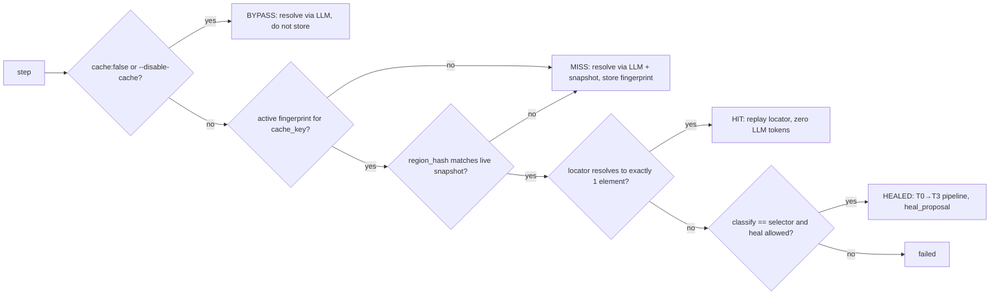

# Test format: `qabrain/test/v1`

QA Brain tests are intent-level YAML files committed to the application repository. A step says what a user would do ("click the 'Add to cart' button"), not how to find the element; the locator that satisfied the intent on a given platform is stored out of band as a fingerprint in the [`step_fingerprint`](./data-model.md#33-locator-cache) table, so a second run replays the cached locator without an LLM call and a changed page heals through the tiered pipeline in [self-healing](./self-healing.md) rather than breaking the test. The file shape follows the pattern established by [Momentic](https://momentic.ai/docs/reliability/step-cache.md) and [Shiplight](https://www.shiplight.ai/) (NL `act`/`assert` steps, reusable modules, git-committed), with two QA Brain-specific additions: structured `expect` oracles that map onto Playwright MCP's `browser_verify_*` tools, and platform overlays so one test can declare web, Android, and iOS parity. This document is the v1 specification; the zod schema in `packages/test-format/src/schema.ts` is the executable form.

## 1. Annotated example

```yaml
# tests/checkout/add-to-cart.test.yaml
# yaml-language-server: $schema=../../node_modules/@qa-brain/test-format/schemas/qabrain-test-v1.schema.json
fileType: qabrain/test/v1
id: checkout/add-to-cart            # stable key; uq(project_id, key) in the store
aliases: [cart/add-hoodie]          # former ids; history and fingerprints follow the rename
name: Login then add a hoodie to the cart
owners: [qa-team@example.com]
tags: [smoke, checkout]
platforms: [web, android]           # declared parity targets; ios absent = "not declared"
env:
  baseUrl: ${BASE_URL}              # plain variable: process env, --var, or qa-brain.config
  user: ${TEST_USER}
  password: ${secret:TEST_PASSWORD} # secret: never cached, logged, or sent to the LLM
defaults: { timeout: 10s, heal: true, cache: true }
steps:
  - navigate: "${baseUrl}/login"
  - module: auth/login              # modules/auth/login.yaml (fileType qabrain/module/v1)
    with: { user: ${user}, password: ${password} }
  - assert: "the account menu shows the signed-in user"
    expect: { visible: { role: button, name: /Account/ } }   # structured oracle, preferred
  - act: "search for 'blue hoodie'"
    platform:                       # overlay replaces the step body on that platform
      android: { act: "tap the search icon, type 'blue hoodie', press enter" }
  - act: "open the first search result"
    cache: false                    # dynamic list: always re-resolve
  - act: "click the 'Add to cart' button"
    id: add-to-cart                 # stable step id; survives rewording of the intent
    target: { role: button, name: "Add to cart" }
    timeout: 20s
  - wait: { text: "Added to cart", timeout: 5s }
  - assert: "the cart badge shows 1"
    expect: { text: "1", within: { role: link, name: Cart } }
  - assert: "no error toast is visible"
    negative: true                  # healing is disabled automatically
  - data: { set: cartCount, from: { text: { role: link, name: Cart } } }
  - act: "open the cart"
    heal: false
    only: [web]
```

## 2. Document fields

| Field | Type | Required | Rules |
|---|---|---|---|
| `fileType` | literal `qabrain/test/v1` | yes | Version negotiation; unknown versions are rejected with a pointer to the migration note. |
| `id` | string | yes | `^[a-z0-9][a-z0-9/_-]{0,127}$`; becomes `test_case.key`. The CLI warns when it differs from the path-derived id (`tests/checkout/add-to-cart.test.yaml` → `checkout/add-to-cart`). |
| `aliases` | string[] | no | Former ids. On save, a `test_case` whose `key` matches an alias is renamed instead of duplicated. |
| `name` | string | yes | Human title, ≤ 200 chars. |
| `owners` | string[] | no | Emails or GitHub handles; required before a test can be quarantined. |
| `tags` | string[] | no | `^[a-z0-9][a-z0-9-]*$`; `project.settings.smoke_tags` selects the always-run set. |
| `platforms` | (`web`\|`android`\|`ios`)[] | no (default `[web]`) | Parity targets; a platform not listed is "not declared", not "unmapped". |
| `env` | map<string, string> | no | Variable declarations; values are `${VAR}`, `${VAR:-default}`, `${secret:NAME}`, or literals. |
| `defaults` | object | no | `timeout` (default `10s`), `heal` (`true`), `cache` (`true`), `retries` (`0`). |
| `steps` | step[] | yes | 1–200 steps after module expansion; field reports show agents drift past 15–20 steps per flow, so keep files short and chain them via modules ([QAby field data](https://qaby.ai/blog/claude-code-playwright-tests-guide)). |

## 3. Step types

Every step is a single-key mapping (`navigate:`, `act:`, …) plus optional flags. The key identifies the kind; the value is the step body.

| Kind | Body | Additional fields | Runtime mapping (web) |
|---|---|---|---|
| `navigate` | URL string (variables allowed) | — | `web_navigate { url }`; HTTP 5xx or `net::ERR_*` classifies as `infra` |
| `act` | natural-language intent | `target: { role?, name?, testid?, text? }` hint; `value` for typed input | Resolve target (cache → LLM), then `web_click` / `web_type` / `web_select_option` / `web_press_key` / `web_hover` chosen by the resolver; plan cached per step |
| `assert` | natural-language statement | `expect` oracle (below); `negative: true` | Oracle maps to `web_verify_element_visible`, `web_verify_text_visible`, `web_verify_value`, `web_verify_list_visible` (the last two are hidden-but-callable via `qa_call_tool`); without `expect`, an LLM judgment over the snapshot is recorded with `oracle='llm'` |
| `module` | module id, e.g. `auth/login` | `with: { input: value }` | Steps are inlined at save time; see §5 |
| `wait` | `{ time: 2s }` \| `{ text: "…" }` \| `{ textGone: "…" }` \| `{ url: /pattern/ }` | `timeout` | `web_wait_for { time \| text \| textGone }`; `url` polls `web_snapshot` |
| `data` | `{ set: name, from: … }` or `{ set: name, generate: { kind: email \| uuid \| int, min?, max? } }` | — | `from.text: { role, name }` reads visible text through `web_find`; generated values are scoped to the attempt and appear in `step_result` only as their shape |

`expect` oracle forms (exactly one key):

| Oracle | Shape | Notes |
|---|---|---|
| `visible` | `{ role, name }` | `name` may be a `/regex/` string |
| `hidden` | `{ role, name }` | equivalent to `visible` with `negative: true`; healing disabled |
| `text` | string, optional `within: { role, name }` | substring match; `exact: true` for equality |
| `value` | `{ role, name, value }` | form controls |
| `url` | string or `/regex/` | current page URL |
| `count` | `{ role, name?, equals \| min \| max }` | counted from the snapshot |
| `list` | string[] with optional `within` | ordered visible items |

## 4. Flags, variables, and secrets

Per-step flags, all optional: `heal` (bool), `cache` (bool), `timeout` (duration `^\d+(ms|s|m)$`, cap `5m`), `negative` (bool, `assert` only), `only` (platform[]), `skip` (platform[]), `id` (`^[a-z0-9][a-z0-9-]{0,63}$`, unique within the file), `platform` (overlay map). Precedence: CLI flags (`--disable-cache`, `--heal=false`) > step flag > `defaults` > built-in default. Healing is forced off for `negative: true`, `data` steps, and any step whose intent is an absence check, mirroring Healenium's `@DisableHealing` guidance for element-absence checks ([Healenium README](https://github.com/healenium/healenium-web/blob/master/README.md)).

Variables: `${name}` refers to an `env` entry; `${VAR}` inside `env` refers to the process environment, a `--var VAR=value` CLI argument, or `qa-brain.config.yaml` `vars`; `${VAR:-default}` supplies a fallback; an unresolvable reference is a validation error, never an empty string. Values are substituted at execution time only. Canonicalization (§6) replaces every `${…}` with its *name*, so two steps that differ only in variable values share one cache entry and a value can never leak into a key or a log ([Stagehand's cache key uses variable keys, not values](https://www.browserbase.com/blog/stagehand-caching)).

Secrets: `${secret:NAME}` marks a value as sensitive. The gateway resolves it from the environment variable `NAME` (or from a secrets file in hosted mode) immediately before the upstream call, adds it to the redaction set so `action_log.args_redacted` and stderr show `«secret:NAME»`, excludes it from every LLM prompt (the model sees the placeholder, the gateway performs the substitution in `web_type`/`web_fill_form` arguments), and never writes it into `step_fingerprint`, `test_case_revision.content`, or an artifact. A plain `${VAR}` whose name matches `/pass(word)?|secret|token|api[-_]?key|authorization|cookie|session/i` is treated as a secret with a validation warning.

## 5. Modules (`qabrain/module/v1`)

```yaml
# modules/auth/login.yaml
fileType: qabrain/module/v1
id: auth/login
inputs:
  user: { type: string, required: true }
  password: { type: string, required: true, secret: true }
  landing: { type: string, default: "/account" }
steps:
  - act: "type ${user} into the email field"
    target: { role: textbox, name: /Email/ }
  - act: "type ${password} into the password field"
    target: { role: textbox, name: /Password/ }
  - act: "click the 'Sign in' button"
  - wait: { url: "${landing}" }
```

Rules: module ids are path-derived (`modules/auth/login.yaml` → `auth/login`); `inputs` declare name, `type` (`string` only in v1), `required`, `default`, and `secret`; a `secret: true` input may only be bound to a `${secret:…}` value. Modules may call modules to depth 3; cycles are a validation error. At save time the test's steps are expanded into `test_case_revision.content` with each module's sha256 recorded in `module_hashes`, and the originating module id is kept in `test_step.module_ref`. Editing a module therefore yields a new revision of every test that uses it, which is what makes impact analysis and fingerprint invalidation correct.

Platform overlays: a step's `platform:` map may carry `web`, `android`, or `ios` keys whose value is a complete replacement step body (kind and fields) for that platform; flags outside the overlay still apply. `only`/`skip` remove the step on the excluded platforms and record `step_result.status='skipped'`. When a declared platform has neither an overlay nor a resolvable canonical key for the target, the step is recorded `unmapped` and the attempt outcome is `unmapped` — reported, not failed, unless `--strict-parity` is set.

## 6. Canonicalization and cache keys

`canon(intent)` is applied to the step body before hashing:

1. Unicode NFC normalization.
2. Trim; collapse any whitespace run to a single space.
3. Replace every `${name}` and `${secret:name}` occurrence with the token `${name}`; collect the names into `var_keys`.
4. For structured fields (`target`, `expect`, `wait`, `data.from`), serialize as JSON with keys sorted; regex strings keep their `/…/` form.
5. Case is preserved — quoted labels are meaningful.

Formulas (hex sha256, lowercase; `␟` is U+001F, `var_keys` sorted and comma-joined, empty fields stay empty):

```text
step_key  = sha256( kind ␟ canon(intent) ␟ var_keys ␟ module_path )
cache_key = sha256( kind ␟ canon(intent) ␟ var_keys ␟ platform ␟ module_path ␟ env_scope )
```

`module_path` is the module id (`auth/login`) when the step came from a module, else empty, so identical intents inside and outside a module are cached separately while the same module step is shared by every test using it. `env_scope` is the environment name (`staging`, `prod-like`) only when `project.settings.isolateCacheByEnvironment` is true, the equivalent of Momentic's `advanced.isolateCachesByEnvironment`; otherwise empty. The test id is deliberately not part of either key: a project-wide cache means a step authored twice is resolved once.

Resolution at run time, per step and platform:



`step_result.cache_status` records `HIT`, `MISS`, `HEALED`, or `BYPASS`. A drifted `region_hash` is a MISS, not a HIT with a warning: "a wrong cached click is worse than a slow click" ([Stagehand](https://www.browserbase.com/blog/stagehand-caching)).

Invalidation, i.e. when a fingerprint stops being used:

| Event | Effect |
|---|---|
| Intent text, structured params, or variable *keys* change | new `cache_key`; old row stays `active` until its 30-day `last_hit_at` prune |
| Variable *values* change | none |
| `region_hash` drift | MISS for this run; the new fingerprint supersedes the old on success |
| Heal proposal approved or auto-approved | new fingerprint `active`, old `superseded` |
| Heal proposal rejected | new fingerprint `rejected`; excluded from all future candidate sets |
| `qa_cache_clear { test_key \| step_key }` (M2) | matching rows `superseded` |
| Platform overlay added/removed | only that platform's key changes |

## 7. Validation

`packages/test-format/src/schema.ts` defines `TestFileSchema` and `ModuleFileSchema` with zod 4.4.3. Validation runs in three places: `qa-brain test lint` in the user's repo, `qa_test_save` before a revision is written, and the vitest fixtures in `packages/test-format/test`. Semantic checks beyond the schema: unique step `id`s, resolvable module refs, module input coverage, `negative` only on `assert`, `only`/`skip` subsets of `platforms`, and no `${secret:…}` outside `env` or `with`.

The JSON Schema for editors is emitted by `z.toJSONSchema(TestFileSchema, { target: 'draft-2020-12' })` ([zod JSON Schema](https://zod.dev/json-schema)) into `packages/test-format/schemas/qabrain-test-v1.schema.json` and `qabrain-module-v1.schema.json` at build time. Users associate it with the `# yaml-language-server: $schema=` comment shown in §1 or a VS Code `yaml.schemas` entry mapping `tests/**/*.test.yaml` to the file.

Excerpt of the generated schema (step union abbreviated):

```json
{
  "$schema": "https://json-schema.org/draft/2020-12/schema",
  "$id": "https://qa-brain.dev/schemas/qabrain-test-v1.schema.json",
  "type": "object",
  "additionalProperties": false,
  "required": ["fileType", "id", "name", "steps"],
  "properties": {
    "fileType": { "const": "qabrain/test/v1" },
    "id": { "type": "string", "pattern": "^[a-z0-9][a-z0-9/_-]{0,127}$" },
    "platforms": { "type": "array", "items": { "enum": ["web", "android", "ios"] }, "default": ["web"] },
    "env": { "type": "object", "additionalProperties": { "type": "string" } },
    "steps": { "type": "array", "minItems": 1, "maxItems": 200, "items": { "$ref": "#/$defs/step" } }
  },
  "$defs": {
    "duration": { "type": "string", "pattern": "^\\d+(ms|s|m)$" },
    "flags": {
      "type": "object",
      "properties": {
        "id": { "type": "string", "pattern": "^[a-z0-9][a-z0-9-]{0,63}$" },
        "heal": { "type": "boolean" }, "cache": { "type": "boolean" },
        "timeout": { "$ref": "#/$defs/duration" },
        "only": { "$ref": "#/$defs/platformList" }, "skip": { "$ref": "#/$defs/platformList" },
        "platform": { "type": "object", "propertyNames": { "enum": ["web", "android", "ios"] } }
      }
    },
    "step": {
      "oneOf": [
        { "$ref": "#/$defs/navigateStep" }, { "$ref": "#/$defs/actStep" },
        { "$ref": "#/$defs/assertStep" },   { "$ref": "#/$defs/moduleStep" },
        { "$ref": "#/$defs/waitStep" },     { "$ref": "#/$defs/dataStep" }
      ]
    },
    "assertStep": {
      "allOf": [{ "$ref": "#/$defs/flags" }],
      "required": ["assert"],
      "properties": {
        "assert": { "type": "string", "minLength": 3, "maxLength": 500 },
        "negative": { "type": "boolean" },
        "expect": { "$ref": "#/$defs/expect" }
      }
    }
  }
}
```

## 8. Repository layout

```text
your-app/
  qa-brain.config.yaml            # gateway + project config (store, upstreams, vars)
  tests/
    smoke/home.test.yaml
    checkout/add-to-cart.test.yaml
  modules/
    auth/login.yaml
    cart/empty.yaml
  .qa-brain/                      # gitignored: qa-brain.db, pw-out/, era-cache.json, artifacts/
```

Conventions: tests match `tests/**/*.test.yaml`, modules `modules/**/*.yaml`; both globs are configurable under `tests.include` / `modules.dir` in `qa-brain.config.yaml`. File names should equal the `id` path; `qa-brain test lint --strict` enforces it. Fingerprints live in the store, not in the repo, so CI determinism comes from the hosted store or from a SQLite file restored by the workflow cache; a committed sidecar export is deferred beyond M2. Two reference tests and the `auth/login` module ship as fixtures for `packages/test-format/test` against `examples/static-site`.

Tool surface: `qa_test_save { path, source }` validates, expands modules, computes hashes, and inserts a revision; `qa_test_get { key, revision? }` returns `content` and `source_text`; `qa_test_list { tags?, platform?, status? }` lists keys. All three are hidden stubs in M0 (`server.exposeStubs: true` lists them) and are implemented in M1 ([tool catalog](./tool-catalog.md), [roadmap](./roadmap.md)).
