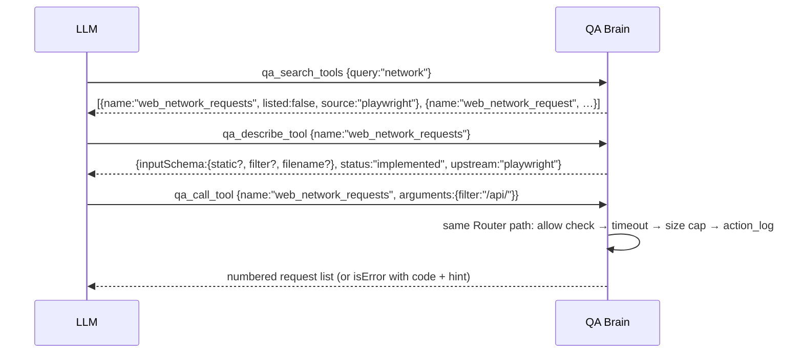

# QA Brain Tool Catalog

This catalog lists every tool an LLM can see or call through the QA Brain gateway: the 22 tools returned by `tools/list` by default, the hidden tools reachable only through `qa_call_tool`, the tools that are blocked and why, the stubs that exist for milestone M1 to M4 features, and the future tools whose names are reserved now so that prompts, docs, and tests do not churn later. It also fixes the naming rules, the discovery flow, the result-size cap, and the error contract that every tool obeys. Proxied `web_*` tools pass their arguments and results through to [Playwright MCP](https://github.com/microsoft/playwright-mcp) unchanged, so their schemas are Playwright's; native `qa_*` tools are defined in `packages/gateway/src/server/native/` with zod 4 schemas. The surface is deliberately small: Anthropic reports that tool-selection accuracy degrades past 30 to 50 tools ([Tool Search](https://platform.claude.com/docs/en/agents-and-tools/tool-use/tool-search-tool)), and a CI test fails if the default list exceeds 25.

## 1. Naming rules

| Rule | Value | Source |
|---|---|---|
| Allowed characters | `^[a-zA-Z0-9_-]{1,64}$` | [Claude Messages API](https://platform.claude.com/docs/en/agents-and-tools/tool-use/define-tools); stricter than MCP [SEP-986](https://modelcontextprotocol.io/seps/986-specify-format-for-tool-names), which also allows `.` and `/` |
| Maximum public length | 40 characters | Design decision: Claude Code wraps names as `mcp__qa-brain__<tool>` (15 extra characters), so 40 keeps the wrapped name under 64 |
| Proxied web tools | `web_` + upstream name with `browser_` stripped (`browser_click` → `web_click`) | MCP 2026-07-28 says aggregating proxies SHOULD prefix upstream tool names ([tools](https://modelcontextprotocol.io/specification/2026-07-28/server/tools)) |
| Native tools | `qa_*` | Design decision |
| Future mobile tools | `mobile_*` (appium-mcp upstream, `appium_` stripped where present) | [ADR-0015](./adr/0015-mobile-via-appium-mcp-synthesized-refs-android-first.md) |
| Collisions | Two public names equal, or a proxied name equal to a native name → startup error listing both sources; no shadowing, no silent rename | [Docker MCP Gateway v0.43.1](https://github.com/docker/mcp-gateway/releases/tag/v0.43.1) rule |
| Ordering | `tools/list` sorted by name, `ttlMs: 300000`, `cacheScope: 'public'` | Deterministic order improves prompt-cache hits ([changelog](https://modelcontextprotocol.io/specification/2026-07-28/changelog)) |
| Removal | Names are never removed from `tools/list` while the process lives; an unhealthy upstream answers with `isError` instead | Stale-history problem ([discussion #2036](https://github.com/modelcontextprotocol/modelcontextprotocol/discussions/2036)) |

The mapping functions live in `packages/core/src/tool-name.ts` (`toPublicToolName`, `toUpstreamToolName`, `assertValidToolName`). See [ADR-0004](./adr/0004-tool-namespacing-and-curated-surface.md).

## 2. Default surface: 15 proxied `web_*` tools

The Playwright child is launched as `node <playwright>/cli.js mcp --headless --isolated --caps=testing --snapshot-mode=full --image-responses=omit --codegen none --output-dir <QA_BRAIN_HOME>/pw-out --timeout-action 5000 --timeout-navigation 30000` and advertises 29 tools (`--caps=testing` adds `browser_generate_locator` and four `browser_verify_*` tools). Fifteen are listed. Input shapes below are Playwright 1.62.1's; `target` is the `[ref=eN]` string from a snapshot or a unique Playwright selector, and `element` is a human-readable description used for permission prompts and logs.

| Public name | Upstream | Input (required in bold) | Output | Notes |
|---|---|---|---|---|
| `web_navigate` | `browser_navigate` | **`url`** | text: navigation status + page snapshot | Only way to open a page; `file://` and private addresses are subject to the URL guard ([threat model T2](./security-threat-model.md)) |
| `web_snapshot` | `browser_snapshot` | `target?`, `depth?`, `boxes?`, `filename?` | text: YAML-like accessibility tree with `[ref=eN]` | Refs are renumbered per snapshot; re-snapshot after any navigation. Largest result in practice (200 to 400 tokens per small page, far more on dense apps) |
| `web_find` | `browser_find` | `text?` or `regex?` | text: matching nodes with refs | Cheap re-grounding instead of a full snapshot; used by healing T2 excerpts |
| `web_click` | `browser_click` | **`target`**, `element?`, `doubleClick?`, `button?`, `modifiers?` | text: post-action snapshot | Stale ref → upstream `isError` "ref eN not found"; call `web_snapshot` and retry |
| `web_type` | `browser_type` | **`target`**, **`text`**, `element?`, `submit?`, `slowly?` | text | `submit: true` presses Enter |
| `web_fill_form` | `browser_fill_form` | **`fields[]`** of `{name, type, ref, value}` | text | One call for a whole form; preferred over many `web_type` calls |
| `web_select_option` | `browser_select_option` | **`target`**, **`values[]`**, `element?` | text | Native `<select>` only |
| `web_press_key` | `browser_press_key` | **`key`** | text | Playwright key names (`Enter`, `ArrowDown`) |
| `web_hover` | `browser_hover` | **`target`**, `element?` | text | |
| `web_wait_for` | `browser_wait_for` | `time?` (seconds), `text?`, `textGone?` | text | Exactly one of the three; a long `time` is still bounded by the gateway's 60 s call timeout |
| `web_take_screenshot` | `browser_take_screenshot` | `target?`, `element?`, `type?` (`png` \| `jpeg`), `fullPage?`, `scale?`, `filename?` | text: path under `pw-out/` | Images are omitted from results (`--image-responses=omit`) to protect the host's token budget; WebP arrives with Playwright 1.63 |
| `web_console_messages` | `browser_console_messages` | **`level`**, `all?`, `filename?` | text: list | Used by failure classification (`runtime_error`) |
| `web_handle_dialog` | `browser_handle_dialog` | **`accept`**, `promptText?` | text | Must be called when a dialog blocks the page |
| `web_verify_text_visible` | `browser_verify_text_visible` | **`text`** | text; `isError` when not visible | Assertion primitive; healing never weakens it |
| `web_verify_element_visible` | `browser_verify_element_visible` | **`role`**, **`accessibleName`** | text; `isError` when not visible | Post-heal verification uses this |

Every proxied result carries `_meta["in.qabrain/actionLogId"]` so a later `qa_run_log` row can be correlated with the call.

## 3. Default surface: 7 native `qa_*` tools

All native schemas set `additionalProperties: false` and list `required` explicitly; weak models otherwise invent fields. Outputs are returned both as `content[0].text` (JSON) and as `structuredContent`.

### `qa_health`

Reports gateway, upstream, and store state. Call it when a `web_*` tool returns `upstream_unavailable`.

```jsonc
// input
{ "type": "object", "properties": {}, "additionalProperties": false }
// output
{ "version": "0.1.0",
  "upstreams": [{ "id": "playwright", "state": "healthy|degraded|failed", "era": "legacy|modern",
                  "restarts": 0, "lastProbeMs": 412 }],
  "store": { "driver": "sqlite|pg", "ok": true } }
```

### `qa_run_start`

Mints a run handle so that subsequent calls are grouped. Pass the handle in `_meta["in.qabrain/runId"]` or as a `run_id` argument where a tool accepts one.

```jsonc
// input
{ "type": "object", "properties": { "name": { "type": "string", "maxLength": 200 },
                                    "meta": { "type": "object" } },
  "required": [], "additionalProperties": false }
// output
{ "run_id": "rn_0198f3b2-c4d0-7a1e-9c6b-5f4a3d2e1c0b", "expires_at": "2026-08-21T10:00:00Z" }
```

Handle format is `<kind>_<uuidv7>` (hyphenated RFC 9562 form, as `uuidv7` 1.2.1 emits it); run handles expire after 24 hours and are owner-checked ([ADR-0005](./adr/0005-server-minted-handles-not-sessions.md)).

### `qa_run_finish`

```jsonc
// input
{ "type": "object",
  "properties": { "run_id": { "type": "string", "pattern": "^rn_[0-9a-f]{8}-[0-9a-f]{4}-7[0-9a-f]{3}-[89ab][0-9a-f]{3}-[0-9a-f]{12}$" },
                  "status": { "enum": ["passed", "failed", "cancelled", "error"] },
                  "summary": { "type": "object" } },
  "required": ["run_id", "status"], "additionalProperties": false }
// output
{ "run_id": "rn_…", "status": "passed", "steps": 14, "errors": 1, "duration_ms": 38210 }
```

### `qa_run_log`

Compact view over `action_log` for one run; result bodies are never included.

```jsonc
// input
{ "type": "object",
  "properties": { "run_id": { "type": "string" },
                  "limit": { "type": "integer", "minimum": 1, "maximum": 200, "default": 50 },
                  "offset": { "type": "integer", "minimum": 0, "default": 0 } },
  "required": ["run_id"], "additionalProperties": false }
// output
{ "rows": [{ "id": "…", "ts_start": 1755684000000, "tool": "web_click", "upstream_tool": "browser_click",
             "duration_ms": 312, "is_error": false, "error_code": null, "error_message": null,
             "result_chars": 2210 }], "total": 14 }
```

### `qa_search_tools`

```jsonc
// input
{ "type": "object",
  "properties": { "query": { "type": "string", "minLength": 1 },
                  "includeHidden": { "type": "boolean", "default": true } },
  "required": ["query"], "additionalProperties": false }
// output
{ "tools": [{ "name": "web_network_requests", "summary": "List network requests since load",
              "listed": false, "source": "playwright", "status": "implemented" }] }
```

Matching is substring and token overlap over name plus description (BM25-lite, no embeddings).

### `qa_describe_tool`

```jsonc
// input
{ "type": "object", "properties": { "name": { "type": "string" } },
  "required": ["name"], "additionalProperties": false }
// output
{ "name": "web_generate_locator", "upstream": "playwright", "upstreamTool": "browser_generate_locator",
  "listed": false, "status": "implemented", "description": "…", "inputSchema": { /* upstream schema verbatim */ } }
```

### `qa_call_tool`

Forwards any *allowed* tool, listed or hidden, through the same Router, timeout, size cap, and `action_log` path as a direct call. Blocked names are rejected before reaching the upstream.

```jsonc
// input
{ "type": "object",
  "properties": { "name": { "type": "string" }, "arguments": { "type": "object" } },
  "required": ["name", "arguments"], "additionalProperties": false }
// output: the target tool's result, unchanged
```

## 4. Hidden but callable

These 12 tools are allowed but not listed, to keep the default surface small. Reach them with `qa_call_tool` after `qa_describe_tool`.

| Public name | Upstream | Input | Why hidden |
|---|---|---|---|
| `web_navigate_back` | `browser_navigate_back` | none | Rarely needed; `web_navigate` suffices |
| `web_tabs` | `browser_tabs` | `action` (`list`, `new`, `select`, `close`), `index?`, `url?` | Multi-tab flows are an advanced case |
| `web_network_requests` | `browser_network_requests` | `static?`, `filter?`, `filename?` | Large output; used by TIA `api_route` mapping (M4) and failure classification |
| `web_network_request` | `browser_network_request` | `index`, `part?`, `filename?` | Companion to the above |
| `web_generate_locator` | `browser_generate_locator` | `target`, `element?` | Healing capture and fingerprint storage (M3) |
| `web_verify_value` | `browser_verify_value` | `type`, `element`, `target`, `value` | Assertion primitive for forms |
| `web_verify_list_visible` | `browser_verify_list_visible` | `element`, `target`, `items[]` | Assertion primitive for lists |
| `web_drag` | `browser_drag` | `startTarget`, `endTarget`, `startElement?`, `endElement?` | Uncommon |
| `web_drop` | `browser_drop` | `target`, `element?`, `paths?`, `data?` | Uncommon |
| `web_file_upload` | `browser_file_upload` | `paths?` | Touches the local filesystem; hidden until the artifact store mediates paths (M2) |
| `web_resize` | `browser_resize` | `width`, `height` | Viewport experiments only |
| `web_close` | `browser_close` | none | The gateway owns the browser lifecycle; closing it mid-run breaks subsequent calls |

## 5. Blocked

| Upstream name | Reason |
|---|---|
| `browser_run_code_unsafe` | Executes arbitrary JavaScript in the Playwright server process; Playwright's own config calls it RCE-equivalent ([config.d.ts](https://raw.githubusercontent.com/microsoft/playwright/main/packages/playwright-core/src/tools/mcp/config.d.ts)). A prompt-injected page could reach the gateway host |
| `browser_evaluate` | Runs page-context JavaScript with access to cookies, storage, and the DOM; the same exfiltration vector at lower privilege. Coverage collection in M4 reads `window.__coverage__` internally, never through the LLM |
| Everything behind `--caps=vision,pdf,devtools,network,storage,config` | Not spawned at all (`--caps=testing` only): `browser_mouse_*_xy`, `browser_pdf_save`, `browser_start_tracing`, `browser_route`, `browser_cookie_*`, `browser_localstorage_*`, `browser_storage_state`, `browser_get_config`. Adding a capability requires an adapter change and a threat-model entry |

A call to a blocked name, including through `qa_call_tool`, returns `isError` with code `blocked_tool` and is logged. Defense in depth: even if a future config typo allowed the name, the adapter's `toolTable()` marks it `allow: false`.

## 6. Stubs (hidden unless `server.exposeStubs: true`)

Registered so that clients, docs, and tests can reference stable names. Each returns `isError` with code `not_implemented` and text `"<name> is not implemented in M0; see docs/roadmap.md"`.

| Name | Planned input | Milestone |
|---|---|---|
| `qa_test_save` | `{ test: <qabrain/test/v1 YAML or object>, path? }` → `{ test_id, revision_id, content_hash }` | M1 ([test format](./test-format.md)) |
| `qa_test_get` | `{ test_id \| key, revision? }` → test with inlined modules | M1 |
| `qa_test_list` | `{ tags?, platform?, status?, limit?, offset? }` | M1 |
| `qa_heal_locator` | `{ test_id, step_id, run_id }` → heal proposal with tier, score, margin, candidates | M3 ([self-healing](./self-healing.md)) |
| `qa_impact_select` | `{ base, head, budget?, includeQuarantined? }` → `{ selectedTests, fallbackToRunAll, notRun, mapFreshness }` | M4 ([impact analysis](./impact-analysis.md)) |
| `qa_report_generate` | `{ run_id, format: 'md' \| 'junit' }` → artifact reference | M2 |

## 7. Future tools (names reserved, not registered)

| Name | Purpose | Milestone |
|---|---|---|
| `qa_run_test` | Deterministic replay of a stored test: cache `HIT` replays the stored locator without an LLM call, `MISS` re-resolves, `HEALED` goes through the proposal pipeline | M2 |
| `qa_heal_list`, `qa_heal_show`, `qa_heal_review` | Inspect proposals with evidence; approve or reject; rejected candidates are excluded forever from scoring | M3 |
| `qa_run_suite` | Runs a selection across platforms. Returns a `CreateTaskResult` (`taskId = run_id`, `pollIntervalMs: 2000`, `ttlMs: 86400000`) when the client declares the [`io.modelcontextprotocol/tasks`](https://modelcontextprotocol.io/extensions/tasks/overview) extension in `_meta`, otherwise runs inline with `notifications/progress`; `idempotency_key` is unique per project | M5 |
| `qa_visual_compare` | pixelmatch baseline diff for a step or page, threshold per test | M3 |
| `qa_issue_file` | Files a GitHub issue for a `regression`-classified failure with ordered repro steps and artifact links; deduplicated by error signature, at most 5 per run | M4 |
| `qa_parity_report` | Per-step matrix of web, Android, and iOS outcomes for one intent test; `unmapped` is reported, never silently matched | M6 |
| `qa_cache_clear` | Invalidate fingerprints by `test_key` or `step_key` | M2 |
| `mobile_*` | appium-mcp upstream via the `appium` adapter: `mobile_snapshot` (page-source XML rendered as an accessibility tree with synthesized `[ref=mN]`), `mobile_tap`, `mobile_type`, `mobile_swipe`, `mobile_launch_app`, `mobile_verify_text_visible`; `mapArgs` translates `ref=mN` to the Appium `elementUUID` ([appium-mcp](https://github.com/appium/appium-mcp)) | M6 |
| `db_*` | Postgres/MySQL MCP upstream for database verification steps | M4 |

The sum of listed tools after all milestones is planned to stay at or below 30; new natives displace hidden web tools rather than grow the list.

## 8. Discovery flow

Three native tools make the hidden surface reachable without enlarging `tools/list`, following the meta-tool pattern used by [Lasso mcp-gateway](https://github.com/lasso-security/mcp-gateway) and Anthropic's progressive-disclosure guidance ([code execution with MCP](https://www.anthropic.com/engineering/code-execution-with-mcp)).



`qa_call_tool` never bypasses policy: blocked names fail with `blocked_tool`, unknown names with `unknown_tool`, and stubs with `not_implemented`, exactly as a direct call would.

## 9. Result-size cap

`server.maxResultChars` defaults to 80,000 characters (roughly 20k tokens). When the serialized text content of a result exceeds it, the Router truncates the largest text block and appends a marker:

```
[qa-brain: result truncated — showing 80000 of 143212 chars; narrow the request (web_find, depth, filter) or rerun with a run_id once artifact storage lands in M2]
```

Design rationale: Claude Code writes MCP results above 25,000 tokens to disk and replaces them with a file-path message, and warns at 10,000 ([Claude Code MCP docs](https://code.claude.com/docs/en/mcp)); staying under that ceiling keeps the snapshot in context where the model can act on it. From M2 the full payload becomes an artifact and the marker carries its id. Images are already omitted at the source (`--image-responses=omit`). A tool may declare the `anthropic/maxResultSizeChars` annotation to raise the host cap for genuinely large outputs; QA Brain does not in M0.

## 10. Error contract

No failure escapes as a JSON-RPC error (`-32603`): the model cannot recover from a transport-level error, but it can read an `isError` result and act on the hint. Every error result has the shape:

```jsonc
{ "isError": true,
  "content": [{ "type": "text", "text": "<code>: <message>. <recovery hint>" }],
  "structuredContent": { "code": "timeout", "tool": "web_click", "upstream": "playwright", "retryable": true,
                         "hint": "call web_snapshot to re-ground refs, then retry" },
  "_meta": { "in.qabrain/actionLogId": "…" } }
```

| `code` | When | `retryable` | Recovery hint text |
|---|---|---|---|
| `timeout` | Upstream call exceeded `callTimeoutMs` (60,000 ms; progress notifications reset it up to `maxTotalTimeout` 300,000 ms) | yes | "the browser may still be busy; call web_snapshot before retrying" |
| `upstream_unavailable` | Upstream `degraded` or `failed` (3 missed 5 s probes; restart backoff 1 s to 30 s, 5 attempts) or child exited mid-call | yes, after delay | "upstream 'playwright' is restarting (attempt n/5); retry in 5 s or call qa_health" |
| `unknown_tool` | Name not in the registry | no | "call qa_search_tools to find the right name" |
| `blocked_tool` | Name is in `tools.block` or `allow: false` in the adapter table | no | "this tool is disabled by policy; see docs/tool-catalog.md" |
| `invalid_args` | zod validation failed for a native tool, or upstream rejected the schema | no | includes the validation path, e.g. "run_id must match ^rn_" |
| `cancelled` | Client aborted (`notifications/cancelled` on stdio, stream close on HTTP); the abort is forwarded to the child | n/a | none |
| `not_implemented` | Stub called | no | "see docs/roadmap.md for the milestone" |
| `upstream_error` | The upstream itself returned `isError` (stale ref, element not visible) | depends | upstream text passed through verbatim |

Each code lands in `action_log.error_code` with the message truncated to 1 KiB; `qa_run_log` surfaces both.

## 11. Host notes: Claude Code

Claude Code names every MCP tool `mcp__<server>__<tool>`, so with the server registered as `qa-brain` the model sees `mcp__qa-brain__web_click` and CI allowlists use `--allowedTools "mcp__qa-brain__*"` ([Claude Code MCP docs](https://code.claude.com/docs/en/mcp)). Three consequences shape this catalog:

1. **Length.** The wrapper adds 15 characters, which is why public names are capped at 40.
2. **Result cap.** MCP outputs above 25,000 tokens (`MAX_MCP_OUTPUT_TOKENS`) are spilled to a file; the 80,000-character gateway cap keeps results below it. Warnings start at 10,000 tokens, so `web_find` and `depth` should be preferred over repeated full snapshots.
3. **Deferred schemas.** Claude Code's tool search loads only names and server instructions at start and fetches schemas on demand; set `"alwaysLoad": true` on the `qa-brain` entry in `.mcp.json` when the 22 tools should stay hot ([client setup](./client-setup.md)). Tool descriptions therefore carry the one-line purpose from this catalog, not the full schema.

Cursor, Codex, and Claude Desktop apply no length transformation but share the same 64-character provider limit. See [../ARCHITECTURE.md](../ARCHITECTURE.md) for the request lifecycle behind every row above and [data-model.md](./data-model.md) for the `action_log` columns the error codes land in.
